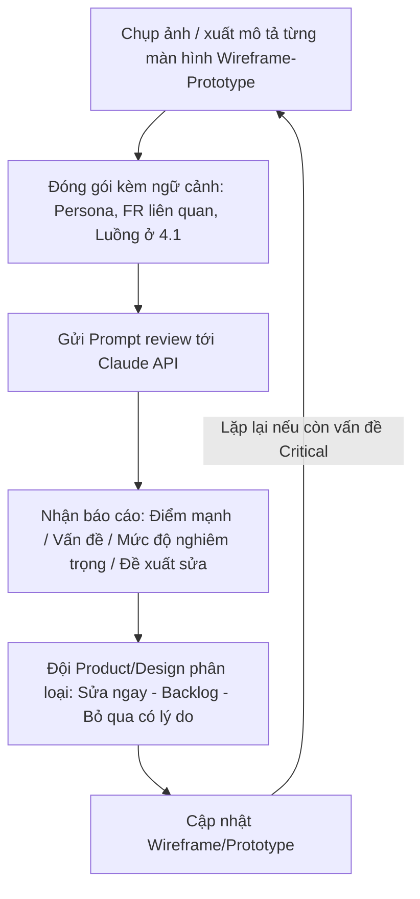

# CHƯƠNG 4: THIẾT KẾ TRẢI NGHIỆM NGƯỜI DÙNG (UX/UI DESIGN)
## DỰ ÁN: CVMikiri

## 4.4 AI Đánh giá Thiết kế (AI Design Review)

### 4.4.1 Mục đích
Trước khi chuyển Prototype (4.3) thành sản phẩm code chính thức, nhóm sử dụng AI (Claude) như một **"reviewer thiết kế cấp hai"** — độc lập với người đã tự thiết kế — nhằm phát hiện sớm các vấn đề về khả dụng (usability), khả năng tiếp cận (accessibility) và tính nhất quán trước khi tốn công sức phát triển.

> **Lưu ý phạm vi**: AI Design Review đóng vai trò **bổ sung**, không thay thế việc test người dùng thật với Persona 1 & 2. AI giỏi ở việc quét lỗi có tính hệ thống (thiếu trạng thái, vi phạm heuristic phổ biến) nhưng không thay được cảm nhận trải nghiệm thực tế của HR/Recruiter.

### 4.4.2 Quy trình đưa thiết kế vào AI Review



### 4.4.3 Khung tiêu chí đánh giá (dựa trên 10 Heuristics của Nielsen)
AI được yêu cầu chấm từng màn hình theo khung 10 nguyên tắc khả dụng kinh điển, áp riêng cho ngữ cảnh CVMikiri:

| # | Heuristic (Nielsen) | Câu hỏi kiểm tra áp dụng cho CVMikiri |
| :-- | :--- | :--- |
| 1 | Hiển thị trạng thái hệ thống | Người dùng có luôn biết file đang upload/parse ở bước nào không? |
| 2 | Khớp giữa hệ thống & thế giới thực | Thuật ngữ "Kỹ năng khớp/thiếu" có dễ hiểu hơn "matchedSkills/missingSkills" không? |
| 3 | Quyền kiểm soát & tự do của người dùng | Có thể huỷ giữa chừng khi đang chạy AI Matching 50 CV không? |
| 4 | Nhất quán & theo chuẩn | Badge màu điểm số (🟢🟡🔴) có dùng nhất quán ở cả bảng danh sách và Drawer chi tiết không? |
| 5 | Phòng tránh lỗi | Nút "Xoá JD" có bắt buộc modal xác nhận khi JD đã có MatchResult không? |
| 6 | Nhận biết hơn là ghi nhớ | Khi mở Drawer chi tiết, JD đang so sánh có được nhắc lại rõ ràng không? |
| 7 | Linh hoạt & hiệu quả sử dụng | HR xử lý 200-300 CV/tuần có thao tác chọn hàng loạt (select-all, shift-click) không? |
| 8 | Thẩm mỹ & thiết kế tối giản | Bảng dữ liệu có bị quá tải cột không cần thiết ở màn hình mặc định không? |
| 9 | Giúp người dùng nhận diện, chẩn đoán, phục hồi lỗi | Thông báo lỗi "429 Too Many Requests" có được dịch thành ngôn ngữ nghiệp vụ dễ hiểu không? |
| 10 | Trợ giúp & tài liệu | Có tooltip giải thích ý nghĩa điểm số 0-100 ngay lần đầu người dùng thấy không? |

### 4.4.4 Mẫu Prompt gửi AI Review (đưa vào Claude API)

```text
Bạn là một chuyên gia UX Reviewer cấp cao, có kinh nghiệm đánh giá sản phẩm B2B SaaS
cho ngành HR Tech. Hãy đánh giá màn hình dưới đây của sản phẩm CVMikiri.

Bối cảnh:
- Người dùng chính: HR Recruiter (xử lý 200-300 CV/tuần) và Hiring Manager.
- Mục tiêu màn hình: {{ tên màn hình, ví dụ "Quản lý CV" }}
- Luồng liên quan: {{ mô tả từ mục 4.1 tương ứng }}
- Mô tả/ảnh chụp wireframe: {{ đính kèm mô tả từ 4.2 hoặc ảnh Figma }}

Yêu cầu đánh giá:
1. Chấm điểm 1-5 cho từng mục trong 10 Heuristics của Nielsen, giải thích ngắn gọn lý do.
2. Liệt kê tối đa 5 vấn đề nghiêm trọng nhất (Critical/High/Medium) kèm đề xuất sửa cụ thể.
3. Chỉ ra nếu có mâu thuẫn giữa màn hình này với Yêu cầu chức năng FR đã cung cấp.
4. Không bịa ra vấn đề nếu thông tin không đủ để đánh giá — hãy nêu rõ những gì cần bổ sung.

Trả lời bằng tiếng Việt, súc tích, dùng bảng cho phần chấm điểm.
```

### 4.4.5 Ví dụ Báo cáo AI Design Review (minh hoạ cho màn hình "Quản lý CV")

| Heuristic | Điểm (1-5) | Nhận xét |
| :--- | :--- | :--- |
| 1. Hiển thị trạng thái hệ thống | 4 | Progress bar theo từng file rõ ràng; cần thêm trạng thái "đang trích xuất text" tách biệt với "đang upload" |
| 3. Quyền kiểm soát & tự do | 2 | **Vấn đề**: chưa có nút "Huỷ" khi đang chạy AI Matching hàng loạt — nếu chọn nhầm 50 CV, người dùng buộc phải đợi hết |
| 7. Linh hoạt & hiệu quả | 3 | Chưa thấy tuỳ chọn "Chọn tất cả" trong bảng — bất tiện khi HR muốn chấm AI cho toàn bộ danh sách đã lọc |
| 9. Nhận diện & phục hồi lỗi | 3 | Thông báo "sai định dạng" tốt, nhưng khi AI lỗi 429 cần thông điệp kiểu "Hệ thống đang xử lý quá nhiều hồ sơ cùng lúc, vui lòng thử lại sau ít phút" thay vì mã lỗi kỹ thuật |

**Vấn đề nghiêm trọng nhất được AI gắn cờ (Critical):**
> *"Floating Action Bar hiện chỉ có nút 'Chạy AI Matching', không có cách nào huỷ một tác vụ AI Matching đang chạy dở cho hàng loạt CV. Với NFR2 (tối ưu chi phí AI), việc gọi nhầm 1 lô lớn không thể huỷ giữa chừng gây lãng phí token trực tiếp — nên bổ sung nút 'Dừng' xuất hiện thay thế nút Chạy trong lúc xử lý."*

> **Cập nhật trạng thái xử lý**: Vấn đề Critical này đã được đưa ngược lại vào luồng chính ở mục 4.1.3(d) — bổ sung nút "Dừng" thay thế nút "Chạy AI Matching" trong lúc xử lý, cùng với việc sửa lại thông báo tổng kết để phản ánh đúng số ứng viên thành công/lỗi/đã huỷ thay vì luôn báo "N/N". Đây là ví dụ cho quy tắc ở 4.4.6: một phát hiện Critical từ AI Review **phải** được đưa ngược lại vào bản luồng chính thức trước khi coi là "đã đóng", không chỉ dừng ở mức ghi nhận trong báo cáo.

### 4.4.6 Quy tắc phân loại & xử lý phản hồi từ AI
| Mức độ | Tiêu chí | Hành động |
| :--- | :--- | :--- |
| **Critical** | Chặn hoàn thành tác vụ chính (FR1-FR5) hoặc vi phạm NFR đã cam kết | Sửa ngay trước khi code Frontend chính thức |
| **High** | Gây khó chịu rõ rệt cho Persona chính nhưng có thể dùng tạm được | Đưa vào Sprint gần nhất |
| **Medium** | Cải thiện trải nghiệm nhưng không ảnh hưởng luồng chính | Đưa vào Backlog (có thể gộp Wave 1-4 ở roadmap) |
| **Bỏ qua có lý do** | AI hiểu sai ngữ cảnh nghiệp vụ hoặc đề xuất vượt phạm vi MVP (3.2.2.B) | Ghi chú lý do từ chối để tránh review viên sau lặp lại câu hỏi |

### 4.4.7 Giới hạn của AI Design Review (cần lưu ý khi áp dụng)
* AI đánh giá dựa trên **mô tả/ảnh chụp tĩnh**, không "cảm" được độ trễ thực tế, độ mượt animation hay cảm giác cầm nắm trên thiết bị thật.
* Kết quả review phụ thuộc nhiều vào **chất lượng ngữ cảnh cung cấp** (Persona, FR, luồng) — thiếu ngữ cảnh sẽ khiến AI đưa ra góp ý chung chung, không đặc thù cho HR Tech.
* Không dùng AI Review để **thay thế** hoàn toàn bước kiểm thử người dùng thật (usability testing) trước khi ra mắt bản chính thức — đây vẫn là bước bắt buộc trước khi Go-live.

---

## TỔNG KẾT CHƯƠNG 4
Chương 4 đã cụ thể hoá các yêu cầu chức năng và User Stories của Chương 3 thành: luồng thao tác chi tiết theo từng FR (4.1), bố cục khung màn hình lõi (4.2), quy trình dựng bản mẫu tương tác tái sử dụng trực tiếp component React (4.3), và một vòng lặp đánh giá thiết kế có sự hỗ trợ của AI dựa trên 10 Heuristics của Nielsen (4.4). Đầu ra của chương này là cơ sở trực tiếp để đội Frontend triển khai giao diện thật, thay thế mock data bằng các API đã đặc tả tại mục 3.5.2.
