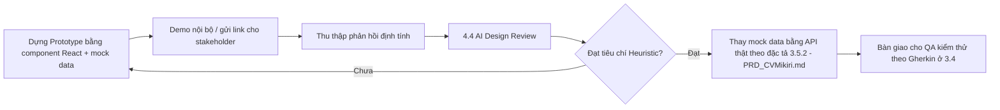

# CHƯƠNG 4: THIẾT KẾ TRẢI NGHIỆM NGƯỜI DÙNG (UX/UI DESIGN)
## DỰ ÁN: CVMikiri

## 4.3 Tạo Bản mẫu (Prototyping)

### 4.3.1 Mục tiêu giai đoạn Prototype
Chuyển từ wireframe tĩnh (4.2) sang **bản mẫu tương tác được (clickable prototype)** để:
1. Kiểm chứng luồng người dùng (4.1) có "chạy mượt" trên thực tế thao tác hay không, phát hiện sớm các bước thừa.
2. Thu thập phản hồi của Persona 1 & 2 (giả lập hoặc thật) trước khi Frontend Developer viết code chính thức.
3. Làm tài liệu bàn giao trực quan, đối chiếu song song với đặc tả RESTful API đã có sẵn tại **mục 3.5.2 (PRD_CVMikiri.md)** và mô hình dữ liệu Prisma tại **mục 3.3.4**. Nếu nhóm có duy trì thêm các file `ARCHITECTURE.md` / `API.md` riêng biệt trong repository mã nguồn, cần trỏ Prototype tới đúng phiên bản mới nhất của các file đó; nếu chưa tồn tại, mục 3.5.2 đóng vai trò là nguồn tham chiếu API chính thức duy nhất cho tới khi các file này được tạo.

### 4.3.2 Công cụ & Mức độ trung thực (Fidelity)
| Giai đoạn | Công cụ đề xuất | Mức fidelity | Đầu ra |
| :--- | :--- | :--- | :--- |
| Prototype nhanh nội bộ | Figma (frame liên kết bằng Prototype mode) | Mid-fidelity, đúng màu thương hiệu, chưa cần animation phức tạp | Link Figma chia sẻ cho HR/Lead review |
| Prototype chức năng thật | Component React thật dựng trên Storybook hoặc route riêng `/proto` trong app Vite hiện có | High-fidelity, dữ liệu giả (mock JSON) | Có thể click thật, dùng lại được component khi code chính thức |

> **Khuyến nghị cho CVMikiri**: vì stack đã có sẵn React + Tailwind + Zustand (theo 3.2.1), nên **bỏ qua công cụ thiết kế ngoài và dựng prototype ngay bằng chính component thật với dữ liệu mock** (`mockCandidates.json`, `mockJobs.json`). Cách này giúp tái sử dụng 80–90% code khi chuyển sang tích hợp API thật, tiết kiệm thời gian dựng lại UI hai lần.

### 4.3.3 Kịch bản click-test (Clickable Flow Script)
Bản mẫu tương tác cần đảm bảo đi hết được **kịch bản thử nghiệm** sau, tương ứng trực tiếp các Gherkin Scenario đã viết ở 3.4:

```mermaid
journey
    title Kịch bản Click-test: Từ tạo JD đến ra quyết định phỏng vấn
    section Chuẩn bị
      Tạo JD mới: 5: HR
      Upload 5 CV: 4: HR
    section Sàng lọc
      Lọc theo kỹ năng + kinh nghiệm: 5: HR
      Chọn 3 ứng viên tiềm năng: 5: HR
    section Đánh giá AI
      Chạy AI Matching: 3: HR
      Chờ kết quả từng dòng: 3: HR
    section Ra quyết định
      Mở chi tiết ứng viên #1: 5: Hiring Manager
      So sánh Matched/Missing skills: 5: Hiring Manager
      Xoá ứng viên không đạt: 4: Hiring Manager
```
*(Thang điểm 1–5 mô phỏng mức độ hài lòng kỳ vọng tại mỗi bước — dùng làm baseline để so sánh với kết quả usability test thật sau này.)*

### 4.3.4 Trạng thái cần dựng đầy đủ trong Prototype
Không chỉ dựng "happy path", bản mẫu bắt buộc bao gồm các **trạng thái biên** để tránh việc Frontend Developer phải tự đoán khi code:
* Empty state (chưa có JD / chưa có CV nào).
* Loading state (đang upload, đang chạy AI matching theo từng dòng).
* Error state (file sai định dạng, AI trả lỗi JSON, mất kết nối mạng).
* Success state (toast, badge cập nhật).
* Trạng thái responsive tối thiểu ở breakpoint tablet (768px).

### 4.3.5 Quy trình bàn giao Prototype

> **Ghi chú (đã sửa)**: Bản trước tham chiếu `API.md` như một file đích để tích hợp, nhưng file này chưa xác nhận tồn tại trong repository tại thời điểm viết Chương 4. Để người triển khai luôn có tài liệu đích cụ thể, bước "Thay mock data bằng API thật" trỏ trực tiếp tới đặc tả endpoint đã có sẵn ở **mục 3.5.2 của `PRD_CVMikiri.md`** (Nhóm 1: `/api/jobs`, Nhóm 2: `/api/candidates`, Nhóm 3: `/api/matching`). Nếu về sau nhóm tách riêng `API.md`/`ARCHITECTURE.md` thành file độc lập, cần cập nhật lại tham chiếu này để trỏ đúng phiên bản file đang tồn tại.

---

