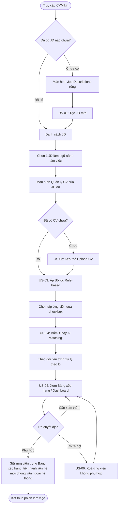
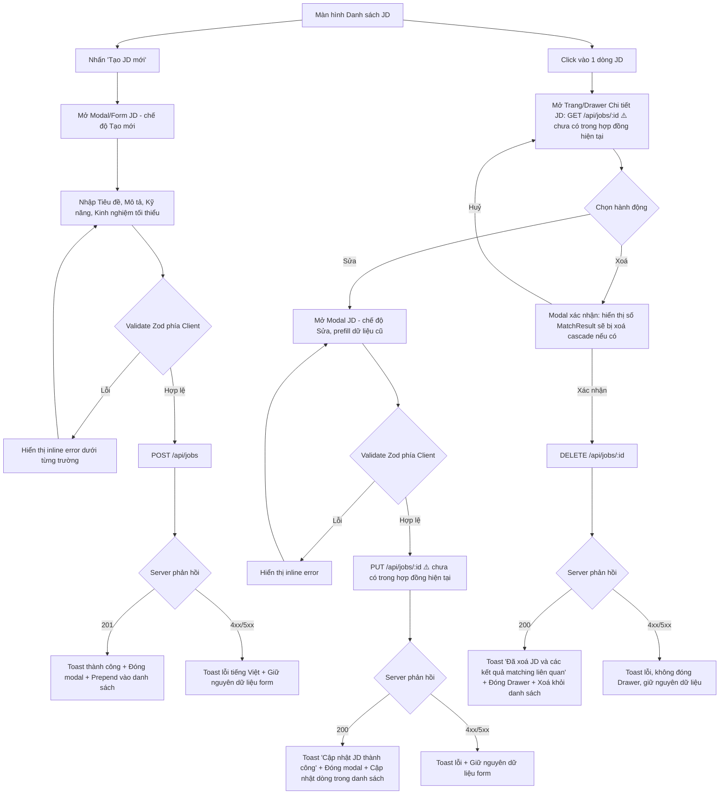
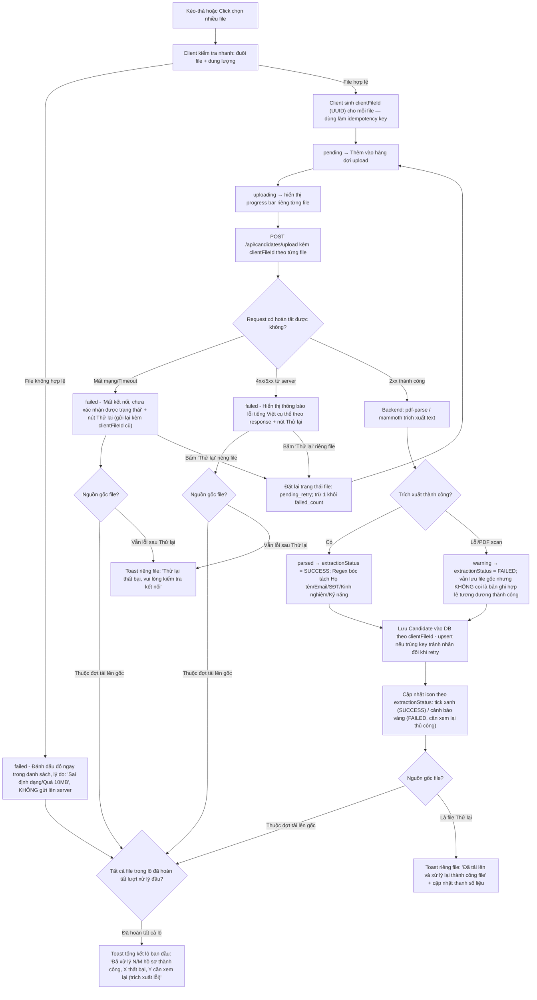
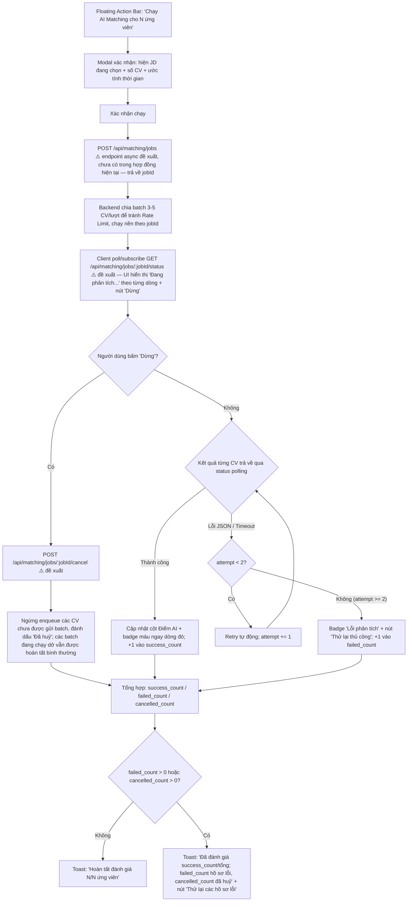
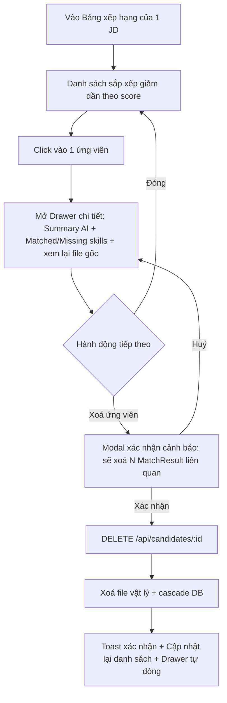

# CHƯƠNG 4: THIẾT KẾ TRẢI NGHIỆM NGƯỜI DÙNG (UX/UI DESIGN)
## DỰ ÁN: CVMikiri

## 4.1 Luồng Người dùng (User Flow)

### 4.1.1 Nguyên tắc thiết kế luồng
Toàn bộ luồng người dùng của CVMikiri được thiết kế theo nguyên tắc **"Lọc rẻ trước — Chấm AI sau"** (Two-tier Hybrid Screening đã nêu ở 3.1.3), nhằm đảm bảo:
* Người dùng luôn thao tác trên **tập ứng viên đã được thu hẹp** trước khi tốn chi phí gọi AI.
* Không có bước nào là "ngõ cụt" (dead-end) — mỗi màn hình luôn có lối ra rõ ràng (quay lại, tiếp tục, hoặc CTA chính).
* Trạng thái lỗi (file sai định dạng, AI timeout, JD trống) đều được xử lý ngay tại bước phát sinh, không đẩy người dùng ra khỏi luồng.

### 4.1.2 Luồng tổng quan cấp cao (Master Flow)


> **Ghi chú phạm vi (đã hiệu chỉnh)**: Nhánh "Phù hợp" ở bản trước dẫn tới hành động "Đánh dấu / Xuất danh sách mời phỏng vấn" — đây là chức năng **chưa được định nghĩa** ở bất kỳ FR nào trong phạm vi MVP (3.2.2.A) và cũng không có API endpoint tương ứng ở 3.5.2. Để tránh Frontend triển khai một CTA không có backend contract, Master Flow chỉ dừng ở việc **giữ nguyên ứng viên trong Bảng xếp hạng** (hành vi mặc định, không cần thêm FR) — việc liên hệ mời phỏng vấn được thực hiện ngoài hệ thống ở giai đoạn MVP. Chức năng "Đánh dấu / Shortlist" và "Xuất báo cáo Excel/PDF" đã được đặt đúng chỗ trong roadmap mở rộng (Wave 1: Shortlist management; Wave 3: Export) và **cần được bổ sung FR, API, định dạng xuất, cùng trạng thái lỗi tương ứng** trước khi đưa vào bất kỳ luồng thiết kế nào ở các phiên bản sau.

### 4.1.3 Luồng chi tiết theo từng User Story

#### a) Luồng FR1 / US-01 — Tạo, Xem, Sửa & Xoá JD
> **Ghi chú phạm vi**: FR1 không chỉ dừng ở tạo mới (FR1.1) mà còn bắt buộc phải có xem danh sách/chi tiết (FR1.2), xoá (FR1.3) và sửa (FR1.4). Luồng dưới đây bổ sung đầy đủ các nhánh Xem — Sửa — Xoá còn thiếu, để bản thiết kế cung cấp đủ hành vi cần triển khai và kịch bản QA tương ứng với các Gherkin Scenario ở US-01 (bao gồm cả kịch bản "Xoá JD đã có MatchResult").
>
> ⚠️ **Cảnh báo thiếu hợp đồng API (bug-risk)**: Hợp đồng RESTful hiện có ở mục 3.5.2 (`PRD_CVMikiri.md`) **chỉ đặc tả `POST /api/jobs`, `GET /api/jobs` (danh sách) và `DELETE /api/jobs/:id`** — chưa có `PUT /api/jobs/:id` (phục vụ nhánh Sửa) lẫn `GET /api/jobs/:id` (phục vụ Drawer chi tiết với mô tả đầy đủ + số ứng viên đã gắn). Hai nhánh này trong sơ đồ dưới đây **chưa có hợp đồng backend tương ứng** và **không được triển khai Frontend** cho tới khi hai endpoint được bổ sung chính thức theo đặc tả tại **Phụ lục 4.1.5**. Trước khi đó, nhánh Sửa/Xem chi tiết chỉ tồn tại ở mức thiết kế (wireframe/prototype), chưa đưa vào Sprint code thật.


* **Điểm chạm cảm xúc (Emotional touchpoint)**: Toast "Tạo Job Description thành công" xuất hiện góc phải dưới, tự ẩn sau 3s, không chặn thao tác tiếp theo — giữ nhịp làm việc liên tục cho HR đang xử lý nhiều JD cùng lúc.
* **Ràng buộc QA quan trọng**: Modal xác nhận xoá JD **phải hiển thị rõ số lượng `MatchResult` sẽ bị cascade xoá** trước khi người dùng bấm xác nhận, đúng theo Gherkin "Xóa Job Description và các kết quả liên quan" (3.4/US-01) — tránh xoá nhầm dữ liệu chấm điểm đã tốn chi phí AI.
* Nhánh Sửa (FR1.4) tái sử dụng cùng Modal/Form với nhánh Tạo, chỉ khác ở việc prefill dữ liệu và gọi `PUT` thay vì `POST` — giúp giảm chi phí phát triển UI trùng lặp, **với điều kiện** endpoint `PUT /api/jobs/:id` đã được bổ sung theo Phụ lục 4.1.5.

#### b) Luồng FR2 / US-02 — Upload & Trích xuất CV hàng loạt
> **Ghi chú rủi ro lỗi (bug risk) đã khắc phục**: Bản luồng trước chỉ xử lý lỗi validate phía client (sai định dạng/quá dung lượng) và lỗi trích xuất phía backend, nhưng **bỏ sót nhánh khi chính request `POST upload` thất bại** — do mất mạng, timeout, hoặc server trả 4xx/5xx trước khi kịp xử lý file. Khi đó một file đang ở trạng thái `uploading` sẽ không có lối chuyển tiếp, khiến progress bar treo vô thời hạn — vi phạm nguyên tắc "mỗi file là một đơn vị trạng thái độc lập". Sơ đồ dưới đây bổ sung trạng thái `failed` cho riêng lỗi request, kèm khả năng retry theo từng file.
>
> ⚠️ **2 rủi ro hợp đồng API bổ sung (bug-risk)**:
> 1. **Trùng lặp khi retry sau timeout một phần**: Vì nhiều file được gửi chung 1 request multipart, nếu request timeout **sau khi** server đã lưu thành công một số file, client không biết file nào đã lưu — bấm "Thử lại" qua cùng endpoint có thể tạo `Candidate` và file vật lý trùng lặp. Hợp đồng `POST /api/candidates/upload` hiện tại **chưa định nghĩa idempotency key** hay quy tắc khử trùng. Cần bổ sung theo Phụ lục 4.1.5 trước khi triển khai nút "Thử lại" ở cấp độ file.
> 2. **Lỗi trích xuất bị "biến" thành thành công ngầm**: Theo Edge Case 3.3.3, khi `pdf-parse`/`mammoth` không đọc được nội dung (PDF scan, file khoá mật khẩu), hệ thống vẫn **lưu bản ghi Candidate** kèm "trạng thái cảnh báo" — nhưng model `Candidate` ở 3.3.4 và response API ở 3.5.2 **không có trường trạng thái nào** để phân biệt bản ghi này với một Candidate trích xuất thành công bình thường. Nếu không có trường `extractionStatus` tường minh, UI/DB sẽ không thể tách được Candidate "thiếu dữ liệu bắt buộc" ra khỏi Candidate hợp lệ. Cần bổ sung trường này theo Phụ lục 4.1.5.


* **Máy trạng thái từng file (per-file state machine)**: `pending → uploading → (parsed | warning | failed)`. Trạng thái `failed` được tách riêng theo 2 nguồn gốc (validate client vs. lỗi request/network) để thông báo đúng nguyên nhân, nhưng đều dẫn tới cùng một hành vi phục hồi: **nút "Thử lại" cho riêng file đó**, không bắt người dùng upload lại toàn bộ lô.
* **Chống trùng lặp khi retry (bug-risk fix)**: Mỗi file được gán `clientFileId` **ngay từ phía client trước khi gửi** và gửi kèm trong mỗi request/retry. Backend dùng `clientFileId` làm khoá `upsert` khi lưu `Candidate` + file vật lý — nếu request trước đó thực ra đã lưu thành công nhưng client không nhận được response (timeout), lần gửi lại với cùng `clientFileId` sẽ **ghi đè**, không tạo bản ghi thứ hai.
* **Phân biệt rõ trạng thái trích xuất (bug-risk fix)**: `Candidate` được lưu kèm trường `extractionStatus` (`SUCCESS` | `FAILED`). Bản ghi `FAILED` **vẫn hiển thị trong danh sách** (để HR biết file đã upload) nhưng được đánh dấu rõ "cần xem lại thủ công" và **không được tính là "đã xử lý thành công"** trong toast tổng kết — tránh việc một CV không đọc được nội dung bị âm thầm trộn lẫn với các CV hợp lệ.
* **Đồng bộ tổng kết lô & Luồng Thử lại độc lập (bug-risk fix - Nhận xét 3)**: Toast tổng kết lô chỉ phát ra khi **100% file trong đợt kéo-thả ban đầu** đã rời khỏi trạng thái `uploading` (rơi vào một trong các trạng thái dừng: `parsed`, `warning`, `failed`). Khi người dùng bấm "Thử lại" trên từng file lỗi, file đó chuyển trạng thái về `pending_retry` (tạm trừ khỏi số lượng thất bại hiện hữu). Kết quả retry chỉ phát toast thông báo riêng cho file đó và đồng bộ cập nhật lại số liệu thanh tiến trình, **tuyệt đối không phát lại Toast tổng kết của toàn bộ lô** để tránh xung đột dữ liệu và gây hoang mang cho người dùng.
* ⚠️ **Rủi ro hợp đồng API bổ sung thứ 3 (bug-risk, mới phát hiện)**: Với Candidate ở trạng thái `FAILED` (trích xuất lỗi), hành vi hợp lý là cho phép "Thử lại trích xuất" **mà không cần upload lại file** (vì file vật lý đã lưu trên server). Tuy nhiên hợp đồng 3.5.2 **chưa có endpoint nào để trích xuất lại một Candidate đã tồn tại** (chỉ có `POST /api/candidates/upload` nhận file mới). Cần bổ sung `POST /api/candidates/:id/reextract` theo đặc tả tại **Phụ lục 4.1.5 (E)** trước khi gắn nút "Thử lại trích xuất" vào các bản ghi `FAILED`; nếu chưa có endpoint này, nút "Thử lại" ở nhóm `FAILED` chỉ nên cho phép **xoá và upload lại file mới** thay vì ngụ ý trích xuất lại file cũ.
* **Nguyên tắc UX quan trọng**: mỗi file trong hàng đợi là một **đơn vị trạng thái độc lập**, tránh tình huống 1 file lỗi (dù lỗi định dạng, lỗi trích xuất, hay lỗi mạng/server) làm treo hoặc chặn toàn bộ lô 50 file.
* **Ràng buộc QA bổ sung**: Toast tổng kết ở bước cuối phải phản ánh đúng cả 3 nhóm: **thành công**, **thất bại do request**, và **cần xem lại do lỗi trích xuất** (vd: "Đã xử lý 40/50 hồ sơ thành công, 8 thất bại, 2 cần xem lại") — tránh việc chỉ đếm theo FR2.6 (báo lỗi định dạng) mà bỏ sót lỗi tầng network hoặc gộp nhầm Candidate `FAILED` vào nhóm thành công.

#### c) Luồng FR3 / US-03 — Lọc Rule-based (real-time, < 100ms)
```mermaid
flowchart LR
    A[Người dùng gõ từ khoá / chọn kỹ năng / kéo slider kinh nghiệm] --> B[Áp dụng filter tại chỗ ngay lập tức]
    B --> C[Debounce chỉ gọi GET có query từ xa]
    C --> D[Cập nhật bảng dữ liệu + đếm 'Tìm thấy N ứng viên phù hợp']
    D --> E{Người dùng chọn checkbox ứng viên}
    E --> F[Thanh hành động nổi (Floating Action Bar) xuất hiện: 'Đã chọn N ứng viên — Chạy AI Matching']
```
* Vì FR3 không tốn phí AI, giao diện phải phản hồi **tức thời** — không hiển thị spinner cho thao tác lọc, chỉ debounce nhẹ để tránh gọi API dồn dập khi gõ nhanh.

#### d) Luồng FR4 / US-04 — AI Matching (Gemini)
> **Ghi chú khắc phục 2 vấn đề đã phát hiện ở 4.4.5**: (1) bổ sung thao tác **Dừng/Huỷ giữa chừng** ngay sau khi batch bắt đầu chạy, để không lãng phí token khi người dùng chọn nhầm một lô lớn (đúng **Product Goal 3 / KR3.1** — tối ưu chi phí AI, PRD 3.1.5); (2) sửa lại thông báo tổng kết để **phản ánh đúng số lượng thành công/thất bại thực tế**, thay vì luôn báo "N/N" ngay cả khi có ứng viên rơi vào nhánh lỗi sau retry.
>
> ⚠️ **Cảnh báo thiếu hợp đồng API (bug-risk, Critical)**: Toàn bộ thiết kế Dừng/tiến độ theo từng dòng bên dưới giả định có một **hàng đợi phía backend, điểm dừng huỷ được, và cập nhật tiến độ theo từng CV** — nhưng hợp đồng đã đặc tả ở 3.5.2 chỉ có **`POST /api/matching/run` dạng đồng bộ**, nhận vào danh sách `candidateIds` và trả về **một mảng kết quả cuối cùng** sau khi toàn bộ đã chạy xong; không có `jobId`, không có endpoint theo dõi tiến độ, không có endpoint huỷ. Với hợp đồng hiện tại, **Frontend không thể**: (a) hiển thị kết quả tăng dần theo từng dòng trước khi cả request hoàn tất, (b) huỷ các CV chưa xử lý ở giữa chừng phía server. Sơ đồ dưới đây mô tả **hành vi mục tiêu (target UX)** — chỉ được đưa vào code khi API bất đồng bộ có `jobId` + trạng thái + endpoint huỷ (đặc tả tại Phụ lục 4.1.5) đã sẵn sàng. Trước đó, nhóm có thể triển khai tạm bằng một trong hai cách: (i) giữ `POST /api/matching/run` đồng bộ nhưng **giới hạn cứng số CV chọn mỗi lần** (ví dụ ≤10) để giảm thời gian chờ và rủi ro lãng phí token khi chưa có endpoint huỷ, hoặc (ii) hoãn tính năng "Dừng" tới khi API async sẵn sàng.


* **Thiết kế chống chờ đợi vô nghĩa**: vì việc chấm điểm hàng loạt có thể mất 10-30 giây, UI cập nhật **theo từng dòng** ngay khi có kết quả (progressive rendering) thay vì bắt người dùng nhìn một spinner toàn màn hình — **điều kiện tiên quyết**: đã có API async theo Phụ lục 4.1.5.
* **Thao tác Dừng/Huỷ (Critical fix, phụ thuộc API mới)**: nút "Dừng" chỉ ngăn các CV **chưa được đưa vào batch** — các CV thuộc batch đang gọi API dở dang vẫn hoàn tất để tránh trạng thái nửa vời khó xử lý phía backend. Giao diện cần phân biệt rõ 3 trạng thái cuối cùng của một ứng viên sau khi dừng: đã chấm xong (thành công/lỗi) hoặc "Đã huỷ" (chưa kịp gọi AI). Thao tác này **không thể triển khai đáng tin cậy** trên hợp đồng đồng bộ hiện tại — xem cảnh báo đầu mục.
* **Toast tổng kết chính xác (bug-risk fix)**: không còn cố định là "N/N" — công thức hiển thị luôn dựa trên `success_count`, `failed_count`, `cancelled_count` thực tế, ví dụ: *"Đã đánh giá 8/10; 2 hồ sơ lỗi"* hoặc *"Đã đánh giá 6/10; 3 hồ sơ lỗi, 1 đã huỷ"*. Nút "Thử lại các hồ sơ lỗi" cho phép gom chạy lại đồng thời tất cả CV đang ở trạng thái lỗi mà không cần chọn lại thủ công từng dòng. Với hợp đồng đồng bộ hiện tại (chưa nâng cấp), phần này vẫn áp dụng được ngay vì `POST /api/matching/run` đã trả mảng kết quả có thể đếm `success/failed` sau khi hoàn tất — chỉ riêng phần "Dừng" và "hiển thị tiến độ từng dòng trước khi xong" là phụ thuộc API mới.

#### e) Luồng FR5 / US-05, US-06 — Dashboard, Chi tiết & Xoá


### 4.1.4 Bảng ánh xạ Luồng ↔ Màn hình ↔ FR
| Luồng | Màn hình chính | FR liên quan | Trạng thái lỗi cần xử lý |
| :--- | :--- | :--- | :--- |
| Tạo/Xem/Sửa/Xoá JD | `Job Descriptions` + Chi tiết JD | FR1 | Thiếu trường bắt buộc, trùng tiêu đề, lỗi khi PUT/DELETE, xoá JD đang có MatchResult |
| Upload CV | `Quản lý CV` (Dropzone) | FR2 | Sai định dạng, quá 10MB, file scan không đọc được, **mất mạng/timeout/4xx-5xx khi gửi request upload** |
| Lọc CV | `Quản lý CV` (Filter Bar) | FR3 | Không có kết quả khớp |
| AI Matching | `AI Matching Studio` | FR4 | Rate limit 429, JSON lỗi định dạng, **người dùng bấm Dừng giữa batch**, toast tổng kết phải phản ánh đúng số thành công/thất bại/đã huỷ |
| Dashboard/Chi tiết | `Bảng xếp hạng (Dashboard)` | FR5 | Chưa có ứng viên nào được chấm điểm |

### 4.1.5 Phụ lục — Hợp đồng API cần bổ sung/điều chỉnh trước khi triển khai
> Mục này tổng hợp toàn bộ khoảng trống giữa **hợp đồng API đã đặc tả ở 3.5.2 (`PRD_CVMikiri.md`)** và **hành vi UX đã thiết kế ở 4.1**, phát sinh từ AI Design Review. Các endpoint dưới đây là **đề xuất bổ sung chính thức**, cần được đội Backend rà soát, chốt schema và cập nhật ngược lại vào `PRD_CVMikiri.md`/`API.md` trước khi Frontend code theo các luồng có đánh dấu ⚠️ ở 4.1.3.

#### A. `GET /api/jobs/:id` — Chi tiết Job Description (mới, phục vụ FR1.2 + Drawer chi tiết)
* **Response (200 OK)**:
```json
{
  "success": true,
  "data": {
    "id": "clx123abc456",
    "title": "Senior Fullstack Developer",
    "description": "Mô tả đầy đủ...",
    "requiredSkills": ["React", "Node.js", "PostgreSQL", "Docker"],
    "minExperience": 3,
    "candidateCount": 25,
    "createdAt": "2026-09-08T10:30:00.000Z",
    "updatedAt": "2026-09-08T10:30:00.000Z"
  }
}
```
* **404**: JD không tồn tại → trả `{ "success": false, "message": "Không tìm thấy Job Description" }`.

#### B. `PUT /api/jobs/:id` — Cập nhật JD (mới, phục vụ FR1.4)
* **Request Body**: giống schema `POST /api/jobs` (title, description, requiredSkills, minExperience) — tái sử dụng nguyên Zod schema đã có.
* **Response (200 OK)**: trả về bản ghi JD sau khi cập nhật (cùng shape với mục A).
* **404 / 400**: JD không tồn tại, hoặc dữ liệu không hợp lệ → trả lỗi validate theo đúng field, dùng chung format lỗi Zod như `POST /api/jobs`.

#### C. Nâng cấp `POST /api/matching/run` thành API bất đồng bộ theo Job (phục vụ FR4 + thao tác Dừng)
* **Bước 1 — Khởi tạo job**: `POST /api/matching/jobs`
```json
// Request
{ "jobDescriptionId": "clx123abc456", "candidateIds": ["cand_001", "cand_002", "..."] }
// Response 202 Accepted
{ "success": true, "data": { "jobId": "mjob_9x8y7z", "totalCandidates": 10, "status": "RUNNING" } }
```
* **Bước 2 — Theo dõi tiến độ**: `GET /api/matching/jobs/:jobId/status`
```json
{
  "success": true,
  "data": {
    "jobId": "mjob_9x8y7z",
    "status": "RUNNING",              // RUNNING | CANCELLING | CANCELLED | COMPLETED
    "totalCandidates": 10,
    "successCount": 6,
    "failedCount": 1,
    "cancelledCount": 0,
    "results": [
      { "candidateId": "cand_001", "status": "SUCCESS", "score": 85, "summary": "...", "matchedSkills": [], "missingSkills": [] },
      { "candidateId": "cand_007", "status": "FAILED", "error": "JSON_SCHEMA_ERROR" }
    ]
  }
}
```
* **Bước 3 — Huỷ job**: `POST /api/matching/jobs/:jobId/cancel`
```json
{ "success": true, "data": { "jobId": "mjob_9x8y7z", "status": "CANCELLING" } }
```
Ứng viên chưa được xếp vào batch nào sẽ chuyển sang `status: "CANCELLED"` trong lần poll tiếp theo; ứng viên thuộc batch đang chạy dở vẫn hoàn tất bình thường (theo đúng thiết kế 4.1.3.d).
* **Tương thích ngược**: nếu chưa kịp triển khai API async, có thể giữ tạm `POST /api/matching/run` đồng bộ hiện tại **kèm giới hạn cứng `candidateIds.length ≤ 10`/lần gọi** để giảm thời gian chờ và giới hạn rủi ro lãng phí token khi chưa có endpoint huỷ — đây là phương án tạm, không phải thiết kế đích.

#### D. Bổ sung Idempotency Key cho `POST /api/candidates/upload` (phục vụ FR2, chống trùng lặp khi retry)
* **Request**: mỗi phần tử trong multipart `files` được gửi kèm một `clientFileId` (UUID sinh phía client) tương ứng, ví dụ qua field `clientFileIds` cùng thứ tự với `files`.
* **Response (200 OK)**:
```json
{
  "success": true,
  "message": "Đã xử lý 3/3 file",
  "data": [
    { "clientFileId": "c1f2...", "id": "cand_001", "extractionStatus": "SUCCESS", "fullName": "Nguyễn Văn An", "...": "..." },
    { "clientFileId": "c3d4...", "id": "cand_002", "extractionStatus": "FAILED", "reason": "Không thể đọc nội dung văn bản (PDF scan hoặc có mật khẩu)" }
  ],
  "errors": []
}
```
* **Quy tắc khử trùng**: Backend `upsert` bản ghi `Candidate` theo khoá duy nhất `clientFileId` (cần thêm cột `clientFileId` — unique — vào model `Candidate` ở 3.3.4). Nếu nhận lại cùng `clientFileId` (do client retry sau timeout), backend **ghi đè** thay vì tạo bản ghi mới, đồng thời xoá file vật lý cũ trước khi lưu file mới nếu có thay đổi.
* **Trường mới trong model `Candidate`**: bổ sung `extractionStatus` (`SUCCESS` | `FAILED`, mặc định `SUCCESS`) và `clientFileId` (`String`, `@unique`) vào Prisma schema tại 3.3.4.

#### E. `POST /api/candidates/:id/reextract` — Trích xuất lại một Candidate đã tồn tại (mới, phục vụ nhánh "Thử lại trích xuất" ở FR2.6)
* **Bối cảnh**: Khi `extractionStatus = FAILED` (PDF scan, file khoá mật khẩu...), file vật lý **đã có sẵn trên server** — không cần bắt người dùng upload lại từ đầu nếu chỉ cần chạy lại bước trích xuất (ví dụ sau khi backend nâng cấp thư viện `pdf-parse`, hoặc người dùng đã gỡ mật khẩu file gốc và thay thế qua endpoint khác).
* **Request**: không cần body, chỉ cần `:id` của Candidate hiện có.
* **Response (200 OK)**:
```json
{
  "success": true,
  "data": {
    "id": "cand_002",
    "extractionStatus": "SUCCESS",
    "rawText": "...",
    "fullName": "...",
    "...": "..."
  }
}
```
* **404**: Candidate không tồn tại. **409/422**: file vật lý gốc không còn tồn tại trên server (đã bị dọn dẹp) → trả lỗi rõ ràng, gợi ý xoá bản ghi và upload lại file mới thay vì trích xuất lại.
* **Ràng buộc UI**: nút "Thử lại trích xuất" trên các dòng `FAILED` **chỉ được hiển thị** khi endpoint này đã tồn tại; nếu chưa triển khai, hành động duy nhất cho bản ghi `FAILED` là "Xoá và tải lên file thay thế" (dùng lại `POST /api/candidates/upload` như một file mới, không tái sử dụng `clientFileId` cũ vì đó là một lượt nộp hồ sơ khác).

---