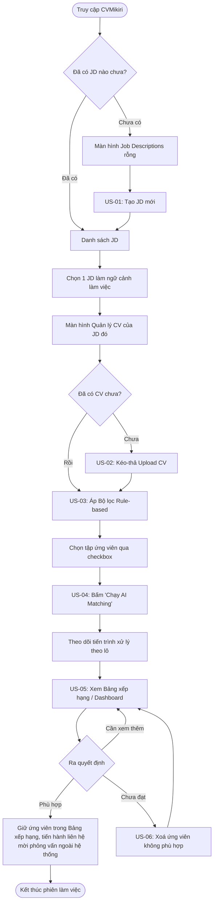
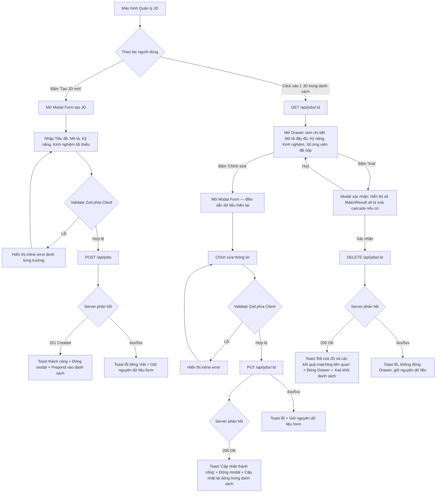
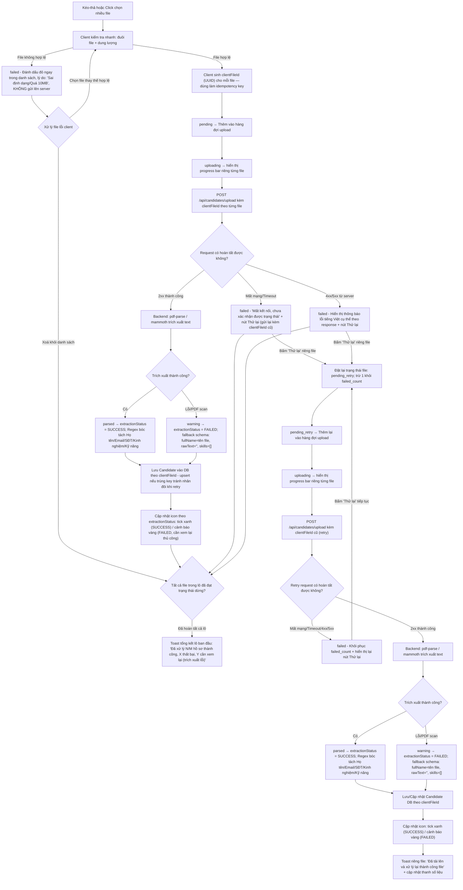
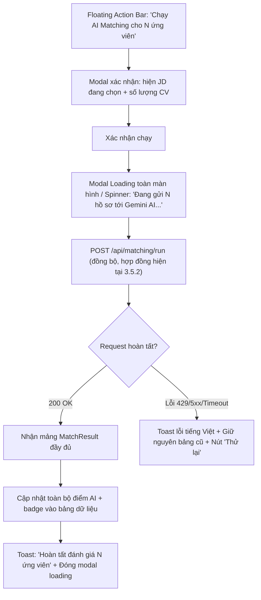
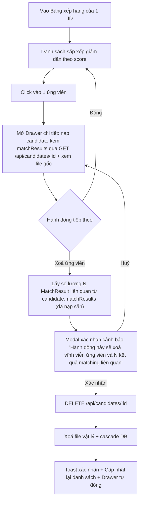
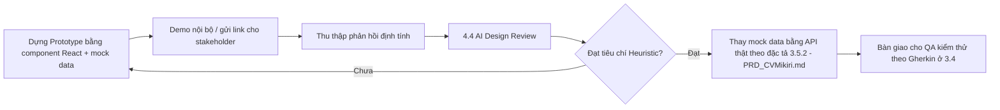
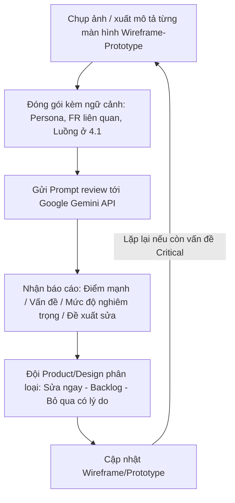

# CHƯƠNG 4: THIẾT KẾ TRẢI NGHIỆM NGƯỜI DÙNG (UX/UI DESIGN)
## DỰ ÁN: CVMikiri — HỆ THỐNG KIỂM TRA, SÀNG LỌC VÀ CHẤM ĐIỂM CV THÔNG MINH

> Chương này kế thừa trực tiếp phạm vi sản phẩm (3.2.2), các Yêu cầu chức năng FR1–FR5 và User Stories US-01 → US-06 đã xác lập ở Chương 3, cụ thể hoá thành: (4.1) Luồng người dùng chi tiết cho từng tác vụ, (4.2) Bố cục khung màn hình (wireframe) mức low-fidelity, (4.3) Quy trình dựng bản mẫu tương tác (prototype), và (4.4) Quy trình dùng AI để tự đánh giá và tinh chỉnh thiết kế trước khi bàn giao cho Frontend Developer.
>
> 📌 **QUY ƯỚC QUẢN LÝ TÀI LIỆU (SINGLE SOURCE OF TRUTH)**:
> Tài liệu thiết kế Chương 4 được chuẩn hoá và quản lý theo cấu trúc modular trong thư mục `docs/Chuong4/`:
> - [4.1 Luồng Người dùng (User Flow)](file:///d:/StudyMaterials/MikiriCV/docs/Chuong4/UserFlow.md)
> - [4.2 Bố cục Khung (Wireframing)](file:///d:/StudyMaterials/MikiriCV/docs/Chuong4/Wireframe.md)
> - [4.3 Tạo Bản mẫu (Prototyping)](file:///d:/StudyMaterials/MikiriCV/docs/Chuong4/Prototyping.md)
> - [4.4 AI Đánh giá Thiết kế (AI Design Review)](file:///d:/StudyMaterials/MikiriCV/docs/Chuong4/AIDesignReview.md)
>
> File `Chuong4_CVMikiri_UX.md` này đóng vai trò bản hợp nhất toàn văn để phục vụ việc tham khảo tổng thể, đồng bộ 100% với các tệp chi tiết trên.

---

## 4.1 Luồng Người dùng (User Flow)

### 4.1.1 Nguyên tắc thiết kế luồng
Toàn bộ luồng người dùng của CVMikiri được thiết kế theo nguyên tắc **"Lọc rẻ trước — Chấm AI sau"** (Two-tier Hybrid Screening đã nêu ở 3.1.3), nhằm đảm bảo:
* Người dùng luôn thao tác trên **tập ứng viên đã được thu hẹp** trước khi tốn chi phí gọi AI.
* Không có bước nào là "ngõ cụt" (dead-end) — mỗi màn hình luôn có lối ra rõ ràng (quay lại, tiếp tục, hoặc CTA chính).
* Trạng thái lỗi (file sai định dạng, AI timeout, JD trống) đều được xử lý ngay tại bước phát sinh, không đẩy người dùng ra khỏi luồng.

### 4.1.2 Luồng tổng quan cấp cao (Master Flow)


> **Ghi chú phạm vi (đã hiệu chỉnh)**: Nhánh "Phù hợp" ở bản trước dẫn tới hành động "Đánh dấu / Xuất danh sách mời phỏng vấn" — đây là chức năng **chưa được định nghĩa** ở bất kỳ FR nào trong phạm vi MVP (3.2.2.A) và cũng không có API endpoint tương ứng ở 3.5.2. Để tránh Frontend triển khai một CTA không có backend contract, Master Flow chỉ dừng ở việc **giữ nguyên ứng viên trong Bảng xếp hạng** (hành vi mặc định, không cần thêm FR) — việc liên hệ mời phỏng vấn được thực hiện ngoài hệ thống ở giai đoạn MVP. Chức năng "Đánh dấu / Shortlist" và "Xuất báo cáo Excel/PDF" đã được đặt đúng chỗ trong roadmap mở rộng (Wave 1: Shortlist management; Wave 3: Export) và **cần được bổ sung FR, API, định dạng xuất, cùng trạng thái lỗi tương ứng** trước khi đưa vào bất kỳ luồng thiết kế nào ở các phiên bản sau.

### 4.1.3 Luồng chi tiết theo từng User Story

#### a) Luồng FR1 / US-01 — Tạo & Quản lý JD

* **Điểm chạm cảm xúc (Emotional touchpoint)**: Toast "Tạo Job Description thành công" xuất hiện góc phải dưới, tự ẩn sau 3s, không chặn thao tác tiếp theo — giữ nhịp làm việc liên tục cho HR đang xử lý nhiều JD cùng lúc.
* **Ràng buộc QA quan trọng**: Modal xác nhận xoá JD **phải hiển thị rõ số lượng `MatchResult` sẽ bị cascade xoá** trước khi người dùng bấm xác nhận, đúng theo Gherkin "Xóa Job Description và các kết quả liên quan" (3.4/US-01) — tránh xoá nhầm dữ liệu chấm điểm đã tốn chi phí AI.
* Nhánh Sửa (FR1.4) tái sử dụng cùng Modal/Form với nhánh Tạo, chỉ khác ở việc prefill dữ liệu và gọi `PUT` thay vì `POST` — giúp giảm chi phí phát triển UI trùng lặp qua endpoint `PUT /api/jobs/:id` đã được chuẩn hoá trong hợp đồng backend.

#### b) Luồng FR2 / US-02 — Upload & Trích xuất CV hàng loạt
> **Ghi chú rủi ro lỗi (bug risk) đã khắc phục**: Bản luồng trước chỉ xử lý lỗi validate phía client (sai định dạng/quá dung lượng) và lỗi trích xuất phía backend, nhưng **bỏ sót nhánh khi chính request `POST upload` thất bại** — do mất mạng, timeout, hoặc server trả 4xx/5xx trước khi kịp xử lý file. Khi đó một file đang ở trạng thái `uploading` sẽ không có lối chuyển tiếp, khiến progress bar treo vô thời hạn — vi phạm nguyên tắc "mỗi file là một đơn vị trạng thái độc lập". Sơ đồ dưới đây bổ sung trạng thái `failed` cho riêng lỗi request, kèm khả năng retry theo từng file.
>
> ⚠️ **2 rủi ro hợp đồng API bổ sung (bug-risk)**:
> 1. **Trùng lặp khi retry sau timeout một phần**: Vì nhiều file được gửi chung 1 request multipart, nếu request timeout **sau khi** server đã lưu thành công một số file, client không biết file nào đã lưu — bấm "Thử lại" qua cùng endpoint có thể tạo `Candidate` và file vật lý trùng lặp. Hợp đồng `POST /api/candidates/upload` hiện tại **chưa định nghĩa idempotency key** hay quy tắc khử trùng. Cần bổ sung theo Phụ lục 4.1.5 trước khi triển khai nút "Thử lại" ở cấp độ file.
> 2. **Lỗi trích xuất bị "biến" thành thành công ngầm**: Theo Edge Case 3.3.3, khi `pdf-parse`/`mammoth` không đọc được nội dung (PDF scan, file khoá mật khẩu), hệ thống vẫn **lưu bản ghi Candidate** kèm "trạng thái cảnh báo" — nhưng model `Candidate` ở 3.3.4 và response API ở 3.5.2 **không có trường trạng thái nào** để phân biệt bản ghi này với một Candidate trích xuất thành công bình thường. Nếu không có trường `extractionStatus` tường minh, UI/DB sẽ không thể tách được Candidate "thiếu dữ liệu bắt buộc" ra khỏi Candidate hợp lệ. Cần bổ sung trường này theo Phụ lục 4.1.5.


* **Máy trạng thái từng file (per-file state machine)**: `pending → uploading → (parsed | warning | failed)`. Trạng thái `failed` được tách riêng theo 2 nguồn gốc: (1) validate client (file sai định dạng/quá dung lượng) cung cấp tuỳ chọn "Chọn file thay thế" hoặc "Xoá khỏi danh sách" — không bị nghẽn ở ngõ cụt; (2) lỗi request/network cung cấp nút "Thử lại" độc lập cho riêng file đó để retry. Nếu retry tiếp tục lỗi (`P_RetryFail`), file tự động quay về trạng thái `failed` và hiển thị lại nút Thử lại, không bị kẹt ở trạng thái lấp lửng.
* **Chống trùng lặp khi retry (bug-risk fix)**: Mỗi file được gán `clientFileId` **ngay từ phía client trước khi gửi** và gửi kèm trong mỗi request/retry. Backend dùng `clientFileId` làm khoá `upsert` khi lưu `Candidate` + file vật lý — nếu request trước đó thực ra đã lưu thành công nhưng client không nhận được response (timeout), lần gửi lại với cùng `clientFileId` sẽ **ghi đè**, không tạo bản ghi thứ hai.
* **Phân biệt rõ trạng thái trích xuất & Quy tắc fallback schema (bug-risk fix - Nhận xét 4)**: `Candidate` được lưu kèm trường `extractionStatus` (`SUCCESS` | `FAILED`). Khi trích xuất thất bại (PDF scan / file khoá mật khẩu / file rỗng), hệ thống vẫn lưu bản ghi để giữ file vật lý cho HR tải lại, nhưng áp dụng các giá trị fallback để thỏa mãn ràng buộc NOT NULL của Prisma model (`fullName` = tên file bỏ đuôi hoặc `'Ứng viên chưa rõ tên'`, `rawText` = `''`, `skills` = `[]`, `yearsOfExperience` = `0`). Bản ghi `FAILED` hiển thị cảnh báo vàng "cần xem lại thủ công", không được tính là thành công trong toast tổng kết và bị loại khỏi danh sách có thể chạy AI Matching.
* **Đồng bộ tổng kết lô & Luồng Thử lại độc lập (bug-risk fix - Nhận xét 2 & 3)**: Toast tổng kết lô chỉ phát ra khi **100% file trong đợt kéo-thả ban đầu** đã rời khỏi trạng thái `uploading`. Quá trình retry sau đó chạy trên pipeline riêng (`J_Retry → O_Retry`), tuyệt đối không nối vào `CheckBatch` của đợt ban đầu, chỉ phát toast thông báo riêng cho từng file và đồng bộ cập nhật thanh số liệu.
* ⚠️ **Rủi ro hợp đồng API bổ sung thứ 3 (bug-risk, mới phát hiện)**: Với Candidate ở trạng thái `FAILED` (trích xuất lỗi), hành vi hợp lý là cho phép "Thử lại trích xuất" **mà không cần upload lại file** (vì file vật lý đã lưu trên server). Tuy nhiên hợp đồng 3.5.2 **chưa có endpoint nào để trích xuất lại một Candidate đã tồn tại** (chỉ có `POST /api/candidates/upload` nhận file mới). Cần bổ sung `POST /api/candidates/:id/reextract` theo đặc tả tại **Phụ lục 4.1.5 (E)** trước khi gắn nút "Thử lại trích xuất" vào các bản ghi `FAILED`; nếu chưa có endpoint này, nút "Thử lại" ở nhóm `FAILED` chỉ nên cho phép **xoá và upload lại file mới** thay vì ngụ ý trích xuất lại file cũ.
* **Nguyên tắc UX quan trọng**: mỗi file trong hàng đợi là một **đơn vị trạng thái độc lập**, tránh tình huống 1 file lỗi (dù lỗi định dạng, lỗi trích xuất, hay lỗi mạng/server) làm treo hoặc chặn toàn bộ lô 50 file.
* **Ràng buộc QA bổ sung**: Toast tổng kết ở bước cuối phải phản ánh đúng cả 3 nhóm: **thành công**, **thất bại do request**, và **cần xem lại do lỗi trích xuất** (vd: "Đã xử lý 40/50 hồ sơ thành công, 8 thất bại, 2 cần xem lại") — tránh việc chỉ đếm theo FR2.6 (báo lỗi định dạng) mà bỏ sót lỗi tầng network hoặc gộp nhầm Candidate `FAILED` vào nhóm thành công.

#### c) Luồng FR3 / US-03 — Lọc Rule-based (real-time, < 100ms)
```mermaid
flowchart LR
    A[Người dùng gõ từ khoá / chọn kỹ năng / kéo slider kinh nghiệm] --> B[Áp dụng filter tại chỗ ngay lập tức]
    B --> C[Debounce chỉ gọi GET có query từ xa]
    C --> D[Cập nhật bảng dữ liệu + đếm 'Tìm thấy N ứng viên phù hợp']
    D --> E{Người dùng chọn checkbox ứng viên}
    E --> F[Thanh hành động nổi (Floating Action Bar) xuất hiện: 'Đã chọn N ứng viên — Chạy AI Matching']
```
* Vì FR3 không tốn phí AI, giao diện phải phản hồi **tức thời** — không hiển thị spinner cho thao tác lọc, chỉ debounce nhẹ để tránh gọi API dồn dập khi gõ nhanh.

#### d) Luồng FR4 / US-04 — AI Matching (Gemini)

##### Luồng 1: Baseline MVP (Đồng bộ qua endpoint hiện có `POST /api/matching/run`)
> Áp dụng ngay cho phiên bản hiện tại theo đúng hợp đồng mục 3.5.2 (`PRD_CVMikiri.md`) và backend đã triển khai.



##### Luồng 2: Target UX (Bất đồng bộ qua `POST /api/matching/jobs` — Đề xuất Phụ lục 4.1.5)
> **Mục tiêu tương lai**: Khi backend bổ sung hàng đợi async theo Phụ lục 4.1.5, giao diện chuyển sang hỗ trợ progressive rendering từng dòng, dừng/huỷ giữa chừng (Product Goal 3 / KR3.1 — tối ưu chi phí AI) và tổng kết chính xác số lượng thực tế.

```mermaid
flowchart TD
    A[Floating Action Bar: 'Chạy AI Matching cho N ứng viên'] --> B[Modal xác nhận: hiện JD đang chọn + số CV + ước tính thời gian]
    B --> C[Xác nhận chạy]
    C --> D["POST /api/matching/jobs ⚠️ endpoint async đề xuất — trả về jobId"]
    D --> D2[Backend chia batch 3-5 CV/lượt để tránh Rate Limit, chạy nền theo jobId]
    D2 --> E["Client poll/subscribe GET /api/matching/jobs/:jobId/status — UI hiển thị 'Đang phân tích...' theo từng dòng + nút 'Dừng'"]
    E --> F{Người dùng bấm 'Dừng'?}
    F -- Có --> F2["POST /api/matching/jobs/:jobId/cancel ⚠️ đề xuất"]
    F2 --> G[Backend ngừng nhận batch mới; đánh dấu 'Đã huỷ' các CV chưa gửi; các batch đang chạy dở vẫn tiếp tục xử lý]
    G --> H_Wait{Tiếp tục polling status cho tới khi các batch dở báo cáo xong}
    F -- Không --> H{Kết quả từng CV trả về qua status polling}
    H --> ProcessItem{Xử lý kết quả từng CV}
    H_Wait --> ProcessItem
    ProcessItem -- Thành công --> I[Cập nhật cột Điểm AI + badge màu ngay dòng đó; +1 vào success_count]
    ProcessItem -- Lỗi JSON / Timeout --> J{attempt < 2?}
    J -- Có --> R[Retry tự động; attempt += 1]
    R --> E
    J -- Không (attempt >= 2) --> K["Badge 'Lỗi phân tích' + nút 'Thử lại thủ công'; +1 vào failed_count"]
    I --> CheckJobEnd{Job đã terminal (hoàn tất/huỷ) & mọi batch dở đã báo cáo hết?}
    K --> CheckJobEnd
    CheckJobEnd -- Chưa xong hết batch --> E
    CheckJobEnd -- Đã hoàn tất toàn bộ --> L[Tổng hợp: success_count / failed_count / cancelled_count]
    L --> M{failed_count > 0 hoặc cancelled_count > 0?}
    M -- Không --> N["Toast: 'Hoàn tất đánh giá N/N ứng viên'"]
    M -- Có --> O["Toast: 'Đã đánh giá success_count/tổng; failed_count hồ sơ lỗi, cancelled_count đã huỷ' + nút 'Thử lại các hồ sơ lỗi'"]
```
* **Thiết kế chống chờ đợi vô nghĩa**: vì việc chấm điểm hàng loạt có thể mất 10-30 giây, UI cập nhật **theo từng dòng** ngay khi có kết quả (progressive rendering) thay vì bắt người dùng nhìn một spinner toàn màn hình — **điều kiện tiên quyết**: đã có API async theo Phụ lục 4.1.5.
* **Thao tác Dừng/Huỷ & Polling cạn batch đang chạy (bug-risk fix - Nhận xét 3)**: nút "Dừng" chỉ ngăn các CV **chưa được đưa vào batch** — các CV thuộc batch đang gọi API dở dang vẫn hoàn tất. Client **tiếp tục polling** cho đến khi backend trả về trạng thái job là terminal (`CANCELLED`), đảm bảo mọi batch in-flight đã báo cáo hết kết quả trước khi phát Toast tổng kết.
* **Toast tổng kết chính xác (bug-risk fix)**: không còn cố định là "N/N" — công thức hiển thị luôn dựa trên `success_count`, `failed_count`, `cancelled_count` thực tế, ví dụ: *"Đã đánh giá 8/10; 2 hồ sơ lỗi"* hoặc *"Đã đánh giá 6/10; 3 hồ sơ lỗi, 1 đã huỷ"*. Nút "Thử lại các hồ sơ lỗi" cho phép gom chạy lại đồng thời tất cả CV đang ở trạng thái lỗi mà không cần chọn lại thủ công từng dòng.

#### e) Luồng FR5 / US-05, US-06 — Dashboard, Chi tiết & Xoá

* **Hiển thị số lượng cascade xoá (bug-risk fix - Nhận xét 7)**: Giá trị `N MatchResult liên quan` được lấy trực tiếp từ mảng `candidate.matchResults` đã được backend trả về đầy đủ trong endpoint `GET /api/candidates/:id` khi mở Drawer chi tiết (hoặc từ response danh sách), đảm bảo UI luôn hiển thị số lượng chính xác trước khi người dùng bấm xác nhận xoá.

### 4.1.4 Bảng ánh xạ Luồng ↔ Màn hình ↔ FR
| Luồng | Màn hình chính | FR liên quan | Trạng thái lỗi cần xử lý |
| :--- | :--- | :--- | :--- |
| Tạo/Xem/Sửa/Xoá JD | `Job Descriptions` + Chi tiết JD | FR1 | Thiếu trường bắt buộc, trùng tiêu đề, lỗi khi PUT/DELETE, xoá JD đang có MatchResult |
| Upload CV | `Quản lý CV` (Dropzone) | FR2 | Sai định dạng, quá 10MB, file scan không đọc được, **mất mạng/timeout/4xx-5xx khi gửi request upload** |
| Lọc CV | `Quản lý CV` (Filter Bar) | FR3 | Không có kết quả khớp |
| AI Matching | `AI Matching Studio` | FR4 | Rate limit 429, JSON lỗi định dạng, **người dùng bấm Dừng giữa batch**, toast tổng kết phải phản ánh đúng số thành công/thất bại/đã huỷ |
| Dashboard/Chi tiết | `Bảng xếp hạng (Dashboard)` | FR5 | Chưa có ứng viên nào được chấm điểm |

### 4.1.5 Phụ lục — Hợp đồng API cần bổ sung/điều chỉnh trước khi triển khai
> Mục này tổng hợp toàn bộ khoảng trống giữa **hợp đồng API đã đặc tả ở 3.5.2 (`PRD_CVMikiri.md`)** và **hành vi UX đã thiết kế ở 4.1**, phát sinh từ AI Design Review. Các endpoint dưới đây là **đề xuất bổ sung chính thức**, cần được đội Backend rà soát, chốt schema và cập nhật ngược lại vào `PRD_CVMikiri.md` trước khi Frontend code theo các luồng có đánh dấu ⚠️ ở 4.1.3.

#### A. `GET /api/jobs/:id` — Chi tiết Job Description (mới, phục vụ FR1.2 + Drawer chi tiết)
* **Response (200 OK)**:
```json
{
  "success": true,
  "data": {
    "id": "clx123abc456",
    "title": "Senior Fullstack Developer",
    "description": "Mô tả đầy đủ...",
    "requiredSkills": ["React", "Node.js", "PostgreSQL", "Docker"],
    "minExperience": 3,
    "candidateCount": 25,
    "createdAt": "2026-09-08T10:30:00.000Z",
    "updatedAt": "2026-09-08T10:30:00.000Z"
  }
}
```
* **404**: JD không tồn tại → trả `{ "success": false, "message": "Không tìm thấy Job Description" }`.

#### B. `PUT /api/jobs/:id` — Cập nhật JD (mới, phục vụ FR1.4)
* **Request Body**: giống schema `POST /api/jobs` (title, description, requiredSkills, minExperience) — tái sử dụng nguyên Zod schema đã có.
* **Response (200 OK)**: trả về bản ghi JD sau khi cập nhật (cùng shape với mục A).
* **404 / 400**: JD không tồn tại, hoặc dữ liệu không hợp lệ → trả lỗi validate theo đúng field, dùng chung format lỗi Zod như `POST /api/jobs`.

#### C. Nâng cấp `POST /api/matching/run` thành API bất đồng bộ theo Job (phục vụ FR4 + thao tác Dừng)
* **Bước 1 — Khởi tạo job**: `POST /api/matching/jobs`
```json
// Request
{ "jobDescriptionId": "clx123abc456", "candidateIds": ["cand_001", "cand_002", "..."] }
// Response 202 Accepted
{ "success": true, "data": { "jobId": "mjob_9x8y7z", "totalCandidates": 10, "status": "RUNNING" } }
```
* **Bước 2 — Theo dõi tiến độ**: `GET /api/matching/jobs/:jobId/status`
```json
{
  "success": true,
  "data": {
    "jobId": "mjob_9x8y7z",
    "status": "RUNNING",              // RUNNING | CANCELLING | CANCELLED | COMPLETED
    "totalCandidates": 10,
    "successCount": 6,
    "failedCount": 1,
    "cancelledCount": 0,
    "results": [
      { "candidateId": "cand_001", "status": "SUCCESS", "score": 85, "summary": "...", "matchedSkills": [], "missingSkills": [] },
      { "candidateId": "cand_007", "status": "FAILED", "error": "JSON_SCHEMA_ERROR" }
    ]
  }
}
```
* **Bước 3 — Huỷ job**: `POST /api/matching/jobs/:jobId/cancel`
```json
{ "success": true, "data": { "jobId": "mjob_9x8y7z", "status": "CANCELLING" } }
```
Ứng viên chưa được xếp vào batch nào sẽ chuyển sang `status: "CANCELLED"` trong lần poll tiếp theo; ứng viên thuộc batch đang chạy dở vẫn hoàn tất bình thường (theo đúng thiết kế 4.1.3.d).
* **Tương thích ngược**: nếu chưa kịp triển khai API async, có thể giữ tạm `POST /api/matching/run` đồng bộ hiện tại **kèm giới hạn cứng `candidateIds.length ≤ 10`/lần gọi** để giảm thời gian chờ và giới hạn rủi ro lãng phí token khi chưa có endpoint huỷ — đây là phương án tạm, không phải thiết kế đích.

#### D. Bổ sung Idempotency Key cho `POST /api/candidates/upload` (phục vụ FR2, chống trùng lặp khi retry)
* **Request**: mỗi phần tử trong multipart `files` được gửi kèm một `clientFileId` (UUID sinh phía client) tương ứng, ví dụ qua field `clientFileIds` cùng thứ tự với `files`.
* **Response (200 OK)**:
```json
{
  "success": true,
  "message": "Đã xử lý 3/3 file",
  "data": [
    { "clientFileId": "c1f2...", "id": "cand_001", "extractionStatus": "SUCCESS", "fullName": "Nguyễn Văn An", "...": "..." },
    { "clientFileId": "c3d4...", "id": "cand_002", "extractionStatus": "FAILED", "reason": "Không thể đọc nội dung văn bản (PDF scan hoặc có mật khẩu)" }
  ],
  "errors": []
}
```
* **Quy tắc khử trùng**: Backend `upsert` bản ghi `Candidate` theo khoá duy nhất `clientFileId` (cần thêm cột `clientFileId` — unique — vào model `Candidate` ở 3.3.4). Nếu nhận lại cùng `clientFileId` (do client retry sau timeout), backend **ghi đè** thay vì tạo bản ghi mới, đồng thời xoá file vật lý cũ trước khi lưu file mới nếu có thay đổi.
* **Trường mới trong model `Candidate`**: bổ sung `extractionStatus` (`SUCCESS` | `FAILED`, mặc định `SUCCESS`) và `clientFileId` (`String`, `@unique`) vào Prisma schema tại 3.3.4.

#### E. `POST /api/candidates/:id/reextract` — Trích xuất lại một Candidate đã tồn tại (mới, phục vụ nhánh "Thử lại trích xuất" ở FR2.6)
* **Bối cảnh**: Khi `extractionStatus = FAILED` (PDF scan, file khoá mật khẩu...), file vật lý **đã có sẵn trên server** — không cần bắt người dùng upload lại từ đầu nếu chỉ cần chạy lại bước trích xuất (ví dụ sau khi backend nâng cấp thư viện `pdf-parse`, hoặc người dùng đã gỡ mật khẩu file gốc và thay thế qua endpoint khác).
* **Request**: không cần body, chỉ cần `:id` của Candidate hiện có.
* **Response (200 OK)**:
```json
{
  "success": true,
  "data": {
    "id": "cand_002",
    "extractionStatus": "SUCCESS",
    "rawText": "...",
    "fullName": "...",
    "...": "..."
  }
}
```
* **404**: Candidate không tồn tại. **409/422**: file vật lý gốc không còn tồn tại trên server (đã bị dọn dẹp) → trả lỗi rõ ràng, gợi ý xoá bản ghi và upload lại file mới thay vì trích xuất lại.
* **Ràng buộc UI**: nút "Thử lại trích xuất" trên các dòng `FAILED` **chỉ được hiển thị** khi endpoint này đã tồn tại; nếu chưa triển khai, hành động duy nhất cho bản ghi `FAILED` là "Xoá và tải lên file thay thế" (dùng lại `POST /api/candidates/upload` như một file mới, không tái sử dụng `clientFileId` cũ vì đó là một lượt nộp hồ sơ khác).

---

## 4.2 Bố cục Khung (Wireframing)

### 4.2.1 Chiến lược Wireframe
Wireframe được dựng ở mức **low-fidelity → mid-fidelity** (chưa gán màu thương hiệu, chỉ dùng khối xám và ký hiệu) để đội ngũ tập trung vào **cấu trúc thông tin (Information Hierarchy)** và **luồng thao tác**, trước khi chuyển sang giai đoạn High-fidelity Prototype ở mục 4.3.

Grid hệ thống: **Bố cục 12-cột**, sidebar cố định 240px (desktop), breakpoint responsive tại 768px (tablet) chuyển sidebar thành bottom-nav rút gọn.

### 4.2.2 Wireframe màn hình "Quản lý CV" (màn hình lõi, phức tạp nhất)

```
┌──────────────────────────────────────────────────────────────────────────┐
│ [Logo CVMikiri]   Job Descriptions | Quản lý CV | AI Matching | Dashboard │
├──────────────────────────────────────────────────────────────────────────┤
│ JD đang chọn: ▾ [Senior Fullstack Developer            ]  (25 ứng viên)  │
├──────────────────────────────────────────────────────────────────────────┤
│ ╔═══════════════════ DROPZONE (kéo-thả) ══════════════════════════════╗ │
│ ║        ☁  Kéo thả file PDF/DOCX vào đây, hoặc bấm để chọn (≤10MB)   ║ │
│ ╚═══════════════════════════════════════════════════════════════════╝ │
│  [file1.pdf ▓▓▓▓▓▓▓░░ 70%] [file2.docx ✔] [file3.png ✖ sai định dạng] │
├──────────────────────────────────────────────────────────────────────────┤
│ 🔍[ Tìm từ khoá...      ]  Kỹ năng:▾[React,Node.js] Kinh nghiệm ≥[__]năm │
│                                                    Tìm thấy 12 ứng viên  │
├──────────────────────────────────────────────────────────────────────────┤
│ ☐ | Họ tên        | Email          | KN | Kỹ năng          | Điểm AI| ⋮ │
│ ─────────────────────────────────────────────────────────────────────── │
│ ☑ | Nguyễn Văn An  | an@mail.com    | 4  | [React][Node.js] |  85 🟢 | ⋮ │
│ ☑ | Trần Thị Bình  | binh@mail.com  | 2  | [React]          |  62 🟡 | ⋮ │
│ ☐ | Lê Hoàng C     | c@mail.com     | 1  | [Vue]            |   -    | ⋮ │
├──────────────────────────────────────────────────────────────────────────┤
│           ▓▓▓▓ Đã chọn 2 ứng viên — [ Chạy AI Matching ▶ ] ▓▓▓▓          │  ← Floating Action Bar
└──────────────────────────────────────────────────────────────────────────┘
```
**Ghi chú thiết kế:**
- Thanh Filter (FR3) **luôn dính (sticky)** ngay dưới Dropzone khi cuộn — vì đây là hành động lặp lại nhiều nhất trong phiên làm việc.
- Floating Action Bar chỉ xuất hiện khi `selectedCount > 0`, tránh chiếm diện tích khi chưa cần.
- Cột "Điểm AI" hiển thị badge màu theo đúng ngưỡng đã định nghĩa ở US-05 (🟢≥80 / 🟡50-79 / 🔴<50 / `-` chưa chấm).

### 4.2.3 Wireframe "AI Insight Modal / Drawer" (chi tiết kết quả matching)

```
┌───────────────────────────────────────────┐
│  Nguyễn Văn An            [ x đóng ]       │
│  ─────────────────────────────────────    │
│         ╭───────────────╮                  │
│         │   Score: 85    │  (gauge/circle)  │
│         ╰───────────────╯                  │
│  Nhận xét AI:                               │
│  "Ứng viên có nền tảng vững chắc về..."     │
│  ─────────────────────────────────────    │
│  ✅ Kỹ năng khớp     |  ❌ Kỹ năng thiếu    │
│  [Node.js][TS][PG]   |  [Docker][Redis]     │
│  ─────────────────────────────────────    │
│  [ 📄 Xem CV gốc ]   [ 🗑 Xoá ứng viên ]     │
└───────────────────────────────────────────┘
```
**Ghi chú thiết kế:** Chia rõ 2 cột đối lập màu (xanh lá / đỏ nhạt) cho `matchedSkills` vs `missingSkills` — tận dụng nguyên lý **Gestalt về sự tương phản** giúp Hiring Manager quét thông tin trong < 5 giây, đúng mục tiêu của Persona 2 (3.1.2).

### 4.2.4 Wireframe "Dashboard / Bảng xếp hạng"

```
┌──────────────────────────────────────────────────────────────────┐
│  Bảng xếp hạng: Senior Fullstack Developer                        │
├──────────────────────────────────────────────────────────────────┤
│ [Biểu đồ cột: phân bổ điểm  <50 | 50-70 | 70-85 | >85]  (Recharts)│
├──────────────────────────────────────────────────────────────────┤
│  #1  🟢 85  Nguyễn Văn An    Node.js, TS, PostgreSQL    [Xem >]   │
│  #2  🟡 62  Trần Thị Bình    React, TS                  [Xem >]   │
└──────────────────────────────────────────────────────────────────┘
```
> **Ghi chú khắc phục CTA ngoài phạm vi MVP (broader-impact, đã sửa)**: Bản trước hiển thị nút **"Xuất báo cáo"** ở góc phải header như một hành động đang hoạt động (active CTA). Đây là mâu thuẫn trực tiếp với quyết định đã chốt ở Master Flow (4.1.2) và Phần 3.2.2.B của PRD: chức năng Export **không có FR, không có API endpoint**, và được xếp vào roadmap mở rộng (Wave 3). Nếu Frontend code thẳng theo wireframe có nút này, sẽ tạo ra một CTA không có hành vi/backend hỗ trợ. Nút đã được **gỡ khỏi wireframe MVP**; khi Wave 3 (Export) được chính thức đặc tả (FR mới + endpoint `GET /api/jobs/:id/export?format=xlsx|pdf` hoặc tương đương), nút này mới được thêm lại vào đúng vị trí này kèm trạng thái loading/lỗi riêng.
>
> **Ghi chú khắc phục mâu thuẫn hợp đồng (bug-risk, đã sửa lại)**: Bản trước đổi bucket biểu đồ thành 3 nhóm `<50 / 50–79 / ≥80` để "khớp" badge, nhưng làm sai lệch với **hợp đồng FR5.5 và endpoint `GET /api/jobs/:id/stats` đã đặc tả** ở PRD Chương 3 (3.3.1), vốn trả về đúng **4 nhóm**: `Dưới 50`, `50-70`, `70-85`, `Trên 85`. Nếu chỉ sửa phía wireframe mà không sửa API thật, backend triển khai theo PRD sẽ trả 4 nhóm nhưng UI chỉ có chỗ hiển thị 3 nhóm → dữ liệu bị dồn sai hoặc mất mát khi vẽ biểu đồ.
>
> **Hướng xử lý đã chọn**: theo phương án *"giữ 4 nhóm trong wireframe và ánh xạ badge riêng"* — biểu đồ phân bố quay lại đúng 4 bucket theo hợp đồng API hiện có (**không cần sửa backend**), còn **badge màu của từng dòng ứng viên** (🟢≥80 / 🟡50-79 / 🔴<50) tiếp tục dùng đúng 3 ngưỡng đã định nghĩa ở US-05/4.2.2 — đây là **hai lớp thông tin độc lập phục vụ hai mục đích khác nhau**: biểu đồ mô tả phân bố tổng thể theo đúng response `stats`, badge mô tả xếp loại nhanh cho từng cá nhân theo đúng response `leaderboard`. Hai lớp này **không bắt buộc phải trùng khớp ranh giới** — ví dụ một CV điểm 82 sẽ rơi vào bucket biểu đồ "70-85" nhưng vẫn hiển thị badge 🟢 ở dòng riêng của nó; đây là hành vi được kỳ vọng (by design), cần được ghi chú rõ trong tài liệu bàn giao Frontend để tránh hiểu nhầm là lỗi hiển thị.

### 4.2.5 Nguyên tắc bố cục xuyên suốt
| Nguyên tắc | Áp dụng trong CVMikiri |
| :--- | :--- |
| **Progressive Disclosure** | Thông tin chi tiết (rawText, lịch sử matching) chỉ hiện trong Drawer, không làm rối bảng danh sách chính |
| **Ưu tiên vùng nhìn F-Pattern** | Cột quan trọng nhất (Họ tên, Điểm AI) đặt bên trái/giữa bảng, thao tác phụ (⋮) đặt cuối hàng |
| **Feedback tức thời** | Mọi hành động async (upload, filter, matching) đều có trạng thái loading/success/error riêng biệt, không dùng 1 spinner chung cho cả trang |
| **Empty state có hướng dẫn** | Khi chưa có JD/CV nào, hiển thị minh hoạ + CTA rõ ràng thay vì bảng trắng trơn |

---

## 4.3 Tạo Bản mẫu (Prototyping)

### 4.3.1 Mục tiêu giai đoạn Prototype
Chuyển từ wireframe tĩnh (4.2) sang **bản mẫu tương tác được (clickable prototype)** để:
1. Kiểm chứng luồng người dùng (4.1) có "chạy mượt" trên thực tế thao tác hay không, phát hiện sớm các bước thừa.
2. Thu thập phản hồi của Persona 1 & 2 (giả lập hoặc thật) trước khi Frontend Developer viết code chính thức.
3. Làm tài liệu bàn giao trực quan, đối chiếu song song với đặc tả RESTful API đã có sẵn tại **mục 3.5.2 (PRD_CVMikiri.md)** và mô hình dữ liệu Prisma tại **mục 3.3.4**. Nếu nhóm có duy trì thêm các file `ARCHITECTURE.md` / `API.md` riêng biệt trong repository mã nguồn, cần trỏ Prototype tới đúng phiên bản mới nhất của các file đó; nếu chưa tồn tại, mục 3.5.2 đóng vai trò là nguồn tham chiếu API chính thức duy nhất cho tới khi các file này được tạo.

### 4.3.2 Công cụ & Mức độ trung thực (Fidelity)
| Giai đoạn | Công cụ đề xuất | Mức fidelity | Đầu ra |
| :--- | :--- | :--- | :--- |
| Prototype nhanh nội bộ | Figma (frame liên kết bằng Prototype mode) | Mid-fidelity, đúng màu thương hiệu, chưa cần animation phức tạp | Link Figma chia sẻ cho HR/Lead review |
| Prototype chức năng thật | Component React thật dựng trên Storybook hoặc route riêng `/proto` trong app Vite hiện có | High-fidelity, dữ liệu giả (mock JSON) | Có thể click thật, dùng lại được component khi code chính thức |

> **Khuyến nghị cho CVMikiri**: vì stack đã có sẵn React + Tailwind + Zustand (theo 3.2.1), nên **bỏ qua công cụ thiết kế ngoài và dựng prototype ngay bằng chính component thật với dữ liệu mock** (`mockCandidates.json`, `mockJobs.json`). Cách này giúp tái sử dụng 80–90% code khi chuyển sang tích hợp API thật, tiết kiệm thời gian dựng lại UI hai lần.

### 4.3.3 Kịch bản click-test (Clickable Flow Script)
Bản mẫu tương tác cần đảm bảo đi hết được **kịch bản thử nghiệm** sau, tương ứng trực tiếp các Gherkin Scenario đã viết ở 3.4:

```mermaid
journey
    title Kịch bản Click-test: Từ tạo JD đến ra quyết định phỏng vấn
    section Chuẩn bị
      Tạo JD mới: 5: HR
      Upload 5 CV: 4: HR
    section Sàng lọc
      Lọc theo kỹ năng + kinh nghiệm: 5: HR
      Chọn 3 ứng viên tiềm năng: 5: HR
    section Đánh giá AI
      Chạy AI Matching: 3: HR
      Chờ kết quả từng dòng: 3: HR
    section Ra quyết định
      Mở chi tiết ứng viên #1: 5: Hiring Manager
      So sánh Matched/Missing skills: 5: Hiring Manager
      Xoá ứng viên không đạt: 4: Hiring Manager
```
*(Thang điểm 1–5 mô phỏng mức độ hài lòng kỳ vọng tại mỗi bước — dùng làm baseline để so sánh với kết quả usability test thật sau này.)*

### 4.3.4 Trạng thái cần dựng đầy đủ trong Prototype
Không chỉ dựng "happy path", bản mẫu bắt buộc bao gồm các **trạng thái biên** để tránh việc Frontend Developer phải tự đoán khi code:
* Empty state (chưa có JD / chưa có CV nào).
* Loading state (đang upload, đang chạy AI matching theo từng dòng).
* Error state (file sai định dạng, AI trả lỗi JSON, mất kết nối mạng).
* Success state (toast, badge cập nhật).
* Trạng thái responsive tối thiểu ở breakpoint tablet (768px).

### 4.3.5 Quy trình bàn giao Prototype

> **Ghi chú (đã sửa)**: Bản trước tham chiếu `API.md` như một file đích để tích hợp, nhưng file này chưa xác nhận tồn tại trong repository tại thời điểm viết Chương 4. Để người triển khai luôn có tài liệu đích cụ thể, bước "Thay mock data bằng API thật" trỏ trực tiếp tới đặc tả endpoint đã có sẵn ở **mục 3.5.2 của `PRD_CVMikiri.md`** (Nhóm 1: `/api/jobs`, Nhóm 2: `/api/candidates`, Nhóm 3: `/api/matching`). Nếu về sau nhóm tách riêng `API.md`/`ARCHITECTURE.md` thành file độc lập, cần cập nhật lại tham chiếu này để trỏ đúng phiên bản file đang tồn tại.

---

## 4.4 AI Đánh giá Thiết kế (AI Design Review)

### 4.4.1 Mục đích
Trước khi chuyển Prototype (4.3) thành sản phẩm code chính thức, nhóm sử dụng AI (Google Gemini) như một **"reviewer thiết kế cấp hai"** — độc lập với người đã tự thiết kế — nhằm phát hiện sớm các vấn đề về khả dụng (usability), khả năng tiếp cận (accessibility) và tính nhất quán trước khi tốn công sức phát triển.

> **Lưu ý phạm vi**: AI Design Review đóng vai trò **bổ sung**, không thay thế việc test người dùng thật với Persona 1 & 2. AI giỏi ở việc quét lỗi có tính hệ thống (thiếu trạng thái, vi phạm heuristic phổ biến) nhưng không thay được cảm nhận trải nghiệm thực tế của HR/Recruiter.
>
> **Ghi chú khắc phục nhà cung cấp AI (bug-risk, đã sửa)**: Bản trước dùng "Claude" làm công cụ review, trong khi PRD Chương 3 (3.2.1) chỉ định **Google Gemini** là AI Engine chính thức của sản phẩm — dùng nhà cung cấp khác cho quy trình review dễ gây nhầm lẫn rằng đây là một phần của hợp đồng AI sản phẩm. Mục này nay dùng thống nhất **Google Gemini** làm ví dụ mặc định, đồng thời làm rõ: AI Design Review là một **công cụ quy trình nội bộ** (dùng để chấm UX của wireframe/prototype), hoàn toàn tách biệt khỏi **AI Matching Engine trong FR4** (dùng để chấm điểm CV ↔ JD khi sản phẩm chạy thật). Nếu về sau nhóm muốn dùng một nhà cung cấp LLM khác riêng cho việc review thiết kế (không ảnh hưởng tới hợp đồng AI của sản phẩm), cần ghi chú rõ đây là lựa chọn công cụ nội bộ, không phải thay đổi AI Engine của CVMikiri.

### 4.4.2 Quy trình đưa thiết kế vào AI Review



### 4.4.3 Khung tiêu chí đánh giá (dựa trên 10 Heuristics của Nielsen)
AI được yêu cầu chấm từng màn hình theo khung 10 nguyên tắc khả dụng kinh điển, áp riêng cho ngữ cảnh CVMikiri:

| # | Heuristic (Nielsen) | Câu hỏi kiểm tra áp dụng cho CVMikiri |
| :-- | :--- | :--- |
| 1 | Hiển thị trạng thái hệ thống | Người dùng có luôn biết file đang upload/parse ở bước nào không? |
| 2 | Khớp giữa hệ thống & thế giới thực | Thuật ngữ "Kỹ năng khớp/thiếu" có dễ hiểu hơn "matchedSkills/missingSkills" không? |
| 3 | Quyền kiểm soát & tự do của người dùng | Có thể huỷ giữa chừng khi đang chạy AI Matching 50 CV không? |
| 4 | Nhất quán & theo chuẩn | Badge màu điểm số (🟢🟡🔴) có dùng nhất quán ở cả bảng danh sách và Drawer chi tiết không? |
| 5 | Phòng tránh lỗi | Nút "Xoá JD" có bắt buộc modal xác nhận khi JD đã có MatchResult không? |
| 6 | Nhận biết hơn là ghi nhớ | Khi mở Drawer chi tiết, JD đang so sánh có được nhắc lại rõ ràng không? |
| 7 | Linh hoạt & hiệu quả sử dụng | HR xử lý 200-300 CV/tuần có thao tác chọn hàng loạt (select-all, shift-click) không? |
| 8 | Thẩm mỹ & thiết kế tối giản | Bảng dữ liệu có bị quá tải cột không cần thiết ở màn hình mặc định không? |
| 9 | Giúp người dùng nhận diện, chẩn đoán, phục hồi lỗi | Thông báo lỗi "429 Too Many Requests" có được dịch thành ngôn ngữ nghiệp vụ dễ hiểu không? |
| 10 | Trợ giúp & tài liệu | Có tooltip giải thích ý nghĩa điểm số 0-100 ngay lần đầu người dùng thấy không? |

### 4.4.4 Mẫu Prompt gửi AI Review (đưa vào Google Gemini API)

```text
Bạn là một chuyên gia UX Reviewer cấp cao, có kinh nghiệm đánh giá sản phẩm B2B SaaS
cho ngành HR Tech. Hãy đánh giá màn hình dưới đây của sản phẩm CVMikiri.

Bối cảnh:
- Người dùng chính: HR Recruiter (xử lý 200-300 CV/tuần) và Hiring Manager.
- Mục tiêu màn hình: {{ tên màn hình, ví dụ "Quản lý CV" }}
- Luồng liên quan: {{ mô tả từ mục 4.1 tương ứng }}
- Mô tả/ảnh chụp wireframe: {{ đính kèm mô tả từ 4.2 hoặc ảnh Figma }}

Yêu cầu đánh giá:
1. Chấm điểm 1-5 cho từng mục trong 10 Heuristics của Nielsen, giải thích ngắn gọn lý do.
2. Liệt kê tối đa 5 vấn đề nghiêm trọng nhất (Critical/High/Medium) kèm đề xuất sửa cụ thể.
3. Chỉ ra nếu có mâu thuẫn giữa màn hình này với Yêu cầu chức năng FR đã cung cấp.
4. Không bịa ra vấn đề nếu thông tin không đủ để đánh giá — hãy nêu rõ những gì cần bổ sung.

Trả lời bằng tiếng Việt, súc tích, dùng bảng cho phần chấm điểm.
```

### 4.4.5 Ví dụ Báo cáo AI Design Review (minh hoạ cho màn hình "Quản lý CV")

| Heuristic | Điểm (1-5) | Nhận xét |
| :--- | :--- | :--- |
| 1. Hiển thị trạng thái hệ thống | 4 | Progress bar theo từng file rõ ràng; cần thêm trạng thái "đang trích xuất text" tách biệt với "đang upload" |
| 3. Quyền kiểm soát & tự do | 2 | **Vấn đề**: chưa có nút "Huỷ" khi đang chạy AI Matching hàng loạt — nếu chọn nhầm 50 CV, người dùng buộc phải đợi hết |
| 7. Linh hoạt & hiệu quả | 3 | Chưa thấy tuỳ chọn "Chọn tất cả" trong bảng — bất tiện khi HR muốn chấm AI cho toàn bộ danh sách đã lọc |
| 9. Nhận diện & phục hồi lỗi | 3 | Thông báo "sai định dạng" tốt, nhưng khi AI lỗi 429 cần thông điệp kiểu "Hệ thống đang xử lý quá nhiều hồ sơ cùng lúc, vui lòng thử lại sau ít phút" thay vì mã lỗi kỹ thuật |

**Vấn đề nghiêm trọng nhất được AI gắn cờ (Critical):**
> *"Floating Action Bar hiện chỉ có nút 'Chạy AI Matching', không có cách nào huỷ một tác vụ AI Matching đang chạy dở cho hàng loạt CV. Với NFR2 (tối ưu chi phí AI), việc gọi nhầm 1 lô lớn không thể huỷ giữa chừng gây lãng phí token trực tiếp — nên bổ sung nút 'Dừng' xuất hiện thay thế nút Chạy trong lúc xử lý."*

### 4.4.6 Quy tắc phân loại & xử lý phản hồi từ AI
| Mức độ | Tiêu chí | Hành động |
| :--- | :--- | :--- |
| **Critical** | Chặn hoàn thành tác vụ chính (FR1-FR5) hoặc vi phạm NFR đã cam kết | Sửa ngay trước khi code Frontend chính thức |
| **High** | Gây khó chịu rõ rệt cho Persona chính nhưng có thể dùng tạm được | Đưa vào Sprint gần nhất |
| **Medium** | Cải thiện trải nghiệm nhưng không ảnh hưởng luồng chính | Đưa vào Backlog (có thể gộp Wave 1-4 ở roadmap) |
| **Bỏ qua có lý do** | AI hiểu sai ngữ cảnh nghiệp vụ hoặc đề xuất vượt phạm vi MVP (3.2.2.B) | Ghi chú lý do từ chối để tránh review viên sau lặp lại câu hỏi |

### 4.4.7 Giới hạn của AI Design Review (cần lưu ý khi áp dụng)
* AI đánh giá dựa trên **mô tả/ảnh chụp tĩnh**, không "cảm" được độ trễ thực tế, độ mượt animation hay cảm giác cầm nắm trên thiết bị thật.
* Kết quả review phụ thuộc nhiều vào **chất lượng ngữ cảnh cung cấp** (Persona, FR, luồng) — thiếu ngữ cảnh sẽ khiến AI đưa ra góp ý chung chung, không đặc thù cho HR Tech.
* Không dùng AI Review để **thay thế** hoàn toàn bước kiểm thử người dùng thật (usability testing) trước khi ra mắt bản chính thức — đây vẫn là bước bắt buộc trước khi Go-live.

---

## TỔNG KẾT CHƯƠNG 4
Chương 4 đã cụ thể hoá các yêu cầu chức năng và User Stories của Chương 3 thành: luồng thao tác chi tiết theo từng FR (4.1), bố cục khung màn hình lõi (4.2), quy trình dựng bản mẫu tương tác tái sử dụng trực tiếp component React (4.3), và một vòng lặp đánh giá thiết kế có sự hỗ trợ của AI dựa trên 10 Heuristics của Nielsen (4.4). Đầu ra của chương này là cơ sở trực tiếp để đội Frontend triển khai giao diện thật, thay thế mock data bằng các API đã đặc tả tại mục 3.5.2.
