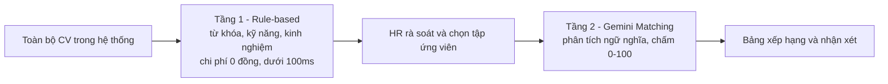
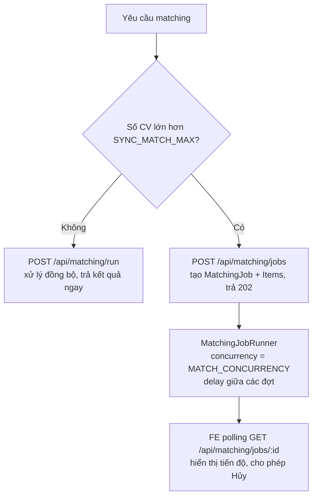

## 5.2 Các Mô hình Kiến trúc (Architecture Patterns)

### 5.2.1 Tổng hợp các mô hình được áp dụng

| Mô hình | Áp dụng ở đâu | Vấn đề giải quyết | Đánh đổi |
| :--- | :--- | :--- | :--- |
| **Client–Server / SPA + REST** | React ↔ Express | Tách UI và nghiệp vụ, key AI ở server (NFR1) | Cần quản lý trạng thái phía client |
| **Layered Architecture** | Backend: Controller → Service → Repository | Tách trách nhiệm, dễ test và thay hạ tầng | Nhiều file hơn với CRUD đơn giản |
| **Modular Monolith** | `modules/jobs`, `candidates`, `matching`, `stats` | Ranh giới rõ nhưng vẫn một đơn vị triển khai | Cần kỷ luật để module không gọi chéo tùy tiện |
| **Hybrid Two-tier Screening** (lọc thô → AI) | Candidates filter → Matching Studio | Cắt ≥ 60% chi phí token (KR 3.1) | HR phải chủ động chọn tập ứng viên |
| **Pipeline (Pipes & Filters)** | Ingest CV: validate → lưu → trích xuất → bóc tách → lưu DB | Mỗi bước thay thế/kiểm thử độc lập | Cần định nghĩa rõ hợp đồng giữa các bước |
| **Hexagonal / Ports & Adapters** (cho phần AI, lưu trữ) | `AIMatchingProvider`, `FileStorage` | Cô lập dịch vụ ngoài; đổi Gemini/S3 không sửa nghiệp vụ | Thêm một lớp trừu tượng |
| **Job Queue / Worker (in-process)** | `MatchingJobRunner` | Xử lý lô lớn, kiểm soát rate limit, tiến độ, hủy | Mất tiến trình khi crash → phải khôi phục từ DB |
| **Anti-Corruption Layer** | `sanitizer` + Zod cho phản hồi LLM | Không để dữ liệu "bẩn" từ LLM chạm tới CSDL | Thêm bước kiểm tra |
| **Idempotent Receiver** | `POST /api/candidates/upload` | Retry không tạo ứng viên trùng | Cần bảng khóa + dọn dẹp định kỳ |

### 5.2.2 Phương án kiến trúc đã cân nhắc

| Tiêu chí | **Modular monolith (chọn)** | Microservices | Serverless (Functions) |
| :--- | :--- | :--- | :--- |
| Độ phức tạp vận hành | Thấp | Cao (nhiều service, mạng, giám sát) | Trung bình |
| Phù hợp quy mô MVP | Rất phù hợp | Quá mức cần thiết | Phù hợp một phần |
| Xử lý tệp upload & job dài | Dễ (đĩa cục bộ, tiến trình sống lâu) | Dễ nhưng phức tạp hóa | Khó (giới hạn thời gian/dung lượng) |
| On-premise / Private Cloud (Lean Canvas) | Dễ | Khó | Không phù hợp |
| Chi phí hạ tầng | Thấp | Cao | Theo lượt gọi |
| **Kết luận** | ✅ | ❌ | ❌ |

### 5.2.3 Mô hình lọc 2 tầng (Hybrid Two-tier Screening)

* **Ranh giới cứng:** API matching chỉ nhận `candidateIds` do người dùng chọn — không có chế độ "chấm toàn bộ" nên không thể vô tình đốt chi phí (KR 3.1).
* **Ứng viên `extractionStatus = FAILED`** (không đọc được nội dung) bị bỏ qua ở tầng 2 và được báo rõ lý do, tránh gửi dữ liệu rỗng tới AI.
* **Chuẩn hóa kỹ năng ở tầng 1** bằng từ điển alias (`Golang → Go`, `NodeJS → Node.js`) để khắc phục điểm yếu "so khớp chuỗi cứng" của ATS truyền thống đã nêu ở mục 3.1.1.

### 5.2.4 Mô hình xử lý bất đồng bộ cho AI Matching

**Cam kết thiết kế:**

1. **Hủy hợp tác (cooperative cancel):** cờ `cancelRequested` được runner kiểm tra trước mỗi đợt; kết quả đã chấm được **giữ lại**, mục chưa chạy chuyển `SKIPPED`.
2. **Lỗi cục bộ:** một CV lỗi (sau tối đa 2 lần retry — FR4.5) chỉ đánh dấu `FAILED` cho mục đó; job vẫn tiếp tục.
3. **Rate limit (429 từ Gemini):** áp dụng backoff mũ có jitter, tôn trọng `Retry-After` nếu có; vượt ngưỡng retry → mục `FAILED` với mã `AI_RATE_LIMITED`.
4. **Khôi phục sau restart:** khi `server.ts` khởi động, mọi job `RUNNING` được chuyển về `QUEUED` và chỉ xử lý các mục còn `PENDING` — không chấm lại mục đã xong.
5. **Giới hạn đã biết:** runner chạy trong một tiến trình, nên không chạy nhiều instance `api` song song cho cùng DB ở MVP (xem ADR-05 để nâng cấp).

---
