## 5.3 Mô hình hóa Hệ thống & UML

### 5.3.1 Biểu đồ Use Case

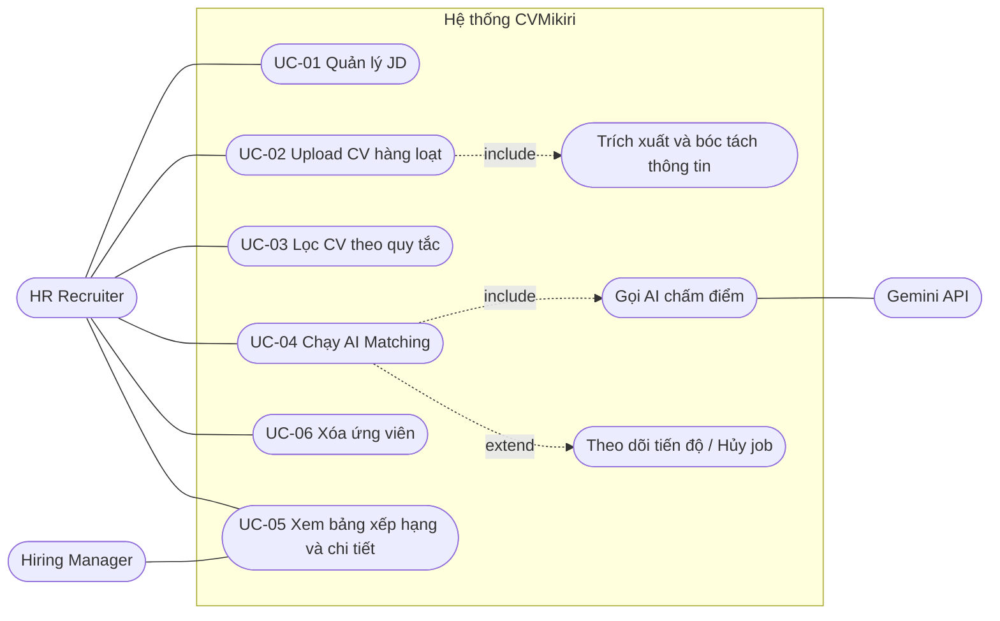

| Use case | Tác nhân chính | Tiền điều kiện | Luồng chính | Ngoại lệ | Truy vết |
| :--- | :--- | :--- | :--- | :--- | :--- |
| UC-01 Quản lý JD | HR | — | Tạo/xem/sửa/xóa JD | Thiếu trường → lỗi tiếng Việt | FR1, US-01 |
| UC-02 Upload CV | HR | — | Chọn file → hệ thống lưu, trích xuất, bóc tách → trả danh sách thành công/thất bại | Sai định dạng, quá 10MB, PDF scan/khóa mật khẩu | FR2, US-02 |
| UC-03 Lọc CV | HR | Có ≥ 1 ứng viên | Nhập từ khóa/kỹ năng/kinh nghiệm → danh sách cập nhật | Không có kết quả → trạng thái rỗng | FR3, US-03 |
| UC-04 AI Matching | HR / HM | Có JD và tập CV đã chọn | Chọn JD + CV → chạy → lưu kết quả (upsert) | AI lỗi/429/JSON sai → mục lỗi, job tiếp tục | FR4, US-04 |
| UC-05 Xem xếp hạng | HM / HR | Có kết quả matching | Mở bảng xếp hạng theo JD → mở drawer chi tiết | JD chưa có kết quả → hướng dẫn chạy matching | FR5.2–5.3, US-05 |
| UC-06 Xóa ứng viên | HR | Ứng viên tồn tại | Xác nhận → xóa DB (cascade) → xóa tệp | Xóa tệp lỗi → ghi log tệp mồ côi | FR5.4, US-06 |

### 5.3.2 Biểu đồ Lớp — Mô hình miền (Domain Model)

```mermaid
classDiagram
    class JobDescription {
        +String id
        +String title
        +String description
        +String[] requiredSkills
        +Int minExperience
        +DateTime createdAt
        +DateTime updatedAt
    }
    class Candidate {
        +String id
        +String fullName
        +String email
        +String phone
        +String rawText
        +String searchText
        +String[] skills
        +Int yearsOfExperience
        +String education
        +String fileName
        +String fileUrl
        +ExtractionStatus extractionStatus
        +String extractionMessage
    }
    class MatchResult {
        +String id
        +Int score
        +String summary
        +String[] matchedSkills
        +String[] missingSkills
        +String modelName
        +DateTime updatedAt
    }
    class MatchingJob {
        +String id
        +MatchingJobStatus status
        +Int total
        +Int processed
        +Int failed
        +Boolean cancelRequested
    }
    class MatchingJobItem {
        +String id
        +MatchingItemStatus status
        +Int attempts
        +String errorMessage
    }
    JobDescription "1" --> "0..*" MatchResult
    Candidate "1" --> "0..*" MatchResult
    JobDescription "1" --> "0..*" MatchingJob
    MatchingJob "1" *-- "1..*" MatchingJobItem
    Candidate "1" --> "0..*" MatchingJobItem
```

### 5.3.3 Biểu đồ Lớp — Tầng dịch vụ & Adapter

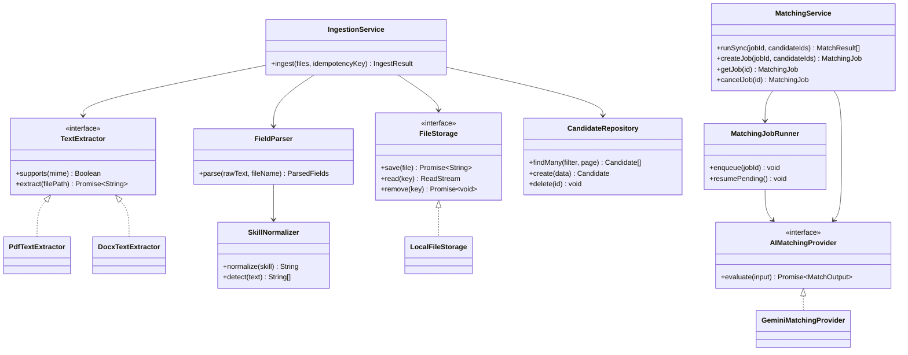

### 5.3.4 Biểu đồ Tuần tự

#### A. Upload CV có idempotency (UC-02)

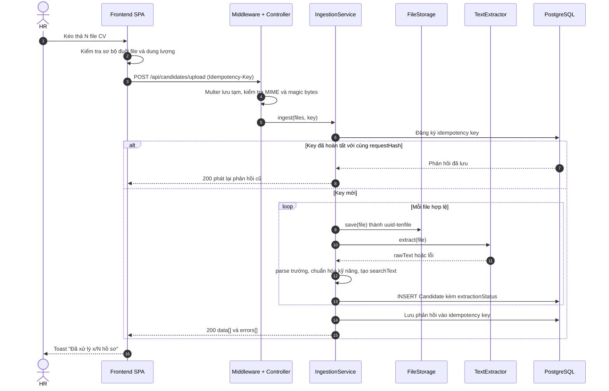

#### B. AI Matching bất đồng bộ (UC-04)

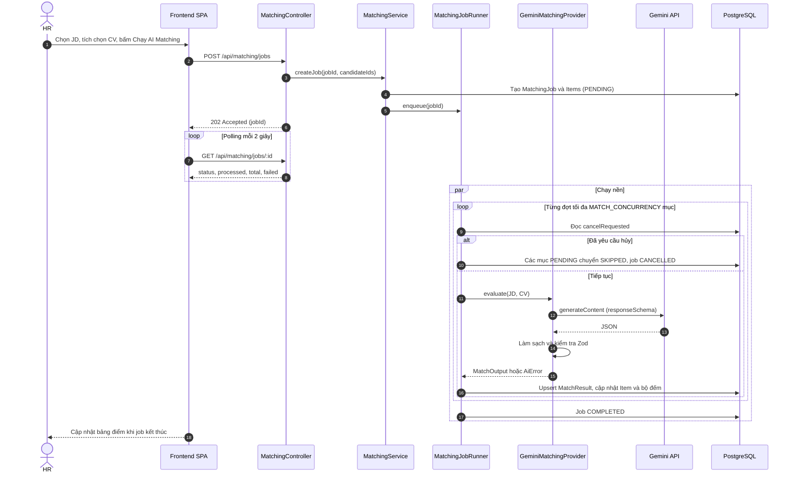

#### C. Xóa ứng viên (UC-06)

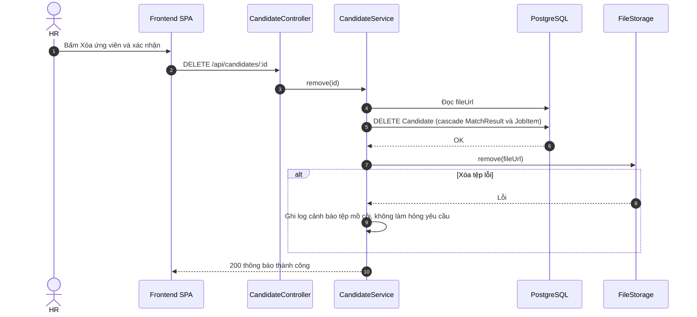

> **Thứ tự quan trọng:** xóa bản ghi DB **trước**, xóa tệp **sau**. Nếu ngược lại, lỗi giữa chừng sẽ để lại bản ghi trỏ tới tệp không tồn tại (xấu hơn một tệp mồ côi). Tệp mồ côi được dọn bằng lệnh bảo trì định kỳ (mục 5.4.8).

### 5.3.5 Biểu đồ Hoạt động — Pipeline trích xuất CV

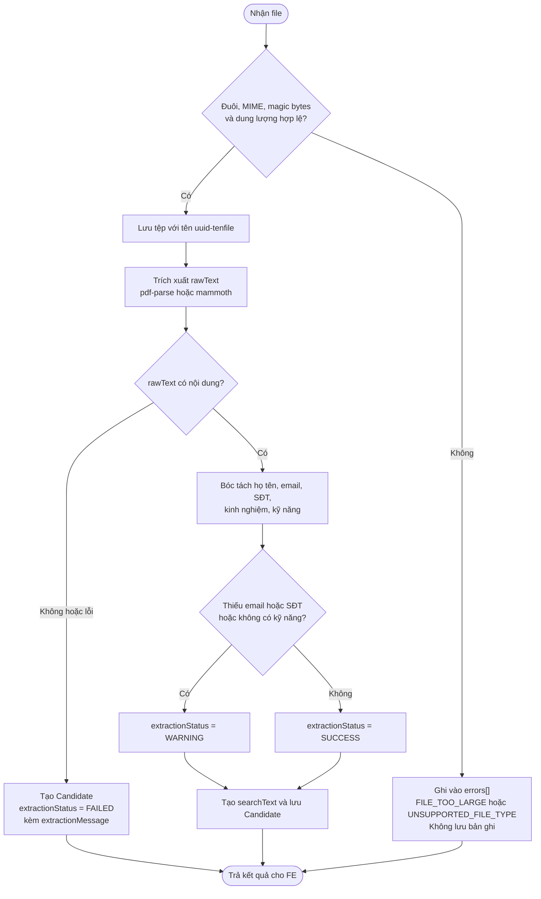

### 5.3.6 Biểu đồ Trạng thái

**Vòng đời `MatchingJob`:**

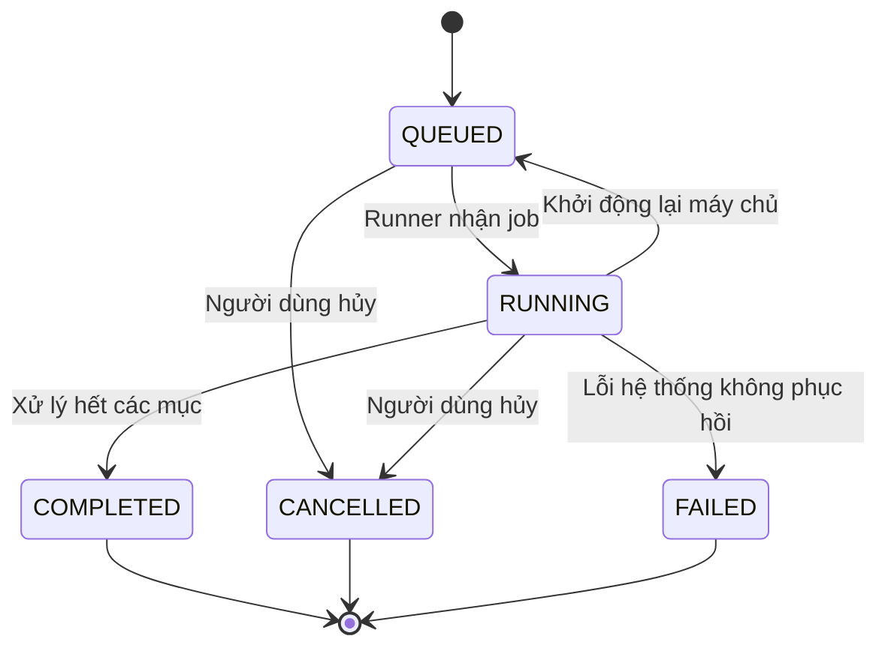

**Vòng đời `MatchingJobItem`:**

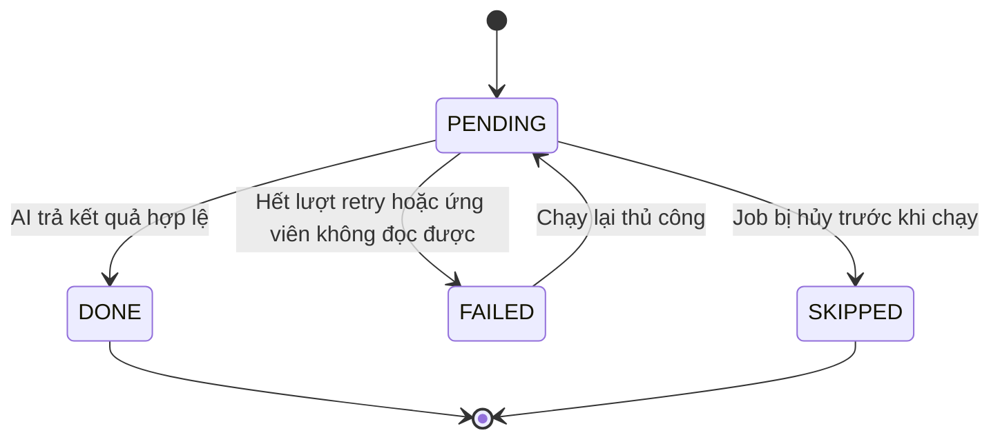

**`Candidate.extractionStatus`:**

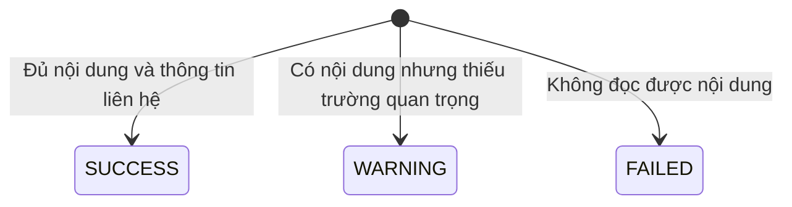

> Ý nghĩa nghiệp vụ: `SUCCESS` — dùng bình thường; `WARNING` — vẫn được chấm AI nhưng HR nên kiểm tra thông tin liên hệ; `FAILED` — **không** được chạy AI Matching, giao diện hiển thị thông điệp ở `extractionMessage` (mục 3.3.3-1).

### 5.3.7 Biểu đồ Thành phần Frontend

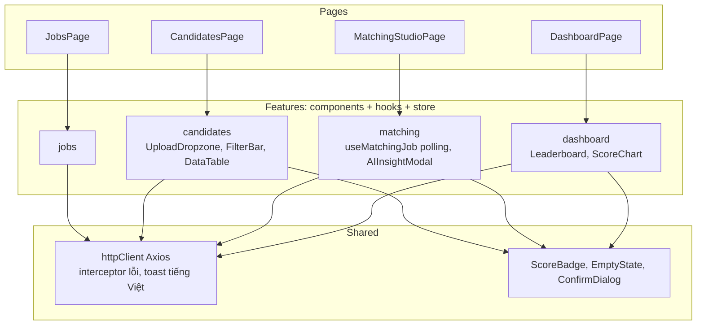

---
