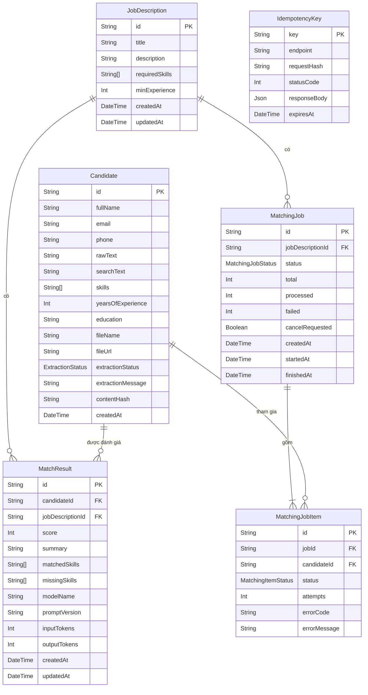

## 5.4 Thiết kế Cơ sở Dữ liệu (Database Design)

> **Cập nhật FR6–FR7:** Prisma `User` lưu email, bcrypt hash, vai trò, trạng thái, token version và trạng thái bắt buộc đổi mật khẩu. `JobDescription` và `Candidate` có `ownerId` FK tới `users` (`ON DELETE CASCADE`) cùng index; MatchResult thừa kế phạm vi qua JD/Candidate. Migration `20261007000000_auth_tenant` backfill bản ghi MVP về user hệ thống đã vô hiệu hóa; xem [ADR-08](ADR-08-authentication-tenant.md).

### 5.4.1 Nguyên tắc thiết kế

1. **PostgreSQL + Prisma** là nguồn duy nhất của schema; mọi thay đổi đi qua `prisma migrate`.
2. **Toàn vẹn bằng ràng buộc DB**, không chỉ bằng code: khóa ngoại + `onDelete: Cascade` + `@@unique([candidateId, jobDescriptionId])`.
3. **Tách dữ liệu nặng khỏi danh sách:** `rawText`/`searchText` rất lớn, các truy vấn danh sách dùng `select` rõ ràng để không kéo về.
4. **Trạng thái dạng enum** thay vì chuỗi tự do.
5. **Phản ánh nhu cầu đo OKR:** lưu `modelName`, `promptVersion`, số token vào `MatchResult`.

### 5.4.2 Mô hình quan hệ thực thể (ERD)



### 5.4.3 Prisma Schema đầy đủ (`backend/prisma/schema.prisma`)

```prisma
datasource db {
  provider = "postgresql"
  url      = env("DATABASE_URL")
}

generator client {
  provider = "prisma-client-js"
}

enum ExtractionStatus {
  SUCCESS
  WARNING
  FAILED
}

enum MatchingJobStatus {
  QUEUED
  RUNNING
  COMPLETED
  CANCELLED
  FAILED
}

enum MatchingItemStatus {
  PENDING
  DONE
  FAILED
  SKIPPED
}

model JobDescription {
  id             String        @id @default(uuid())
  title          String
  description    String        @db.Text
  requiredSkills String[]
  minExperience  Int           @default(0)
  createdAt      DateTime      @default(now())
  updatedAt      DateTime      @updatedAt
  matchResults   MatchResult[]
  matchingJobs   MatchingJob[]

  @@index([createdAt(sort: Desc)])
  @@map("job_descriptions")
}

model Candidate {
  id                String           @id @default(uuid())
  fullName          String
  email             String?
  phone             String?
  rawText           String           @default("") @db.Text
  searchText        String           @default("") @db.Text   // không dấu, chữ thường: fullName + rawText
  skills            String[]
  yearsOfExperience Int              @default(0)
  education         String?
  fileName          String
  fileUrl           String                                   // khóa lưu trữ nội bộ, KHÔNG trả ra API
  extractionStatus  ExtractionStatus @default(SUCCESS)
  extractionMessage String?
  contentHash       String?                                  // SHA-256 của tệp, phục vụ phát hiện trùng (giai đoạn sau)
  createdAt         DateTime         @default(now())
  matchResults      MatchResult[]
  jobItems          MatchingJobItem[]

  @@index([createdAt(sort: Desc)])
  @@index([yearsOfExperience])
  @@index([skills], type: Gin)
  @@index([contentHash])
  @@map("candidates")
}

model MatchResult {
  id               String         @id @default(uuid())
  candidateId      String
  jobDescriptionId String
  score            Int
  summary          String         @db.Text
  matchedSkills    String[]
  missingSkills    String[]
  modelName        String?
  promptVersion    String?
  inputTokens      Int?
  outputTokens     Int?
  createdAt        DateTime       @default(now())
  updatedAt        DateTime       @updatedAt                 // thời điểm chấm gần nhất (upsert)

  candidate        Candidate      @relation(fields: [candidateId], references: [id], onDelete: Cascade)
  jobDescription   JobDescription @relation(fields: [jobDescriptionId], references: [id], onDelete: Cascade)

  @@unique([candidateId, jobDescriptionId])
  @@index([jobDescriptionId, score(sort: Desc)])             // bảng xếp hạng
  @@map("match_results")
}

model MatchingJob {
  id               String            @id @default(uuid())
  jobDescriptionId String
  status           MatchingJobStatus @default(QUEUED)
  total            Int
  processed        Int               @default(0)
  failed           Int               @default(0)
  cancelRequested  Boolean           @default(false)
  errorMessage     String?
  createdAt        DateTime          @default(now())
  startedAt        DateTime?
  finishedAt       DateTime?

  jobDescription   JobDescription    @relation(fields: [jobDescriptionId], references: [id], onDelete: Cascade)
  items            MatchingJobItem[]

  @@index([status])
  @@index([jobDescriptionId, createdAt(sort: Desc)])
  @@map("matching_jobs")
}

model MatchingJobItem {
  id           String             @id @default(uuid())
  jobId        String
  candidateId  String
  status       MatchingItemStatus @default(PENDING)
  attempts     Int                @default(0)
  errorCode    String?
  errorMessage String?
  finishedAt   DateTime?

  job          MatchingJob        @relation(fields: [jobId], references: [id], onDelete: Cascade)
  candidate    Candidate          @relation(fields: [candidateId], references: [id], onDelete: Cascade)

  @@unique([jobId, candidateId])
  @@index([jobId, status])
  @@map("matching_job_items")
}

model IdempotencyKey {
  key          String   @id
  endpoint     String
  requestHash  String
  statusCode   Int?                    // null = đang xử lý
  responseBody Json?
  createdAt    DateTime @default(now())
  expiresAt    DateTime

  @@index([expiresAt])
  @@map("idempotency_keys")
}
```

### 5.4.4 Từ điển dữ liệu (các bảng mới/thay đổi so với Chương 3)

**`candidates` — trường bổ sung**

| Trường | Kiểu | Ràng buộc | Mô tả |
| :--- | :--- | :--- | :--- |
| `searchText` | text | NOT NULL, default `''` | Văn bản đã chuẩn hóa (NFD → bỏ dấu, `đ → d`, chữ thường) của `fullName + rawText`, phục vụ FR3.1 và US-03 |
| `extractionStatus` | enum | NOT NULL, default `SUCCESS` | `SUCCESS` / `WARNING` / `FAILED` (ý nghĩa ở mục 5.3.6) |
| `extractionMessage` | text | NULL | Thông điệp tiếng Việt hiển thị cho HR khi `WARNING`/`FAILED` |
| `contentHash` | varchar | NULL, index | SHA-256 nội dung tệp; chưa dùng để chặn trùng ở MVP |
| `rawText` | text | NOT NULL, default `''` | Có thể rỗng khi `FAILED` |

**`match_results` — trường bổ sung**

| Trường | Kiểu | Mô tả |
| :--- | :--- | :--- |
| `updatedAt` | timestamp | Thời điểm chấm gần nhất. API trả ra dưới tên `evaluatedAt` (vì `createdAt` giữ nguyên sau upsert) |
| `modelName`, `promptVersion` | varchar | Truy vết kết quả với phiên bản model/prompt đã dùng |
| `inputTokens`, `outputTokens` | int | Đo chi phí thực tế, chứng minh KR 3.1 |

**`matching_jobs`**

| Trường | Kiểu | Mô tả |
| :--- | :--- | :--- |
| `status` | enum | `QUEUED`, `RUNNING`, `COMPLETED`, `CANCELLED`, `FAILED` |
| `total` / `processed` / `failed` | int | Tiến độ hiển thị trên UI (`processed` gồm cả `failed`) |
| `cancelRequested` | boolean | Cờ hủy hợp tác |
| `startedAt` / `finishedAt` | timestamp | Đo thời lượng xử lý |

**`matching_job_items`:** `status` (`PENDING/DONE/FAILED/SKIPPED`), `attempts` (số lần gọi AI), `errorCode`/`errorMessage` (mã lỗi theo mục 5.5.4). Ràng buộc `UNIQUE(jobId, candidateId)` ngăn một ứng viên xuất hiện hai lần trong cùng job.

**`idempotency_keys`:** `statusCode`/`responseBody` còn `NULL` nghĩa là yêu cầu **đang xử lý** (yêu cầu trùng key khi đó nhận `409 REQUEST_IN_PROGRESS`). Bản ghi hết hạn sau 24 giờ (`expiresAt`).

### 5.4.5 Chiến lược chỉ mục & Tìm kiếm tiếng Việt

| Truy vấn | Chỉ mục | Ghi chú |
| :--- | :--- | :--- |
| Lọc kỹ năng (`hasSome`/`hasEvery`) | `GIN(skills)` | Kỹ năng lưu dạng **chuẩn hóa** (`Node.js`, `Go`…), nên so khớp không phân biệt biến thể gõ |
| Lọc kinh nghiệm `>= n` | `B-tree(yearsOfExperience)` | |
| Từ khóa tự do | `GIN(searchText gin_trgm_ops)` | Cần SQL migration thủ công vì Prisma chưa mô tả `gin_trgm_ops` |
| Danh sách mới nhất | `B-tree(createdAt DESC)` | |
| Bảng xếp hạng theo JD | `B-tree(jobDescriptionId, score DESC)` | |
| Tiến độ job | `(jobId, status)` | |

**SQL migration bổ sung** (tạo bằng `prisma migrate dev --create-only` rồi chỉnh tay):

```sql
CREATE EXTENSION IF NOT EXISTS pg_trgm;

CREATE INDEX candidates_search_text_trgm_idx
  ON candidates USING GIN ("searchText" gin_trgm_ops);
```

**Hàm chuẩn hóa dùng chung** cho cả lúc ghi `searchText` và lúc nhận từ khóa tìm kiếm (bắt buộc dùng cùng một hàm):

```typescript
export function normalizeForSearch(input: string): string {
  return input
    .normalize('NFD')
    .replace(/[\u0300-\u036f]/g, '')
    .replace(/đ/g, 'd')
    .replace(/Đ/g, 'D')
    .toLowerCase()
    .replace(/\s+/g, ' ')
    .trim();
}
```

### 5.4.6 Ràng buộc toàn vẹn & Vòng đời dữ liệu

| Tình huống | Hành vi | Cơ chế |
| :--- | :--- | :--- |
| Xóa JD | Xóa `match_results`, `matching_jobs` (và `items`) của JD | `onDelete: Cascade` |
| Xóa ứng viên | Xóa `match_results`, `matching_job_items` của ứng viên; xóa tệp vật lý | Cascade + `FileStorage.remove` **sau** commit DB |
| Chạy lại matching cùng cặp | Ghi đè kết quả cũ, không phát sinh dòng mới | `upsert` theo `candidateId_jobDescriptionId` |
| Xóa JD khi có job đang `RUNNING` | Runner phát hiện job biến mất → dừng mục đang chờ, không ghi lỗi | Kiểm tra tồn tại trước khi upsert; bắt `P2003/P2025` |
| Retry upload cùng `Idempotency-Key` | Trả lại phản hồi cũ, không tạo ứng viên trùng | Bảng `idempotency_keys` |

### 5.4.7 Các truy vấn then chốt

**Lọc rule-based (FR3) — Specification gom điều kiện:**

```typescript
const where: Prisma.CandidateWhereInput = {
  AND: [
    keyword ? { searchText: { contains: normalizeForSearch(keyword) } } : {},
    minExp != null ? { yearsOfExperience: { gte: minExp } } : {},
    skills.length
      ? skillMode === 'all'
        ? { skills: { hasEvery: skills } }
        : { skills: { hasSome: skills } }
      : {},
  ],
};

const [total, rows] = await prisma.$transaction([
  prisma.candidate.count({ where }),
  prisma.candidate.findMany({
    where,
    select: candidateListSelect,          // KHÔNG chọn rawText/searchText
    orderBy: { createdAt: 'desc' },
    skip: (page - 1) * limit,
    take: limit,
  }),
]);
```

**Bảng xếp hạng theo JD (FR5.2):**

```typescript
prisma.matchResult.findMany({
  where: { jobDescriptionId },
  orderBy: [{ score: 'desc' }, { updatedAt: 'desc' }],
  include: { candidate: { select: { id: true, fullName: true, email: true, phone: true } } },
});
```

**Upsert kết quả (FR4.4):**

```typescript
prisma.matchResult.upsert({
  where: { candidateId_jobDescriptionId: { candidateId, jobDescriptionId } },
  create: { candidateId, jobDescriptionId, ...output },
  update: { ...output },
});
```

### 5.4.8 Migration, Seed, Sao lưu & Bảo trì

* **Migration:** `prisma migrate dev` (phát triển), `prisma migrate deploy` (production, chạy trước khi `api` khởi động trong Docker entrypoint).
* **Seed:** `prisma/seed.ts` tạo 2–3 JD và vài CV mẫu (kèm một CV `FAILED`) để demo và kiểm thử giao diện.
* **Dọn dẹp định kỳ:** xóa `idempotency_keys` hết hạn; script `npm run maintenance:orphans` đối chiếu thư mục `uploads/` với cột `fileUrl` để xóa tệp mồ côi.
* **Sao lưu:** `pg_dump` định kỳ **và** sao lưu volume `uploads` cùng thời điểm (hai nơi phải nhất quán).
* **Ước lượng dung lượng:** 500 CV × (`rawText` ~20KB + `searchText` ~20KB) ≈ 20MB — không đáng kể; tệp gốc là phần chiếm dung lượng chính.

### 5.4.9 Thay đổi so với Chương 3

| # | Thay đổi | Lý do |
| :--- | :--- | :--- |
| 1 | Thêm `extractionStatus`, `extractionMessage` | Biểu diễn "trạng thái cảnh báo" (3.3.3) và trạng thái `failed` của luồng upload (Chương 4) |
| 2 | Thêm `searchText` + trigram index | US-03: tìm không dấu, < 100ms |
| 3 | Thêm `updatedAt`, `modelName`, `promptVersion`, token vào `MatchResult` | `createdAt` không phản ánh lần chấm gần nhất sau upsert; đo KR 3.1 |
| 4 | Thêm `MatchingJob`, `MatchingJobItem` | Matching bất đồng bộ, tiến độ, hủy (Phụ lục 4.1.5) |
| 5 | Thêm `IdempotencyKey` | Chống ứng viên trùng khi retry upload |
| 6 | Thêm chỉ mục GIN/B-tree | NFR2 |
| 7 | `fileUrl` là khóa nội bộ, không còn là URL `/uploads/...` công khai | ADR-06 |

---
