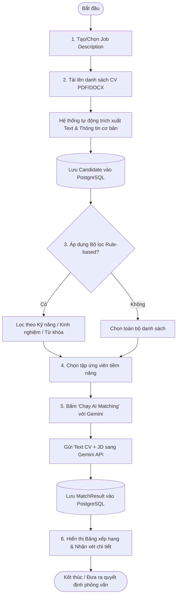

# CHƯƠNG 3: AI TRONG PHÂN TÍCH YÊU CẦU & SẢN PHẨM
## DỰ ÁN: CVMikiri — HỆ THỐNG KIỂM TRA, SÀNG LỌC VÀ CHẤM ĐIỂM CV THÔNG MINH

---

## 3.2 Tài liệu Yêu cầu Sản phẩm (PRD - Product Requirements Document)

### 3.2.1 Tổng quan kiến trúc hệ thống
* **Tên sản phẩm**: CVMikiri
* **Mô hình kiến trúc**: Full-stack Client-Server (SPA + RESTful API).
* **Công nghệ chủ đạo**:
  * **Frontend**: React 18, Vite, TypeScript, Tailwind CSS, Zustand, React-Dropzone, Recharts.
  * **Backend**: Node.js, Express, TypeScript, Multer, `pdf-parse`, `mammoth`, Zod.
  * **Database**: **PostgreSQL** (Quản lý và truy vấn thông qua **Prisma ORM**).
  * **AI Engine**: **Google Gemini API** (sử dụng model `gemini-3.5-flash` hoặc `gemini-3.5-pro` thông qua `@google/genai` hoặc `@google/generative-ai` SDK).

---

### 3.2.2 Phạm vi sản phẩm (Product Scope)

#### A. Trong phạm vi (In-Scope — Phiên bản MVP)
1. **Quản lý Job Description (JD)**: Tạo mới, xem danh sách, xem chi tiết và xóa JD với các trường: Tiêu đề, Mô tả chi tiết, Danh sách kỹ năng yêu cầu (tags), Số năm kinh nghiệm tối thiểu.
2. **Tải lên & Bóc tách CV (CV Ingestion & Extraction)**:
   * Hỗ trợ tải lên nhiều file cùng lúc định dạng PDF và DOCX.
   * Giới hạn kích thước file cấu hình linh hoạt (mặc định tối đa 10MB/file).
   * Tự động trích xuất nội dung văn bản thô (raw text) và bóc tách các trường: Họ tên, Email, SĐT, Kỹ năng, Số năm kinh nghiệm.
   * Lưu trữ file gốc có gán định danh duy nhất (UUID) trên hệ thống tệp cục bộ (`backend/uploads`).
3. **Bộ lọc Quy tắc (Rule-based Filtering)**:
   * Tìm kiếm toàn văn theo từ khóa.
   * Lọc theo kỹ năng yêu cầu (khớp linh hoạt 1 hoặc nhiều kỹ năng).
   * Lọc theo số năm kinh nghiệm tối thiểu.
   * Kết hợp đồng thời nhiều tiêu chí lọc trên giao diện.
4. **Đánh giá & Chấm điểm bằng AI (Gemini AI Matching)**:
   * Lựa chọn 1 JD và một tập hợp CV để thực hiện đối soát ngữ nghĩa qua Gemini API.
   * Nhận kết quả có cấu trúc: Điểm số (0–100), Tóm tắt nhận xét, Danh sách kỹ năng khớp, Danh sách kỹ năng còn thiếu.
   * Tự động lưu và cập nhật kết quả vào PostgreSQL (Upsert theo cặp `candidateId` và `jobDescriptionId`).
5. **Bảng điều khiển & Xếp hạng (Dashboard & Leaderboard)**:
   * Bảng xếp hạng ứng viên theo điểm số từ cao xuống thấp cho từng vị trí tuyển dụng.
   * Xem hồ sơ chi tiết, lịch sử matching giữa ứng viên với các JD khác nhau.
   * Xóa ứng viên và tự động cascade xóa toàn bộ kết quả matching liên quan.

#### B. Ngoài phạm vi (Out-of-Scope — Bản đầu)
* Không triển khai hệ thống xác thực người dùng (Login/OAuth2) và phân quyền (RBAC) ở giai đoạn MVP.
* Không hỗ trợ nhận dạng ký tự quang học (OCR) cho các CV dạng ảnh chụp, file scan bitmap.
* Không gửi email tự động trực tiếp từ hệ thống đến ứng viên.
* Không tích hợp API của các nền tảng tuyển dụng bên ngoài (LinkedIn, TopCV, VietnamWorks,...).

---

### 3.2.3 Sơ đồ luồng người dùng (User Journey Flow)

---

### 3.2.4 Yêu cầu phi chức năng (Non-Functional Requirements - NFRs)

| Mã NFR | Tên yêu cầu | Mô tả chi tiết kỹ thuật |
| :--- | :--- | :--- |
| **NFR1** | **Bảo mật API Key** | `GEMINI_API_KEY` chỉ được lưu trữ và đọc ở môi trường Backend (`backend/.env`). Tuyệt đối không bao giờ trả về hoặc nhúng vào mã nguồn Frontend. |
| **NFR2** | **Hiệu năng hệ thống** | - Bộ lọc Rule-based (FR3) thực thi in-memory hoặc qua chỉ mục PostgreSQL trong thời gian < 100ms cho 500 CV. - Lệnh gọi AI thực hiện có cơ chế kiểm soát số lượng (batching) để tránh vượt quá Rate Limit của Google Gemini. |
| **NFR3** | **Toàn vẹn CSDL** | Sử dụng **PostgreSQL** với chuẩn quan hệ ACID. Quản lý schema và migration thông qua **Prisma ORM**, đảm bảo tính toàn vẹn khóa ngoại và chỉ mục tìm kiếm. |
| **NFR4** | **Xử lý ngoại lệ & Thông điệp** | Mọi ngoại lệ (lỗi định dạng file, lỗi parse văn bản, lỗi quá tải Gemini API) phải được bắt trọn vẹn, ghi log chi tiết và trả về thông báo bằng tiếng Việt rõ ràng, không gây sập tiến trình máy chủ. |
| **NFR5** | **Quản lý Dung lượng & Tệp tin** | Kích thước file tối đa cho phép upload là 10MB (có thể thay đổi qua biến `MAX_FILE_SIZE_MB`). Định dạng tệp được kiểm tra chặt chẽ cả đuôi file và MIME type (`application/pdf`, `application/vnd.openxmlformats-officedocument.wordprocessingml.document`). |
| **NFR6** | **Tính nhất quán Type-safe** | 100% mã nguồn TypeScript ở cả Frontend và Backend phải kích hoạt chế độ `strict: true`. Dữ liệu đầu vào API bắt buộc validate bằng thư viện `zod`. |
| **NFR7** | **Khả năng triển khai** | Hỗ trợ chạy phát triển song song bằng `concurrently`, đồng thời cung cấp cấu hình `Dockerfile` và `docker-compose.yml` để đóng gói chạy cùng PostgreSQL trên môi trường Production. |
| **NFR8** | **Hỗ trợ Tiếng Việt** | Bộ trích xuất và xử lý chuỗi phải hỗ trợ hoàn toàn bảng mã UTF-8, nhận diện chính xác các ký tự tiếng Việt có dấu trong tên, email và nội dung chuyên môn của CV. |

---

