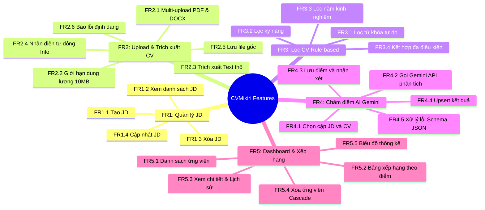
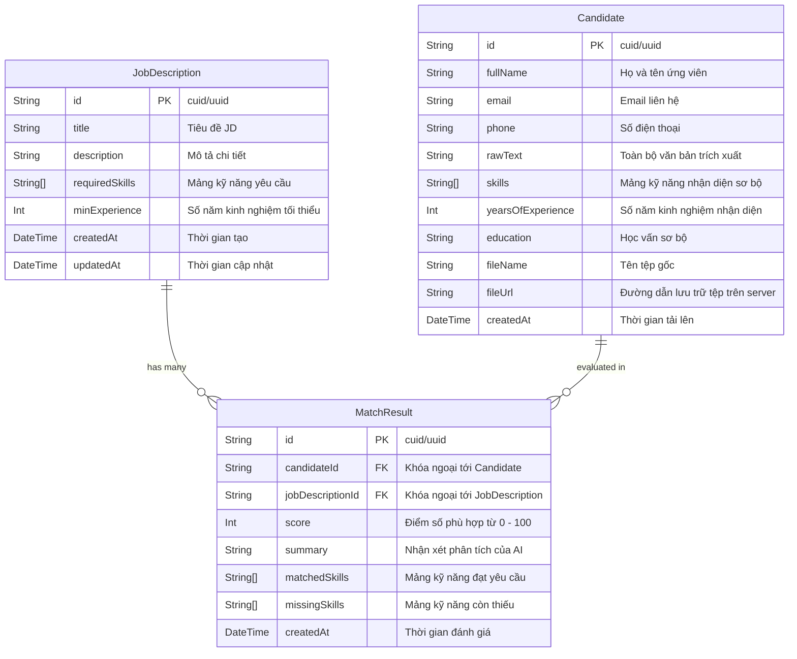

# CHƯƠNG 3: AI TRONG PHÂN TÍCH YÊU CẦU & SẢN PHẨM
## DỰ ÁN: CVMikiri — HỆ THỐNG KIỂM TRA, SÀNG LỌC VÀ CHẤM ĐIỂM CV THÔNG MINH

---

## 3.3 Phân tích Yêu cầu (Requirements Analysis)

### 3.3.1 Phân rã chi tiết Yêu cầu chức năng (FR Decomposition)



#### FR1 — Quản lý Job Description (JD)
* **FR1.1**: Cho phép người dùng nhập các trường thông tin JD:
  * Tiêu đề công việc (`title`): chuỗi từ 5 đến 150 ký tự.
  * Mô tả công việc (`description`): văn bản chi tiết nội dung, quyền lợi, yêu cầu.
  * Danh sách kỹ năng yêu cầu (`requiredSkills`): danh sách các tags (mảng chuỗi).
  * Số năm kinh nghiệm tối thiểu (`minExperience`): số nguyên không âm (0–30).
* **FR1.2**: Hiển thị danh sách tất cả các JD hiện có, sắp xếp theo thời gian tạo mới nhất.
* **FR1.3**: Xóa một JD. Khi xóa JD, các bản ghi `MatchResult` liên kết với JD đó phải tự động bị xóa theo (Cascade Delete).
* **FR1.4**: Cho phép chỉnh sửa thông tin JD đã tạo.

#### FR2 — Upload & Trích xuất CV
* **FR2.1**: Hỗ trợ người dùng kéo thả hoặc bấm chọn cùng lúc nhiều file CV định dạng `.pdf` và `.docx`.
* **FR2.2**: Kiểm tra dung lượng từng file trước khi upload; từ chối file > 10MB.
* **FR2.3**: Trích xuất toàn bộ văn bản thô (`rawText`) từ file sử dụng `pdf-parse` cho PDF và `mammoth` cho DOCX.
* **FR2.4**: Tự động nhận diện và bóc tách thông tin sơ bộ:
  * **Họ tên**: Ưu tiên đọc từ quy ước tên file (ví dụ: `CV_Nguyen_Van_A.pdf`) hoặc dòng tiêu đề đầu tiên trong nội dung.
  * **Email**: Áp dụng biểu thức chính quy (Regex: `[a-zA-Z0-9._%+-]+@[a-zA-Z0-9.-]+\.[a-zA-Z]{2,}`).
  * **Số điện thoại**: Regex nhận dạng định dạng số điện thoại Việt Nam (`/(03|05|07|08|09|01[2|6|8|9])+([0-9]{8})\b/`).
  * **Số năm kinh nghiệm**: Quét các cụm từ chỉ năm kinh nghiệm (ví dụ: `\d+\s*(năm|years)`).
  * **Kỹ năng**: Đối chiếu với từ điển kỹ năng lập trình phổ biến.
* **FR2.5**: Lưu trữ tệp tin vật lý vào thư mục máy chủ với tên tệp chuẩn hóa: `${uuid}-${originalName}` để tránh trùng lặp.
* **FR2.6**: Trả về danh sách chi tiết các file thành công và danh sách file thất bại kèm nguyên nhân rõ ràng.

#### FR3 — Lọc CV (Rule-based, Nhanh, Không tốn phí AI)
* **FR3.1**: Lọc từ khóa: Tìm kiếm không phân biệt chữ hoa chữ thường trên trường `rawText` và `fullName`.
* **FR3.2**: Lọc theo kỹ năng: Cho phép chọn một hoặc nhiều kỹ năng; lọc ra các ứng viên sở hữu ít nhất một (OR) hoặc tất cả (AND) các kỹ năng yêu cầu.
* **FR3.3**: Lọc theo kinh nghiệm: Chọn mốc số năm kinh nghiệm tối thiểu; lọc các ứng viên có `yearsOfExperience >= minExperience`.
* **FR3.4**: Kết hợp đa tiêu chí: Cho phép kích hoạt đồng thời cả 3 bộ lọc trên cùng một giao diện hiển thị.

#### FR4 — Chấm điểm phù hợp bằng AI (Google Gemini AI Matching)
* **FR4.1**: Giao diện cho phép chọn 1 JD làm chuẩn đối sánh và chọn danh sách các ứng viên (thường là danh sách đã qua bước lọc ở FR3).
* **FR4.2**: Backend gửi prompt tới Google Gemini API (`gemini-3.5-flash` hoặc `gemini-3.5-pro`) bao gồm nội dung JD và nội dung `rawText` của CV.
* **FR4.3**: Gemini API phân tích và trả về định dạng JSON nghiêm ngặt gồm:
  * `score` (số nguyên từ 0 đến 100): Đánh giá mức độ phù hợp tổng thể.
  * `summary` (chuỗi văn bản tiếng Việt): Tóm tắt nhận xét ưu điểm và hạn chế của ứng viên.
  * `matchedSkills` (mảng chuỗi): Các kỹ năng mà ứng viên đáp ứng đúng với yêu cầu của JD.
  * `missingSkills` (mảng chuỗi): Các kỹ năng quan trọng mà JD yêu cầu nhưng ứng viên còn thiếu.
* **FR4.4**: Lưu trữ kết quả vào bảng `MatchResult` trong PostgreSQL. Nếu cặp (`candidateId`, `jobDescriptionId`) đã có kết quả trước đó, hệ thống tự động cập nhật kết quả mới (Upsert).
* **FR4.5**: Xử lý ngoại lệ phản hồi từ AI: Kiểm tra tính hợp lệ của JSON trả về, cơ chế retry tự động tối đa 2 lần nếu Gemini API gặp lỗi quá tải hoặc ngắt quãng mạng.

#### FR5 — Dashboard & Danh sách ứng viên
* **FR5.1**: Giao diện hiển thị danh sách toàn bộ ứng viên đã tải lên hệ thống với các cột: Họ tên, Email, Số điện thoại, Số năm kinh nghiệm, Kỹ năng nhận diện, Ngày tải lên.
* **FR5.2**: Chế độ xem bảng xếp hạng (Leaderboard) cho một JD cụ thể: Hiển thị ứng viên xếp hạng theo điểm số AI giảm dần kèm badge điểm số trực quan (ví dụ: Xanh lá ≥ 80, Vàng 50-79, Đỏ < 50).
* **FR5.3**: Modal/Trang xem chi tiết ứng viên: Xem trước nội dung file gốc, văn bản trích xuất thô, và bảng so sánh chi tiết kết quả matching với các JD đã từng phân tích.
* **FR5.4**: Xóa ứng viên: Cho phép xóa một ứng viên khỏi hệ thống, đồng thời xóa tệp tin vật lý tương ứng trên máy chủ và tự động cascade xóa các bản ghi `MatchResult` liên quan.
* **FR5.5**: Biểu đồ thống kê tổng quan (Recharts): Biểu đồ phân bổ khoảng điểm (Dưới 50, 50-70, 70-85, Trên 85) và tỷ lệ ứng viên đạt yêu cầu.

---

### 3.3.2 Ma trận truy vết yêu cầu (Requirements Traceability Matrix - RTM)

| Mã FR | Tên chức năng | User Story liên kết | Thực thể CSDL | API Endpoint liên quan | Mức độ ưu tiên (MoSCoW) |
| :--- | :--- | :--- | :--- | :--- | :--- |
| **FR1.1** | Tạo JD mới | US-01 | `JobDescription` | `POST /api/jobs` | Must-have |
| **FR1.2** | Xem danh sách JD | US-01 | `JobDescription` | `GET /api/jobs` | Must-have |
| **FR1.3** | Xóa JD | US-01 | `JobDescription`, `MatchResult` | `DELETE /api/jobs/:id` | Must-have |
| **FR1.4** | Sửa JD | US-01 | `JobDescription` | `PUT /api/jobs/:id` | Should-have |
| **FR2.1-2.2** | Upload đa file CV | US-02 | `Candidate` | `POST /api/candidates/upload` | Must-have |
| **FR2.3-2.4** | Trích xuất Text & Info | US-02 | `Candidate` | Logic nội bộ Backend | Must-have |
| **FR2.5-2.6** | Lưu file & Validate | US-02 | `Candidate` | `POST /api/candidates/upload` | Must-have |
| **FR3.1-3.4** | Lọc CV Rule-based | US-03 | `Candidate` | `GET /api/candidates?search=...` | Must-have |
| **FR4.1-4.5** | AI Matching Gemini | US-04 | `MatchResult` | `POST /api/matching/run` | Must-have |
| **FR5.1-5.3** | Dashboard & Chi tiết | US-05 | `Candidate`, `MatchResult` | `GET /api/candidates/:id` | Must-have |
| **FR5.4** | Xóa ứng viên Cascade | US-06 | `Candidate`, `MatchResult` | `DELETE /api/candidates/:id` | Must-have |
| **FR5.5** | Biểu đồ thống kê | US-05 | `MatchResult` | `GET /api/jobs/:id/stats` | Could-have |
| **FR6** | Xác thực và phân quyền ADMIN/ENTERPRISE | US-07 | `User` | `/api/auth/*` | Must-have |
| **FR7** | Quản lý tài khoản doanh nghiệp | US-08 | `User`, `JobDescription`, `Candidate` | `/api/users/*` | Must-have |

#### FR6 — Xác thực và phân quyền

Chỉ tài khoản do ADMIN cấp được đăng nhập; phiên dùng JWT trong cookie HTTP-only. ADMIN có thể xem dữ liệu toàn hệ thống, ENTERPRISE chỉ truy vấn JD/CV/matching theo owner của mình. Tài khoản khóa và token cũ bị từ chối.

#### FR7 — Quản lý tài khoản doanh nghiệp

ADMIN tạo, sửa, khóa/mở khóa, đặt lại mật khẩu và xóa tài khoản ENTERPRISE. Tài khoản mới/đặt lại mật khẩu phải đổi mật khẩu khi đăng nhập lần đầu.

---

### 3.3.3 Phân tích Ngoại lệ & Xử lý Trường hợp biên (Edge Cases)

1. **File PDF dạng ảnh quét (Scanned PDF) hoặc bị khóa mật khẩu (Encrypted)**:
   * *Hiện tượng*: Thư viện `pdf-parse` trả về chuỗi rỗng hoặc ném ngoại lệ bảo vệ mật khẩu.
   * *Giải pháp*: Bắt lỗi tại tầng trích xuất; đánh dấu bản ghi với trạng thái cảnh báo `"Không thể đọc nội dung văn bản. Vui lòng kiểm tra file không cài mật khẩu hoặc file ảnh scan chưa được hỗ trợ."`
2. **CV trình bày dạng bảng phức tạp hoặc 2 cột**:
   * *Hiện tượng*: Thứ tự text bị xáo trộn khi convert phẳng ra chuỗi thô.
   * *Giải pháp*: Nhờ khả năng hiểu ngữ cảnh vượt trội của Gemini LLM ở tầng matching, AI vẫn có thể liên kết logic thông tin tốt hơn nhiều so với các thuật toán cắt chuỗi thông thường.
3. **Google Gemini API Rate Limit (Lỗi 429)**:
   * *Hiện tượng*: Khi người dùng chọn cùng lúc 50 CV để chạy matching, việc gửi 50 request song song tức thời sẽ kích hoạt giới hạn API của Google.
   * *Giải pháp*: Triển khai hàng đợi xử lý tuần tự hoặc batching (nhóm 3–5 CV/lần gọi) với độ trễ (delay) thích hợp giữa các đợt gọi.
4. **Phản hồi của Gemini không đúng định dạng JSON thuần**:
   * *Hiện tượng*: LLM có thể tự động bọc chuỗi trong markdown code block (ví dụ: ````json { ... } ````) hoặc kèm lời chào mở đầu.
   * *Giải pháp*: Sử dụng tính năng `responseSchema` của Gemini SDK để ép kiểu đầu ra, đồng thời áp dụng hàm Regex làm sạch (Sanitize) chuỗi trước khi gọi `JSON.parse()`.

---

### 3.3.4 Mô hình Dữ liệu Chi tiết (Data Dictionary & PostgreSQL Prisma Schema)



#### Định nghĩa Prisma Schema (`backend/prisma/schema.prisma`):
```prisma
datasource db {
  provider = "postgresql"
  url      = env("DATABASE_URL")
}

generator client {
  provider = "prisma-client-js"
}

model JobDescription {
  id             String        @id @default(uuid())
  title          String
  description    String        @db.Text
  requiredSkills String[]
  minExperience  Int           @default(0)
  createdAt      DateTime      @default(now())
  updatedAt      DateTime      @updatedAt
  matchResults   MatchResult[]

  @@map("job_descriptions")
}

model Candidate {
  id                String        @id @default(uuid())
  fullName          String
  email             String?
  phone             String?
  rawText           String        @db.Text
  skills            String[]
  yearsOfExperience Int           @default(0)
  education         String?
  fileName          String
  fileUrl           String
  createdAt         DateTime      @default(now())
  matchResults      MatchResult[]

  @@map("candidates")
}

model MatchResult {
  id               String         @id @default(uuid())
  candidateId      String
  jobDescriptionId String
  score            Int
  summary          String         @db.Text
  matchedSkills    String[]
  missingSkills    String[]
  createdAt        DateTime       @default(now())

  candidate        Candidate      @relation(fields: [candidateId], references: [id], onDelete: Cascade)
  jobDescription   JobDescription @relation(fields: [jobDescriptionId], references: [id], onDelete: Cascade)

  @@unique([candidateId, jobDescriptionId])
  @@map("match_results")
}
```

---

