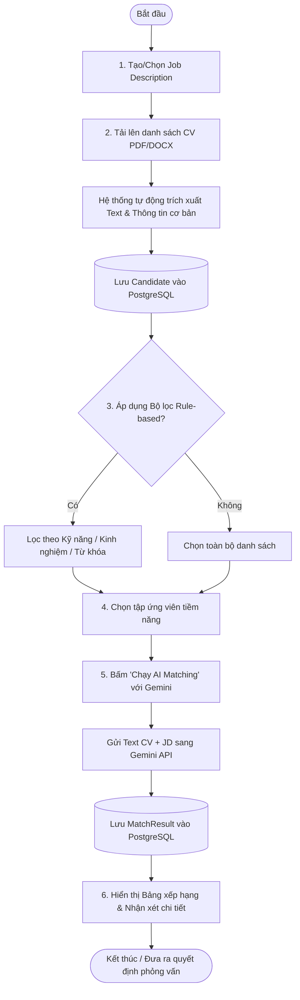
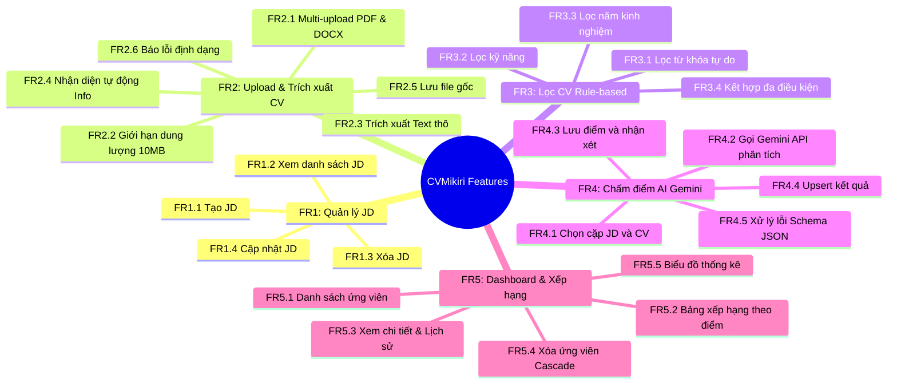
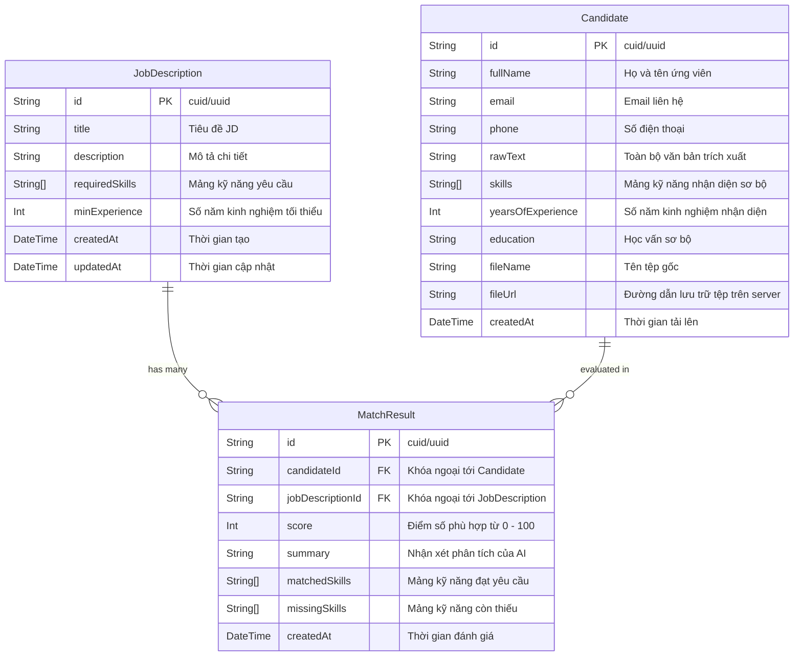

# CHƯƠNG 3: AI TRONG PHÂN TÍCH YÊU CẦU & SẢN PHẨM
## DỰ ÁN: CVMikiri — HỆ THỐNG KIỂM TRA, SÀNG LỌC VÀ CHẤM ĐIỂM CV THÔNG MINH

---

## 3.1 Khám phá Sản phẩm (Product Discovery)

### 3.1.1 Bối cảnh & Tuyên bố vấn đề (Problem Statement)
Trong kỷ nguyên tuyển dụng số, mỗi chiến dịch tuyển dụng cho các vị trí kỹ thuật và chuyên môn có thể nhận về từ hàng trăm đến hàng nghìn CV trong một khoảng thời gian ngắn. Quy trình tuyển dụng truyền thống đang đối mặt với các nút thắt cổ chai (bottlenecks) nghiêm trọng:
1. **Lãng phí thời gian và nguồn lực**: Bộ phận HR/Recruiter phải dành trung bình 5 đến 10 phút để đọc lướt một bản CV, trong đó hơn 70% số lượng ứng viên nộp hồ sơ không đáp ứng đủ các tiêu chí kỹ năng tối thiểu của Job Description (JD).
2. **Hiện tượng mệt mỏi nhận thức (Cognitive Fatigue) & Đánh giá thiên kiến (Human Bias)**: Khi phải đọc lượng lớn hồ sơ liên tục, nhà tuyển dụng dễ đánh giá thiếu nhất quán, dễ thiên kiến bởi cách trình bày, định dạng hoặc bỏ sót những ứng viên thực sự tiềm năng.
3. **Giới hạn của các bộ lọc từ khóa truyền thống (Keyword-based ATS)**: Các hệ thống ATS cổ điển chỉ tìm kiếm từ khóa cứng (exact string match). Nếu ứng viên ghi "Golang" thay vì "Go", hoặc "NodeJS" thay vì "Node.js", bộ lọc sẽ loại bỏ ứng viên đó một cách sai lệch vì thiếu hiểu biết về ngữ cảnh chuyên môn (Contextual Understanding).

> **Tuyên bố vấn đề:**
> *"Các nhà tuyển dụng và bộ phận nhân sự cần một giải pháp sàng lọc hồ sơ ứng viên nhanh chóng, chi phí thấp, kết hợp giữa việc lọc thô tức thời theo tiêu chí cứng và khả năng phân tích ngữ nghĩa sâu sắc bằng AI để xếp hạng độ phù hợp của CV với JD một cách khách quan, minh bạch và chính xác."*

---

### 3.1.2 Chân dung người dùng (User Personas)

#### Persona 1: HR Specialist / Tech Recruiter
* **Họ tên**: Nguyễn Thu Hà (27 tuổi)
* **Vai trò**: Chuyên viên tuyển dụng nhân sự công nghệ
* **Mục tiêu**:
  * Đọc nhanh 200–300 CV/tuần để tìm ra top 10–15 ứng viên xuất sắc nhất gửi cho Hiring Manager.
  * Tự động hóa khâu bóc tách thông tin liên hệ, kinh nghiệm, kỹ năng của ứng viên mà không cần nhập liệu thủ công.
* **Nỗi đau (Pain Points)**:
  * Choáng ngợp bởi số lượng CV định dạng hỗn loạn (PDF nhiều cột, DOCX bảng biểu).
  * Khó khăn trong việc đánh giá các kỹ năng công nghệ mới do không có nền tảng lập trình sâu.
  * Tốn quá nhiều thời gian cho việc sàng lọc sơ bộ thay vì dành thời gian phỏng vấn và chăm sóc ứng viên.

#### Persona 2: Hiring Manager / Tech Lead
* **Họ tên**: Trần Quốc Bảo (34 tuổi)
* **Vai trò**: Trưởng phòng Công nghệ / Kỹ thuật
* **Mục tiêu**:
  * Nhận được danh sách ứng viên đã được sàng lọc chuẩn xác theo các tiêu chí kỹ thuật trong JD.
  * Xem nhanh lý do tại sao ứng viên được đánh giá cao: ứng viên mạnh ở điểm nào, thiếu hụt kỹ năng quan trọng nào.
* **Nỗi đau (Pain Points)**:
  * Thất vọng khi nhận về các CV "qua vòng HR" nhưng thiếu hụt trầm trọng các kỹ năng cốt lõi.
  * Mất nhiều thời gian phỏng vấn những ứng viên có thông tin phóng đại trên CV.

---

### 3.1.3 Tuyên ngôn giá trị & Tầm nhìn sản phẩm (Value Proposition & Vision)
* **Tầm nhìn sản phẩm (Product Vision)**:
  Trở thành trợ lý sàng lọc hồ sơ tuyển dụng AI thông minh, hiệu quả và tối ưu chi phí nhất dành cho doanh nghiệp, chuẩn hóa quy trình tuyển dụng từ tiếp nhận hồ sơ thô đến bảng xếp hạng ứng viên chi tiết.
* **Tuyên ngôn giá trị cốt lõi (Unique Value Proposition)**:
  * **Mô hình sàng lọc 2 tầng (Two-tier Hybrid Screening)**:
    * *Tầng 1 (Rule-based Filtering)*: Lọc tức thời, chi phí $0 dựa trên kinh nghiệm, từ khóa và kỹ năng cứng.
    * *Tầng 2 (Gemini Generative AI Matching)*: Phân tích ngữ nghĩa chuyên sâu, hiểu rõ mối liên hệ giữa các kỹ năng thực tế trong CV và yêu cầu JD, chấm điểm minh bạch kèm giải trình chi tiết.
  * **Xử lý đa định dạng & Đa ngữ**: Trích xuất tối ưu các định dạng PDF, DOCX và xử lý chuẩn xác tiếng Việt có dấu.

---

### 3.1.4 Mô hình Lean Canvas CVMikiri

| Khối Lean Canvas | Nội dung chi tiết |
| :--- | :--- |
| **1. Problem (Vấn đề)** | - Sàng lọc thủ công tốn kém 5-10 phút/CV.<br>- ATS truyền thống lọc cứng nhắc, thiếu hiểu biết ngữ cảnh.<br>- Mệt mỏi nhận thức gây thiên kiến đánh giá. |
| **2. Customer Segments (Khách hàng)** | - Chuyên viên nhân sự (HR Recruiter).<br>- Trưởng bộ phận chuyên môn (Hiring Managers).<br>- Các công ty Headhunter & Startup tuyển dụng liên tục. |
| **3. Unique Value Proposition (UVP)** | "Nền tảng kiểm tra & lọc CV thông minh kết hợp bộ lọc quy tắc tức thời và AI Gemini phân tích ngữ nghĩa sâu, giúp rút ngắn 80% thời gian tuyển dụng." |
| **4. Solution (Giải pháp)** | - Quản lý JD tập trung.<br>- Upload hàng loạt PDF/DOCX & bóc tách tự động.<br>- Bộ lọc rule-based tức thì.<br>- Gemini AI Matching: Chấm điểm 0-100, liệt kê kỹ năng khớp & kỹ năng thiếu. |
| **5. Channels (Kênh phân phối)** | - Nền tảng Web App nội bộ doanh nghiệp.<br>- Diễn đàn tuyển dụng, cộng đồng HR Tech, LinkedIn. |
| **6. Revenue Streams (Doanh thu)** | - Triển khai On-premise / Private Cloud cho doanh nghiệp.<br>- Thuê bao SaaS theo số lượng CV xử lý/tháng. |
| **7. Cost Structure (Chi phí)** | - Chi phí gọi Google Gemini API.<br>- Chi phí hạ tầng Cloud (PostgreSQL, VPS hosting, Storage lưu CV).<br>- Chi phí phát triển và bảo trì phần mềm. |
| **8. Key Metrics (Chỉ số đo lường)** | - Thời gian trung bình sàng lọc 1 CV.<br>- Tỷ lệ chính xác trích xuất thông tin.<br>- Tỷ lệ ứng viên qua AI matching được nhận phỏng vấn thực tế. |
| **9. Unfair Advantage (Lợi thế cạnh tranh)** | - Kiến trúc tối ưu chi phí: Lọc thô miễn phí trước khi gọi LLM.<br>- Tận dụng mô hình Gemini xử lý ngữ cảnh dài và tiếng Việt vượt trội với chi phí cực thấp. |

---

### 3.1.5 Mục tiêu & Chỉ số thành công (Product Goals & KPIs/OKRs)

#### Mục tiêu (Objectives) & Kết quả then chốt (Key Results - OKRs)
* **Mục tiêu 1: Cắt giảm tối đa thời gian tiền xử lý hồ sơ**
  * *KR 1.1*: Giảm ít nhất 75% thời gian lọc sơ bộ từ 8 phút/CV xuống dưới 2 phút/CV.
  * *KR 1.2*: Thời gian phản hồi cho bộ lọc quy tắc (Rule-based) đạt dưới 100ms trên tập dữ liệu 500 CV.
* **Mục tiêu 2: Đảm bảo độ tin cậy và chính xác của AI**
  * *KR 2.1*: Độ chính xác trích xuất các trường cơ bản (Họ tên, Email, Số điện thoại) đạt ≥ 92%.
  * *KR 2.2*: Tỷ lệ lỗi sinh định dạng (JSON schema error) từ Gemini API khi matching đạt dưới 1%.
* **Mục tiêu 3: Tối ưu hóa chi phí AI**
  * *KR 3.1*: 100% các lệnh gọi AI chỉ thực hiện trên tập ứng viên đã vượt qua bộ lọc cứng (Rule-based filter) do HR chủ động chọn, tiết kiệm tối thiểu 60% chi phí token so với việc quét AI toàn bộ.

---

## 3.2 Tài liệu Yêu cầu Sản phẩm (PRD - Product Requirements Document)

### 3.2.1 Tổng quan kiến trúc hệ thống
* **Tên sản phẩm**: CVMikiri
* **Mô hình kiến trúc**: Full-stack Client-Server (SPA + RESTful API).
* **Công nghệ chủ đạo**:
  * **Frontend**: React 18, Vite, TypeScript, Tailwind CSS, Zustand, React-Dropzone, Recharts.
  * **Backend**: Node.js, Express, TypeScript, Multer, `pdf-parse`, `mammoth`, Zod.
  * **Database**: **PostgreSQL** (Quản lý và truy vấn thông qua **Prisma ORM**).
  * **AI Engine**: **Google Gemini API** (sử dụng model `gemini-3.5-flash` hoặc `gemini-3.5-pro` thông qua `@google/genai` hoặc `@google/generative-ai` SDK).

---

### 3.2.2 Phạm vi sản phẩm (Product Scope)

#### A. Trong phạm vi (In-Scope — Phiên bản MVP)
1. **Quản lý Job Description (JD)**: Tạo mới, xem danh sách, xem chi tiết và xóa JD với các trường: Tiêu đề, Mô tả chi tiết, Danh sách kỹ năng yêu cầu (tags), Số năm kinh nghiệm tối thiểu.
2. **Tải lên & Bóc tách CV (CV Ingestion & Extraction)**:
   * Hỗ trợ tải lên nhiều file cùng lúc định dạng PDF và DOCX.
   * Giới hạn kích thước file cấu hình linh hoạt (mặc định tối đa 10MB/file).
   * Tự động trích xuất nội dung văn bản thô (raw text) và bóc tách các trường: Họ tên, Email, SĐT, Kỹ năng, Số năm kinh nghiệm.
   * Lưu trữ file gốc có gán định danh duy nhất (UUID) trên hệ thống tệp cục bộ (`backend/uploads`).
3. **Bộ lọc Quy tắc (Rule-based Filtering)**:
   * Tìm kiếm toàn văn theo từ khóa.
   * Lọc theo kỹ năng yêu cầu (khớp linh hoạt 1 hoặc nhiều kỹ năng).
   * Lọc theo số năm kinh nghiệm tối thiểu.
   * Kết hợp đồng thời nhiều tiêu chí lọc trên giao diện.
4. **Đánh giá & Chấm điểm bằng AI (Gemini AI Matching)**:
   * Lựa chọn 1 JD và một tập hợp CV để thực hiện đối soát ngữ nghĩa qua Gemini API.
   * Nhận kết quả có cấu trúc: Điểm số (0–100), Tóm tắt nhận xét, Danh sách kỹ năng khớp, Danh sách kỹ năng còn thiếu.
   * Tự động lưu và cập nhật kết quả vào PostgreSQL (Upsert theo cặp `candidateId` và `jobDescriptionId`).
5. **Bảng điều khiển & Xếp hạng (Dashboard & Leaderboard)**:
   * Bảng xếp hạng ứng viên theo điểm số từ cao xuống thấp cho từng vị trí tuyển dụng.
   * Xem hồ sơ chi tiết, lịch sử matching giữa ứng viên với các JD khác nhau.
   * Xóa ứng viên và tự động cascade xóa toàn bộ kết quả matching liên quan.

#### B. Ngoài phạm vi (Out-of-Scope — Bản đầu)
* Không triển khai hệ thống xác thực người dùng (Login/OAuth2) và phân quyền (RBAC) ở giai đoạn MVP.
* Không hỗ trợ nhận dạng ký tự quang học (OCR) cho các CV dạng ảnh chụp, file scan bitmap.
* Không gửi email tự động trực tiếp từ hệ thống đến ứng viên.
* Không tích hợp API của các nền tảng tuyển dụng bên ngoài (LinkedIn, TopCV, VietnamWorks,...).

---

### 3.2.3 Sơ đồ luồng người dùng (User Journey Flow)



---

### 3.2.4 Yêu cầu phi chức năng (Non-Functional Requirements - NFRs)

| Mã NFR | Tên yêu cầu | Mô tả chi tiết kỹ thuật |
| :--- | :--- | :--- |
| **NFR1** | **Bảo mật API Key** | `GEMINI_API_KEY` chỉ được lưu trữ và đọc ở môi trường Backend (`backend/.env`). Tuyệt đối không bao giờ trả về hoặc nhúng vào mã nguồn Frontend. |
| **NFR2** | **Hiệu năng hệ thống** | - Bộ lọc Rule-based (FR3) thực thi in-memory hoặc qua chỉ mục PostgreSQL trong thời gian < 100ms cho 500 CV.<br>- Lệnh gọi AI thực hiện có cơ chế kiểm soát số lượng (batching) để tránh vượt quá Rate Limit của Google Gemini. |
| **NFR3** | **Toàn vẹn CSDL** | Sử dụng **PostgreSQL** với chuẩn quan hệ ACID. Quản lý schema và migration thông qua **Prisma ORM**, đảm bảo tính toàn vẹn khóa ngoại và chỉ mục tìm kiếm. |
| **NFR4** | **Xử lý ngoại lệ & Thông điệp** | Mọi ngoại lệ (lỗi định dạng file, lỗi parse văn bản, lỗi quá tải Gemini API) phải được bắt trọn vẹn, ghi log chi tiết và trả về thông báo bằng tiếng Việt rõ ràng, không gây sập tiến trình máy chủ. |
| **NFR5** | **Quản lý Dung lượng & Tệp tin** | Kích thước file tối đa cho phép upload là 10MB (có thể thay đổi qua biến `MAX_FILE_SIZE_MB`). Định dạng tệp được kiểm tra chặt chẽ cả đuôi file và MIME type (`application/pdf`, `application/vnd.openxmlformats-officedocument.wordprocessingml.document`). |
| **NFR6** | **Tính nhất quán Type-safe** | 100% mã nguồn TypeScript ở cả Frontend và Backend phải kích hoạt chế độ `strict: true`. Dữ liệu đầu vào API bắt buộc validate bằng thư viện `zod`. |
| **NFR7** | **Khả năng triển khai** | Hỗ trợ chạy phát triển song song bằng `concurrently`, đồng thời cung cấp cấu hình `Dockerfile` và `docker-compose.yml` để đóng gói chạy cùng PostgreSQL trên môi trường Production. |
| **NFR8** | **Hỗ trợ Tiếng Việt** | Bộ trích xuất và xử lý chuỗi phải hỗ trợ hoàn toàn bảng mã UTF-8, nhận diện chính xác các ký tự tiếng Việt có dấu trong tên, email và nội dung chuyên môn của CV. |

---

## 3.3 Phân tích Yêu cầu (Requirements Analysis)

### 3.3.1 Phân rã chi tiết Yêu cầu chức năng (FR Decomposition)



#### FR1 — Quản lý Job Description (JD)
* **FR1.1**: Cho phép người dùng nhập các trường thông tin JD:
  * Tiêu đề công việc (`title`): chuỗi từ 5 đến 150 ký tự.
  * Mô tả công việc (`description`): văn bản chi tiết nội dung, quyền lợi, yêu cầu.
  * Danh sách kỹ năng yêu cầu (`requiredSkills`): danh sách các tags (mảng chuỗi).
  * Số năm kinh nghiệm tối thiểu (`minExperience`): số nguyên không âm (0–30).
* **FR1.2**: Hiển thị danh sách tất cả các JD hiện có, sắp xếp theo thời gian tạo mới nhất.
* **FR1.3**: Xóa một JD. Khi xóa JD, các bản ghi `MatchResult` liên kết với JD đó phải tự động bị xóa theo (Cascade Delete).
* **FR1.4**: Cho phép chỉnh sửa thông tin JD đã tạo.

#### FR2 — Upload & Trích xuất CV
* **FR2.1**: Hỗ trợ người dùng kéo thả hoặc bấm chọn cùng lúc nhiều file CV định dạng `.pdf` và `.docx`.
* **FR2.2**: Kiểm tra dung lượng từng file trước khi upload; từ chối file > 10MB.
* **FR2.3**: Trích xuất toàn bộ văn bản thô (`rawText`) từ file sử dụng `pdf-parse` cho PDF và `mammoth` cho DOCX.
* **FR2.4**: Tự động nhận diện và bóc tách thông tin sơ bộ:
  * **Họ tên**: Ưu tiên đọc từ quy ước tên file (ví dụ: `CV_Nguyen_Van_A.pdf`) hoặc dòng tiêu đề đầu tiên trong nội dung.
  * **Email**: Áp dụng biểu thức chính quy (Regex: `[a-zA-Z0-9._%+-]+@[a-zA-Z0-9.-]+\.[a-zA-Z]{2,}`).
  * **Số điện thoại**: Regex nhận dạng định dạng số điện thoại Việt Nam (`/(03|05|07|08|09|01[2|6|8|9])+([0-9]{8})\b/`).
  * **Số năm kinh nghiệm**: Quét các cụm từ chỉ năm kinh nghiệm (ví dụ: `\d+\s*(năm|years)`).
  * **Kỹ năng**: Đối chiếu với từ điển kỹ năng lập trình phổ biến.
* **FR2.5**: Lưu trữ tệp tin vật lý vào thư mục máy chủ với tên tệp chuẩn hóa: `${uuid}-${originalName}` để tránh trùng lặp.
* **FR2.6**: Trả về danh sách chi tiết các file thành công và danh sách file thất bại kèm nguyên nhân rõ ràng.

#### FR3 — Lọc CV (Rule-based, Nhanh, Không tốn phí AI)
* **FR3.1**: Lọc từ khóa: Tìm kiếm không phân biệt chữ hoa chữ thường trên trường `rawText` và `fullName`.
* **FR3.2**: Lọc theo kỹ năng: Cho phép chọn một hoặc nhiều kỹ năng; lọc ra các ứng viên sở hữu ít nhất một (OR) hoặc tất cả (AND) các kỹ năng yêu cầu.
* **FR3.3**: Lọc theo kinh nghiệm: Chọn mốc số năm kinh nghiệm tối thiểu; lọc các ứng viên có `yearsOfExperience >= minExperience`.
* **FR3.4**: Kết hợp đa tiêu chí: Cho phép kích hoạt đồng thời cả 3 bộ lọc trên cùng một giao diện hiển thị.

#### FR4 — Chấm điểm phù hợp bằng AI (Google Gemini AI Matching)
* **FR4.1**: Giao diện cho phép chọn 1 JD làm chuẩn đối sánh và chọn danh sách các ứng viên (thường là danh sách đã qua bước lọc ở FR3).
* **FR4.2**: Backend gửi prompt tới Google Gemini API (`gemini-3.5-flash` hoặc `gemini-3.5-pro`) bao gồm nội dung JD và nội dung `rawText` của CV.
* **FR4.3**: Gemini API phân tích và trả về định dạng JSON nghiêm ngặt gồm:
  * `score` (số nguyên từ 0 đến 100): Đánh giá mức độ phù hợp tổng thể.
  * `summary` (chuỗi văn bản tiếng Việt): Tóm tắt nhận xét ưu điểm và hạn chế của ứng viên.
  * `matchedSkills` (mảng chuỗi): Các kỹ năng mà ứng viên đáp ứng đúng với yêu cầu của JD.
  * `missingSkills` (mảng chuỗi): Các kỹ năng quan trọng mà JD yêu cầu nhưng ứng viên còn thiếu.
* **FR4.4**: Lưu trữ kết quả vào bảng `MatchResult` trong PostgreSQL. Nếu cặp (`candidateId`, `jobDescriptionId`) đã có kết quả trước đó, hệ thống tự động cập nhật kết quả mới (Upsert).
* **FR4.5**: Xử lý ngoại lệ phản hồi từ AI: Kiểm tra tính hợp lệ của JSON trả về, cơ chế retry tự động tối đa 2 lần nếu Gemini API gặp lỗi quá tải hoặc ngắt quãng mạng.

#### FR5 — Dashboard & Danh sách ứng viên
* **FR5.1**: Giao diện hiển thị danh sách toàn bộ ứng viên đã tải lên hệ thống với các cột: Họ tên, Email, Số điện thoại, Số năm kinh nghiệm, Kỹ năng nhận diện, Ngày tải lên.
* **FR5.2**: Chế độ xem bảng xếp hạng (Leaderboard) cho một JD cụ thể: Hiển thị ứng viên xếp hạng theo điểm số AI giảm dần kèm badge điểm số trực quan (ví dụ: Xanh lá ≥ 80, Vàng 50-79, Đỏ < 50).
* **FR5.3**: Modal/Trang xem chi tiết ứng viên: Xem trước nội dung file gốc, văn bản trích xuất thô, và bảng so sánh chi tiết kết quả matching với các JD đã từng phân tích.
* **FR5.4**: Xóa ứng viên: Cho phép xóa một ứng viên khỏi hệ thống, đồng thời xóa tệp tin vật lý tương ứng trên máy chủ và tự động cascade xóa các bản ghi `MatchResult` liên quan.
* **FR5.5**: Biểu đồ thống kê tổng quan (Recharts): Biểu đồ phân bổ khoảng điểm (Dưới 50, 50-70, 70-85, Trên 85) và tỷ lệ ứng viên đạt yêu cầu.

---

### 3.3.2 Ma trận truy vết yêu cầu (Requirements Traceability Matrix - RTM)

| Mã FR | Tên chức năng | User Story liên kết | Thực thể CSDL | API Endpoint liên quan | Mức độ ưu tiên (MoSCoW) |
| :--- | :--- | :--- | :--- | :--- | :--- |
| **FR1.1** | Tạo JD mới | US-01 | `JobDescription` | `POST /api/jobs` | Must-have |
| **FR1.2** | Xem danh sách JD | US-01 | `JobDescription` | `GET /api/jobs` | Must-have |
| **FR1.3** | Xóa JD | US-01 | `JobDescription`, `MatchResult` | `DELETE /api/jobs/:id` | Must-have |
| **FR1.4** | Sửa JD | US-01 | `JobDescription` | `PUT /api/jobs/:id` | Should-have |
| **FR2.1-2.2** | Upload đa file CV | US-02 | `Candidate` | `POST /api/candidates/upload` | Must-have |
| **FR2.3-2.4** | Trích xuất Text & Info | US-02 | `Candidate` | Logic nội bộ Backend | Must-have |
| **FR2.5-2.6** | Lưu file & Validate | US-02 | `Candidate` | `POST /api/candidates/upload` | Must-have |
| **FR3.1-3.4** | Lọc CV Rule-based | US-03 | `Candidate` | `GET /api/candidates?search=...` | Must-have |
| **FR4.1-4.5** | AI Matching Gemini | US-04 | `MatchResult` | `POST /api/matching/run` | Must-have |
| **FR5.1-5.3** | Dashboard & Chi tiết | US-05 | `Candidate`, `MatchResult` | `GET /api/candidates/:id` | Must-have |
| **FR5.4** | Xóa ứng viên Cascade | US-06 | `Candidate`, `MatchResult` | `DELETE /api/candidates/:id` | Must-have |
| **FR5.5** | Biểu đồ thống kê | US-05 | `MatchResult` | `GET /api/jobs/:id/stats` | Could-have |

---

### 3.3.3 Phân tích Ngoại lệ & Xử lý Trường hợp biên (Edge Cases)

1. **File PDF dạng ảnh quét (Scanned PDF) hoặc bị khóa mật khẩu (Encrypted)**:
   * *Hiện tượng*: Thư viện `pdf-parse` trả về chuỗi rỗng hoặc ném ngoại lệ bảo vệ mật khẩu.
   * *Giải pháp*: Bắt lỗi tại tầng trích xuất; đánh dấu bản ghi với trạng thái cảnh báo `"Không thể đọc nội dung văn bản. Vui lòng kiểm tra file không cài mật khẩu hoặc file ảnh scan chưa được hỗ trợ."`
2. **CV trình bày dạng bảng phức tạp hoặc 2 cột**:
   * *Hiện tượng*: Thứ tự text bị xáo trộn khi convert phẳng ra chuỗi thô.
   * *Giải pháp*: Nhờ khả năng hiểu ngữ cảnh vượt trội của Gemini LLM ở tầng matching, AI vẫn có thể liên kết logic thông tin tốt hơn nhiều so với các thuật toán cắt chuỗi thông thường.
3. **Google Gemini API Rate Limit (Lỗi 429)**:
   * *Hiện tượng*: Khi người dùng chọn cùng lúc 50 CV để chạy matching, việc gửi 50 request song song tức thời sẽ kích hoạt giới hạn API của Google.
   * *Giải pháp*: Triển khai hàng đợi xử lý tuần tự hoặc batching (nhóm 3–5 CV/lần gọi) với độ trễ (delay) thích hợp giữa các đợt gọi.
4. **Phản hồi của Gemini không đúng định dạng JSON thuần**:
   * *Hiện tượng*: LLM có thể tự động bọc chuỗi trong markdown code block (ví dụ: ````json { ... } ````) hoặc kèm lời chào mở đầu.
   * *Giải pháp*: Sử dụng tính năng `responseSchema` của Gemini SDK để ép kiểu đầu ra, đồng thời áp dụng hàm Regex làm sạch (Sanitize) chuỗi trước khi gọi `JSON.parse()`.

---

### 3.3.4 Mô hình Dữ liệu Chi tiết (Data Dictionary & PostgreSQL Prisma Schema)



#### Định nghĩa Prisma Schema (`backend/prisma/schema.prisma`):
```prisma
datasource db {
  provider = "postgresql"
  url      = env("DATABASE_URL")
}

generator client {
  provider = "prisma-client-js"
}

model JobDescription {
  id             String        @id @default(uuid())
  title          String
  description    String        @db.Text
  requiredSkills String[]
  minExperience  Int           @default(0)
  createdAt      DateTime      @default(now())
  updatedAt      DateTime      @updatedAt
  matchResults   MatchResult[]

  @@map("job_descriptions")
}

model Candidate {
  id                String        @id @default(uuid())
  fullName          String
  email             String?
  phone             String?
  rawText           String        @db.Text
  skills            String[]
  yearsOfExperience Int           @default(0)
  education         String?
  fileName          String
  fileUrl           String
  createdAt         DateTime      @default(now())
  matchResults      MatchResult[]

  @@map("candidates")
}

model MatchResult {
  id               String         @id @default(uuid())
  candidateId      String
  jobDescriptionId String
  score            Int
  summary          String         @db.Text
  matchedSkills    String[]
  missingSkills    String[]
  createdAt        DateTime       @default(now())

  candidate        Candidate      @relation(fields: [candidateId], references: [id], onDelete: Cascade)
  jobDescription   JobDescription @relation(fields: [jobDescriptionId], references: [id], onDelete: Cascade)

  @@unique([candidateId, jobDescriptionId])
  @@map("match_results")
}
```

---

## 3.4 User Stories & Tiêu chí Chấp nhận (User Stories & Acceptance Criteria)

### US-01: Quản lý Bản mô tả công việc (Job Description Management)
* **Là một**: Nhà tuyển dụng (HR Recruiter)
* **Tôi muốn**: Tạo mới, xem lại và xóa các bản mô tả công việc (JD)
* **Để tôi**: Có căn cứ tiêu chuẩn kỹ thuật làm chuẩn đối sánh để lọc và chấm điểm các hồ sơ ứng viên.

#### Tiêu chí chấp nhận (Acceptance Criteria - Gherkin Format):
```gherkin
Scenario: Tạo Job Description mới thành công
  Given Tôi đang ở trang Quản lý JD và mở form "Tạo JD mới"
  When Tôi nhập tiêu đề là "Senior Fullstack Developer"
  And Tôi nhập mô tả chi tiết công việc
  And Tôi thêm các kỹ năng yêu cầu gồm: "React", "Node.js", "PostgreSQL", "Docker"
  And Tôi đặt số năm kinh nghiệm tối thiểu là 3
  And Tôi nhấn nút "Lưu JD"
  Then Hệ thống lưu thông tin JD vào cơ sở dữ liệu PostgreSQL
  And Hiển thị thông báo thành công "Tạo Job Description thành công"
  And JD mới xuất hiện ngay trên đầu danh sách JD

Scenario: Báo lỗi khi thiếu các trường bắt buộc lúc tạo JD
  Given Tôi đang mở form "Tạo JD mới"
  When Tôi để trống trường "Tiêu đề" hoặc không chọn bất kỳ kỹ năng yêu cầu nào
  And Tôi nhấn nút "Lưu JD"
  Then Hệ thống ngăn chặn việc gửi dữ liệu
  And Hiển thị thông báo lỗi bằng tiếng Việt tại các trường bị thiếu

Scenario: Xóa Job Description và các kết quả liên quan
  Given Tôi có một JD tên là "Junior Frontend" đã có 10 kết quả đánh giá AI (MatchResult)
  When Tôi nhấn nút "Xóa" tại JD này và xác nhận hộp thoại cảnh báo
  Then Hệ thống xóa bản ghi JD khỏi PostgreSQL
  And Tự động cascade xóa sạch 10 bản ghi MatchResult tương ứng
  And Danh sách JD được cập nhật lại không còn hiển thị JD vừa xóa
```

---

### US-02: Tải lên hàng loạt và Tự động Bóc tách dữ liệu CV
* **Là một**: Chuyên viên tuyển dụng
* **Tôi muốn**: Kéo thả nhiều file CV định dạng PDF/DOCX vào hệ thống cùng lúc
* **Để tôi**: Tự động chuyển đổi hồ sơ thành dữ liệu có cấu trúc mà không phải gõ tay thông tin từng ứng viên.

#### Tiêu chí chấp nhận (Acceptance Criteria - Gherkin Format):
```gherkin
Scenario: Tải lên nhiều file PDF và DOCX hợp lệ
  Given Tôi đang ở khu vực "Tải lên CV"
  When Tôi chọn kéo thả 5 file gồm 3 file .pdf và 2 file .docx có dung lượng mỗi file dưới 10MB
  Then Hệ thống hiển thị thanh tiến trình tải lên
  And Backend lưu các file vào thư mục lưu trữ uploads với tên file gán UUID duy nhất
  And Thư viện trích xuất đọc thành công nội dung text của cả 5 file
  And Hệ thống nhận diện được Họ tên, Email, SĐT của các ứng viên và lưu vào bảng Candidate
  And Hiển thị thông báo toast: "Tải lên và xử lý thành công 5/5 hồ sơ"

Scenario: Tải lên file sai định dạng hoặc vượt quá kích thước
  Given Tôi đang ở khu vực "Tải lên CV"
  When Tôi cố gắng tải lên một file ảnh "cv_candidate.png" hoặc một file PDF có dung lượng 15MB
  Then Hệ thống lập tức từ chối nhận file
  And Hiển thị thông báo lỗi cụ thể: "File cv_candidate.png không đúng định dạng hỗ trợ (PDF, DOCX)" hoặc "Dung lượng vượt quá giới hạn 10MB"
```

---

### US-03: Sàng lọc nhanh ứng viên theo Quy tắc (Rule-based Filter)
* **Là một**: Nhà tuyển dụng
* **Tôi muốn**: Tìm kiếm ứng viên bằng từ khóa, bộ lọc số năm kinh nghiệm và danh sách kỹ năng
* **Để tôi**: Nhanh chóng thu hẹp danh sách ứng viên phù hợp trước khi đưa vào chấm điểm AI chuyên sâu.

#### Tiêu chí chấp nhận (Acceptance Criteria - Gherkin Format):
```gherkin
Scenario: Lọc ứng viên kết hợp kỹ năng và số năm kinh nghiệm
  Given Danh sách đang hiển thị 100 ứng viên đã lưu trong hệ thống
  When Tôi nhập số năm kinh nghiệm tối thiểu là 2
  And Tôi chọn kỹ năng cần tìm là "PostgreSQL"
  Then Danh sách ngay lập tức cập nhật trong vòng dưới 100ms
  And Chỉ hiển thị các ứng viên có kinh nghiệm >= 2 năm và nội dung hồ sơ có chứa kỹ năng "PostgreSQL"
  And Hiển thị số lượng kết quả tương ứng (ví dụ: "Tìm thấy 12 ứng viên phù hợp")

Scenario: Tìm kiếm từ khóa tự do không dấu
  Given Danh sách đang có ứng viên tên "Nguyễn Văn An" với mô tả kinh nghiệm "Lập trình viên ReactJS"
  When Tôi gõ vào thanh tìm kiếm từ khóa "reactjs" hoặc "nguyen van an"
  Then Hệ thống trả về kết quả khớp ứng viên "Nguyễn Văn An" không phân biệt chữ hoa chữ thường
```

---

### US-04: Đánh giá và Chấm điểm phù hợp bằng Google Gemini AI
* **Là một**: Nhà tuyển dụng hoặc Trưởng nhóm chuyên môn
* **Tôi muốn**: Chọn một JD và danh sách các ứng viên đã lọc để yêu cầu Gemini AI chấm điểm
* **Để tôi**: Có được điểm số khách quan, nắm rõ kỹ năng ứng viên đáp ứng và các khoảng trống kỹ năng cần xem xét.

#### Tiêu chí chấp nhận (Acceptance Criteria - Gherkin Format):
```gherkin
Scenario: Chạy AI Matching thành công với Gemini API
  Given Tôi đã chọn JD "NodeJS Backend Developer"
  And Tôi tích chọn 5 ứng viên từ danh sách đã lọc
  When Tôi nhấn nút "Chạy AI Matching"
  Then Hệ thống hiển thị hiệu ứng đang xử lý (loading status) cho từng ứng viên
  And Backend gửi prompt kèm text của từng CV và JD sang Google Gemini API
  And Gemini trả về kết quả JSON chuẩn với các trường: score (0-100), summary, matchedSkills, missingSkills
  And Dữ liệu được lưu vào bảng MatchResult trong PostgreSQL
  And Giao diện cập nhật điểm số và nhận xét chi tiết ngay cạnh từng ứng viên

Scenario: Chạy lại matching cho cặp CV - JD đã từng chấm điểm
  Given Ứng viên "Trần Văn B" đã từng được chấm điểm cho JD "NodeJS Backend Developer" với điểm cũ là 65
  When Tôi thực hiện chạy matching lại cho cặp này
  Then Hệ thống ghi đè (Upsert) kết quả mới vào bản ghi MatchResult cũ
  And Không tạo ra bản ghi trùng lặp vi phạm ràng buộc Unique
```

---

### US-05: Xem Bảng xếp hạng và Chi tiết Kết quả Phân tích
* **Là một**: Trưởng nhóm tuyển dụng
* **Tôi muốn**: Xem danh sách ứng viên của một JD được sắp xếp theo điểm số AI từ cao xuống thấp
* **Để tôi**: Dễ dàng lựa chọn top những ứng viên sáng giá nhất để lên lịch mời phỏng vấn.

#### Tiêu chí chấp nhận (Acceptance Criteria - Gherkin Format):
```gherkin
Scenario: Xem bảng xếp hạng ứng viên theo JD
  Given Có 15 ứng viên đã được chấm điểm AI cho JD "Senior React Developer"
  When Tôi truy cập vào trang "Bảng xếp hạng" của JD này
  Then Danh sách ứng viên tự động sắp xếp theo thứ tự điểm số giảm dần (từ 100 xuống 0)
  And Mỗi ứng viên hiển thị huy hiệu điểm số có màu tương ứng:
    | Điểm số | Màu sắc huy hiệu |
    | >= 80   | Xanh lá cây (Rất phù hợp) |
    | 50 - 79 | Vàng hổ phách (Khá phù hợp) |
    | < 50    | Đỏ nhạt (Chưa đạt) |

Scenario: Xem chi tiết phân tích của một ứng viên
  Given Tôi đang xem bảng xếp hạng
  When Tôi nhấn vào tên ứng viên "Lê Hoàng C" (Điểm: 88)
  Then Hệ thống mở drawer/modal chi tiết hiển thị:
    - Đoạn văn bản tóm tắt nhận xét của Gemini AI
    - Danh sách các tag kỹ năng đạt yêu cầu (xanh lá)
    - Danh sách các tag kỹ năng còn thiếu (đỏ gạch)
    - Nút bấm tải/xem lại file CV gốc
```

---

### US-06: Quản lý và Xóa Ứng viên (Data Integrity & Cascade Delete)
* **Là một**: Quản trị viên hệ thống tuyển dụng
* **Tôi muốn**: Xóa bỏ một hồ sơ ứng viên không còn sử dụng
* **Để tôi**: Làm sạch dữ liệu và giải phóng dung lượng lưu trữ trên hệ thống.

#### Tiêu chí chấp nhận (Acceptance Criteria - Gherkin Format):
```gherkin
Scenario: Xóa ứng viên thành công
  Given Ứng viên "Phạm Văn D" có file gốc lưu trên ổ đĩa và có 3 kết quả MatchResult với 3 JD khác nhau
  When Tôi nhấn nút "Xóa ứng viên" và xác nhận
  Then Hệ thống xóa bản ghi ứng viên khỏi bảng Candidate
  And Toàn bộ 3 bản ghi MatchResult liên kết tự động bị xóa sạch khỏi bảng match_results
  And File vật lý trong thư mục uploads của server bị xóa an toàn
  And Giao diện cập nhật lại không còn ứng viên đó
```

---

## 3.5 Đặc tả Tính năng (Feature Specification)

### 3.5.1 Đặc tả Giao diện Người dùng (UI/UX Specification)

#### A. Kiến trúc Bố cục Giao diện (Layout Architecture)
* **Thanh điều hướng chính (Top Navbar)**:
  * Logo CVMikiri.
  * Menu điều hướng: **Job Descriptions**, **Quản lý CV (Candidates)**, **AI Matching Studio**, **Bảng xếp hạng (Dashboard)**.
* **Khu vực tải lên (Drag-and-drop Dropzone)**:
  * Sử dụng thư viện `react-dropzone`.
  * Viền nét đứt (dashed border), icon đám mây, thông báo chấp nhận file PDF/DOCX (Tối đa 10MB/file).
  * Danh sách trạng thái file đang upload với progress bar và icon tích xanh/dấu chéo đỏ.
* **Bảng dữ liệu ứng viên & Bộ lọc thông minh (Data Table & Filter Bar)**:
  * Thanh Filter cố định ở trên đầu bảng: Ô tìm kiếm từ khóa, Dropdown chọn kỹ năng (Multi-select), Slider hoặc Input chọn số năm kinh nghiệm.
  * Các cột bảng: Checkbox chọn hàng loạt, Họ tên, Email, Số điện thoại, Kinh nghiệm, Kỹ năng bóc tách, Điểm AI (nếu đã matching), Thao tác (Xem chi tiết, Chạy AI, Xóa).
* **Modal Chi tiết Kết quả Matching (AI Insight Modal)**:
  * Phía trên: Gauge chart hoặc Circle Progress hiển thị điểm số trên thang 100.
  * Đoạn nhận xét tổng quan do Gemini sinh ra.
  * Hai cột so sánh: **Kỹ năng đã có (Matched)** vs **Kỹ năng còn thiếu (Missing)**.

---

### 3.5.2 Đặc tả Giao diện Lập trình Ứng dụng (RESTful API Specifications)

Toàn bộ các endpoint đều tuân thủ chuẩn RESTful, trả về dữ liệu định dạng JSON với mã phản hồi HTTP tiêu chuẩn.

#### Nhóm 1: Quản lý Job Description (`/api/jobs`)

##### 1. Tạo Job Description mới
* **Endpoint**: `POST /api/jobs`
* **Request Headers**: `Content-Type: application/json`
* **Request Body**:
```json
{
  "title": "Senior Backend NodeJS Developer",
  "description": "Tham gia phát triển hệ thống microservices chịu tải cao...",
  "requiredSkills": ["Node.js", "TypeScript", "PostgreSQL", "Docker", "Redis"],
  "minExperience": 3
}
```
* **Validation (Zod Schema)**:
  * `title`: string, min 5 chars, max 150 chars.
  * `description`: string, min 10 chars.
  * `requiredSkills`: array of strings, at least 1 item.
  * `minExperience`: integer, >= 0.
* **Response (201 Created)**:
```json
{
  "success": true,
  "data": {
    "id": "clx123abc456",
    "title": "Senior Backend NodeJS Developer",
    "description": "Tham gia phát triển hệ thống microservices...",
    "requiredSkills": ["Node.js", "TypeScript", "PostgreSQL", "Docker", "Redis"],
    "minExperience": 3,
    "createdAt": "2026-09-08T10:30:00.000Z",
    "updatedAt": "2026-09-08T10:30:00.000Z"
  }
}
```

##### 2. Lấy danh sách Job Description
* **Endpoint**: `GET /api/jobs`
* **Response (200 OK)**:
```json
{
  "success": true,
  "data": [
    {
      "id": "clx123abc456",
      "title": "Senior Backend NodeJS Developer",
      "requiredSkills": ["Node.js", "TypeScript", "PostgreSQL"],
      "minExperience": 3,
      "candidateCount": 25,
      "createdAt": "2026-09-08T10:30:00.000Z"
    }
  ]
}
```

##### 3. Xóa Job Description
* **Endpoint**: `DELETE /api/jobs/:id`
* **Response (200 OK)**:
```json
{
  "success": true,
  "message": "Đã xóa Job Description và toàn bộ kết quả matching liên quan thành công"
}
```

---

#### Nhóm 2: Quản lý Ứng viên & Upload CV (`/api/candidates`)

##### 1. Upload danh sách CV
* **Endpoint**: `POST /api/candidates/upload`
* **Request Headers**: `Content-Type: multipart/form-data`
* **Request Body**: FormData chứa `files` (Mảng các file `.pdf`, `.docx`)
* **Response (200 OK)**:
```json
{
  "success": true,
  "message": "Đã xử lý 3/3 file thành công",
  "data": [
    {
      "id": "cand_001",
      "fullName": "Nguyễn Văn An",
      "email": "an.nguyen@email.com",
      "phone": "0987654321",
      "yearsOfExperience": 4,
      "skills": ["JavaScript", "TypeScript", "Node.js", "PostgreSQL"],
      "fileName": "CV_Nguyen_Van_An.pdf",
      "fileUrl": "/uploads/uuid-CV_Nguyen_Van_An.pdf",
      "createdAt": "2026-09-08T11:00:00.000Z"
    }
  ],
  "errors": []
}
```

##### 2. Lấy danh sách ứng viên (Có hỗ trợ Lọc Rule-based)
* **Endpoint**: `GET /api/candidates`
* **Query Parameters**:
  * `search` (tùy chọn): Tìm kiếm họ tên hoặc nội dung rawText.
  * `skills` (tùy chọn): Chuỗi các kỹ năng ngăn cách bởi dấu phẩy (`skills=Node.js,PostgreSQL`).
  * `minExp` (tùy chọn): Số năm kinh nghiệm tối thiểu (`minExp=2`).
* **Response (200 OK)**:
```json
{
  "success": true,
  "total": 12,
  "data": [
    {
      "id": "cand_001",
      "fullName": "Nguyễn Văn An",
      "email": "an.nguyen@email.com",
      "phone": "0987654321",
      "yearsOfExperience": 4,
      "skills": ["JavaScript", "TypeScript", "Node.js", "PostgreSQL"],
      "fileName": "CV_Nguyen_Van_An.pdf",
      "createdAt": "2026-09-08T11:00:00.000Z"
    }
  ]
}
```

##### 3. Xóa một ứng viên
* **Endpoint**: `DELETE /api/candidates/:id`
* **Response (200 OK)**:
```json
{
  "success": true,
  "message": "Đã xóa ứng viên và giải phóng tệp tin thành công"
}
```

---

#### Nhóm 3: Chấm điểm & AI Matching (`/api/matching`)

##### 1. Chạy AI Matching với Google Gemini
* **Endpoint**: `POST /api/matching/run`
* **Request Headers**: `Content-Type: application/json`
* **Request Body**:
```json
{
  "jobDescriptionId": "clx123abc456",
  "candidateIds": ["cand_001", "cand_002"]
}
```
* **Response (200 OK)**:
```json
{
  "success": true,
  "message": "Hoàn tất đánh giá độ phù hợp cho 2 ứng viên",
  "data": [
    {
      "id": "match_001",
      "candidateId": "cand_001",
      "candidateName": "Nguyễn Văn An",
      "jobDescriptionId": "clx123abc456",
      "score": 85,
      "summary": "Ứng viên có nền tảng vững chắc về Node.js và TypeScript với 4 năm kinh nghiệm thực tế. Đã từng làm việc với cơ sở dữ liệu PostgreSQL và kiến trúc RESTful. Tuy nhiên ứng viên chưa đề cập nhiều đến kinh nghiệm triển khai Docker trong môi trường production.",
      "matchedSkills": ["Node.js", "TypeScript", "PostgreSQL"],
      "missingSkills": ["Docker", "Redis"],
      "createdAt": "2026-09-08T11:15:00.000Z"
    }
  ]
}
```

##### 2. Lấy Bảng xếp hạng ứng viên theo JD
* **Endpoint**: `GET /api/matching/leaderboard/:jobDescriptionId`
* **Response (200 OK)**:
```json
{
  "success": true,
  "jobTitle": "Senior Backend NodeJS Developer",
  "data": [
    {
      "candidateId": "cand_001",
      "fullName": "Nguyễn Văn An",
      "email": "an.nguyen@email.com",
      "phone": "0987654321",
      "score": 85,
      "summary": "Ứng viên có nền tảng vững chắc về Node.js...",
      "matchedSkills": ["Node.js", "TypeScript", "PostgreSQL"],
      "missingSkills": ["Docker", "Redis"],
      "evaluatedAt": "2026-09-08T11:15:00.000Z"
    },
    {
      "candidateId": "cand_002",
      "fullName": "Trần Thị Bình",
      "email": "binh.tran@email.com",
      "phone": "0912345678",
      "score": 62,
      "summary": "Ứng viên có kinh nghiệm với JavaScript và React nhưng kỹ năng backend còn hạn chế...",
      "matchedSkills": ["TypeScript"],
      "missingSkills": ["Node.js", "PostgreSQL", "Docker", "Redis"],
      "evaluatedAt": "2026-09-08T11:15:00.000Z"
    }
  ]
}
```

---

### 3.5.3 Thiết kế Prompt Kỹ thuật & Cấu trúc Dữ liệu Gemini AI (Prompt Engineering & Schema)

Để đảm bảo mô hình Google Gemini trả về kết quả chính xác, khách quan và luôn tuân thủ cấu trúc dữ liệu JSON để backend parse được 100%, chúng ta cấu hình và áp dụng kỹ thuật **Structured Outputs** với SDK `@google/genai` (hoặc `@google/generative-ai`).

#### A. Cấu trúc Prompt Gửi Tới Gemini AI

##### 1. System Instruction (Chỉ dẫn hệ thống):
```text
Bạn là một chuyên gia tuyển dụng nhân sự cấp cao và đánh giá năng lực công nghệ (Senior Technical Recruiter & Talent Assessment Expert).
Nhiệm vụ của bạn là phân tích văn bản CV của một ứng viên và đối chiếu khách quan với Bản mô tả công việc (Job Description - JD) được cung cấp.

Quy tắc chấm điểm (Scoring Guidelines):
- Thang điểm: 0 đến 100.
- 90 - 100: Xuất sắc, đáp ứng vượt mong đợi toàn bộ kỹ năng cốt lõi và số năm kinh nghiệm yêu cầu.
- 75 - 89: Rất tốt, đáp ứng toàn bộ yêu cầu cốt lõi, chỉ thiếu một vài kỹ năng phụ không bắt buộc.
- 50 - 74: Khá, đáp ứng được một phần yêu cầu nhưng thiếu kỹ năng chính hoặc số năm kinh nghiệm chưa đủ.
- Dưới 50: Không phù hợp, thiếu hụt nghiêm trọng các kỹ năng nền tảng của vị trí.

Quy tắc đầu ra:
- Ngôn ngữ nhận xét: Tiếng Việt chuẩn mực, khách quan, súc tích, mang tính xây dựng.
- Định dạng bắt buộc: CHỈ TRẢ VỀ DUY NHẤT một chuỗi JSON hợp lệ tuân thủ đúng Schema được định nghĩa. Tuyệt đối không thêm lời chào, không bọc trong ký hiệu markdown ```json ... ```.
```

##### 2. User Prompt (Dữ liệu đầu vào cụ thể):
```text
Dưới đây là thông tin chi tiết cần đánh giá:

=== THÔNG TIN JOB DESCRIPTION (JD) ===
Tiêu đề vị trí: {{jd_title}}
Số năm kinh nghiệm tối thiểu: {{jd_minExperience}} năm
Danh sách kỹ năng yêu cầu: {{jd_requiredSkills}}
Mô tả công việc:
{{jd_description}}

=== NỘI DUNG CV ỨNG VIÊN ===
Tên ứng viên: {{candidate_name}}
Nội dung văn bản trích xuất từ CV:
{{candidate_rawText}}

Hãy đánh giá mức độ phù hợp và trả về kết quả JSON theo đúng định dạng sau:
{
  "score": <số nguyên từ 0 đến 100>,
  "summary": "<Đoạn nhận xét đánh giá tổng quan bằng tiếng Việt từ 2 đến 4 câu>",
  "matchedSkills": ["<kỹ năng 1>", "<kỹ năng 2>"],
  "missingSkills": ["<kỹ năng còn thiếu 1>", "<kỹ năng còn thiếu 2>"]
}
```

#### B. Thiết kế JSON Schema kiểm soát đầu ra (Google Gemini SDK)

```typescript
import { GoogleGenerativeAI, SchemaType } from '@google/generative-ai';

const genAI = new GoogleGenerativeAI(process.env.GEMINI_API_KEY!);

export const geminiModel = genAI.getGenerativeModel({
  model: 'gemini-3.5-flash',
  generationConfig: {
    responseMimeType: 'application/json',
    temperature: 0.2, // Giảm tính ngẫu nhiên để điểm số có tính nhất quán cao
    responseSchema: {
      type: SchemaType.OBJECT,
      properties: {
        score: {
          type: SchemaType.INTEGER,
          description: 'Điểm số phù hợp tổng thể từ 0 đến 100',
          nullable: false,
        },
        summary: {
          type: SchemaType.STRING,
          description: 'Đoạn tóm tắt nhận xét ưu và nhược điểm bằng tiếng Việt',
          nullable: false,
        },
        matchedSkills: {
          type: SchemaType.ARRAY,
          items: { type: SchemaType.STRING },
          description: 'Danh sách các kỹ năng ứng viên có đáp ứng yêu cầu của JD',
        },
        missingSkills: {
          type: SchemaType.ARRAY,
          items: { type: SchemaType.STRING },
          description: 'Danh sách các kỹ năng JD yêu cầu nhưng CV còn thiếu',
        },
      },
      required: ['score', 'summary', 'matchedSkills', 'missingSkills'],
    },
  },
});
```

#### C. Hàm Xử lý Ngoại lệ và Parse JSON An toàn tại Backend:
```typescript
export function sanitizeAndParseGeminiResponse(rawText: string) {
  try {
    // 1. Loại bỏ các khối code block markdown nếu có
    const cleaned = rawText
      .replace(/^```json\s*/i, '')
      .replace(/^```\s*/i, '')
      .replace(/```\s*$/i, '')
      .trim();

    // 2. Parse JSON
    const parsed = JSON.parse(cleaned);

    // 3. Validate kiểu dữ liệu đầu ra
    if (typeof parsed.score !== 'number' || !Array.isArray(parsed.matchedSkills)) {
      throw new Error('Định dạng dữ liệu JSON không khớp schema mong đợi');
    }

    // Đảm bảo điểm số nằm trong khoảng 0-100
    parsed.score = Math.max(0, Math.min(100, Math.round(parsed.score)));

    return parsed;
  } catch (error) {
    console.error('Lỗi khi parse phản hồi từ Gemini:', rawText, error);
    // Trả về fallback an toàn không làm crash luồng
    return {
      score: 0,
      summary: 'Không thể phân tích tự động do phản hồi từ AI không đúng cấu trúc.',
      matchedSkills: [],
      missingSkills: [],
    };
  }
}
```

---

## TỔNG KẾT & CHẤP THUẬN TÀI LIỆU
Tài liệu PRD Chương 3 này định nghĩa toàn diện từ bối cảnh khám phá sản phẩm (Product Discovery), phạm vi và yêu cầu phi chức năng (PRD), ma trận truy vết và mô hình dữ liệu PostgreSQL (Requirements Analysis), hệ thống kịch bản kiểm thử hành vi Gherkin (User Stories & Acceptance Criteria), cho đến đặc tả chi tiết giao diện, RESTful API và kỹ thuật tích hợp Google Gemini AI.

Tài liệu này đóng vai trò là "nguồn chân lý duy nhất" (Single Source of Truth - SSOT) cho đội ngũ phát triển Frontend, Backend, AI Engineer và QA/QC trong toàn bộ vòng đời triển khai dự án **CVMikiri**.
